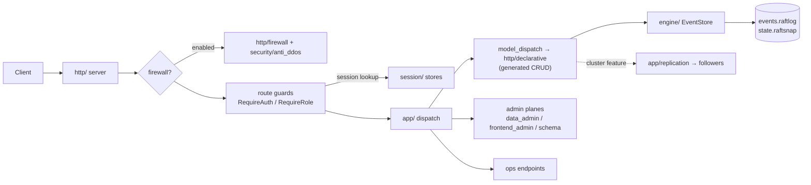

# Code map — bricks ↔ modules

One view of where every identifiable brick lives in `lithair-core/src/`. The
module tree is the canonical map (each module's `//!` header is its legend on
[docs.rs](https://docs.rs/lithair-core)); this page adds the brick-level view,
including the bricks that span more than one module.

## Bricks → modules

| Brick | Modules / files | Notes |
|---|---|---|
| **Server & dispatch** | `app/` | `mod.rs` = lifecycle (`serve`, graceful shutdown, request dispatch, guards). Split per concern: `builder.rs` (the `with_*` API), `model_dispatch.rs` (`/api/{model}` routing), `replication.rs` (leader/follower plane), `data_admin.rs` (`/_admin/data/*`), `frontend_admin.rs` (`/_admin/frontend/*`), `schema_handlers.rs` (`/_admin/schema/*`), `ops_endpoints.rs` (`/health` `/ready` `/info` `/metrics`) |
| **HTTP** | `http/` | Hyper server, `router.rs`, `declarative.rs` (generated CRUD handlers), `route_guard.rs` (`RequireAuth`/`RequireRole`), `host_router.rs` (vhosts), SSE |
| **Auth & sessions** *(spans 4 modules)* | `session/` (stores, manager, cookies) · `security/` (JWT, validation, `SecurityState`) · `rbac/` (roles, field permissions, providers) · `mfa/` (TOTP, feature `mfa`) | Guards enforcing it live in `http/route_guard.rs`; the role convention is `session.data["role"]` |
| **Firewall / anti-abuse** *(spans 2 modules)* | `http/firewall.rs` (IP allow/deny, QPS, protected prefixes) · `security/anti_ddos.rs` | Off by default (`LT_FW_ENABLE`); defense-in-depth on top of the auth guards |
| **Event sourcing & storage** | `engine/` | `events.rs` (`EventStore`, hash chain), `persistence.rs` (+ async writer), `snapshot.rs` (auto-compaction), `scc2_engine.rs` (hidden tier), `retention.rs` (`#[retention]`/`#[pinned]`) |
| **Serialization** | `serialization/` | `json.rs` (simd-json path), `binary.rs`, `rkyv_mode.rs` (dual-mode, BDD-covered) |
| **Cluster / replication** | `cluster/` (WAL, snapshot, leadership) · `app/replication.rs` (HTTP plane) · `consensus/` (**deprecated**, still load-bearing via `DeclarativeHttpHandler`) | Single-leader envelope: see [cluster ops](../operations/cluster.md) |
| **Frontend serving** | `frontend/` | Memory-first static assets, per-vhost engines, hot reload + `sha256:` versioning (`/_admin/frontend/*`) |
| **Schema & migration** | `schema/` | Model specs, schema history/locking, relations & FK registry, cluster schema sync |
| **Declarative models** | `model/`, `model_inspect/` + the `lithair-macros` crate | `#[derive(DeclarativeModel)]` parses field attributes → generates REST/RBAC/event sourcing; unknown attribute keys are compile errors (G2) |
| **Observability** | `logging/` (tracing subscriber, log bridge) · `system/` (CPU/RAM/request stats) · `app/ops_endpoints.rs` | Opt-in OTLP export behind the `otel` feature |
| **Config** | `config/` | `LT_*` env vars + TOML; see [env-vars](../reference/env-vars.md) |
| **Admin UI** | `admin_ui/` (feature `admin-ui`) | Single embedded `dashboard.html` (data + frontends + cluster tabs) |

Feature gates are the user-facing switches for optional bricks: `macros`
(default), `tls`, `mfa`, `cluster`, `openapi`, `otel`, `admin-ui`.

## Request flow

## Where to look for…

- **"How does a write get durable?"** → `http/declarative.rs` (handler) →
  `engine/events.rs` (append + hash chain) → `engine/persistence.rs` (flush).
- **"Who decides 401 vs 403?"** → `http/route_guard.rs` (`RequireAuth` = 401,
  `RequireRole` = 403), wired by `app/builder.rs` (`with_data_admin`,
  `with_admin_roles`).
- **"What exactly is stable API?"** →
  [`api-stability.md`](../reference/api-stability.md) (stable / unstable /
  hidden tiers).
