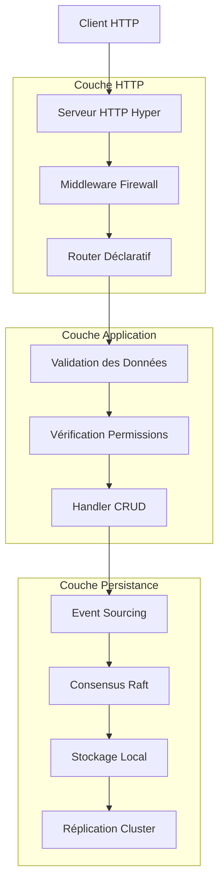
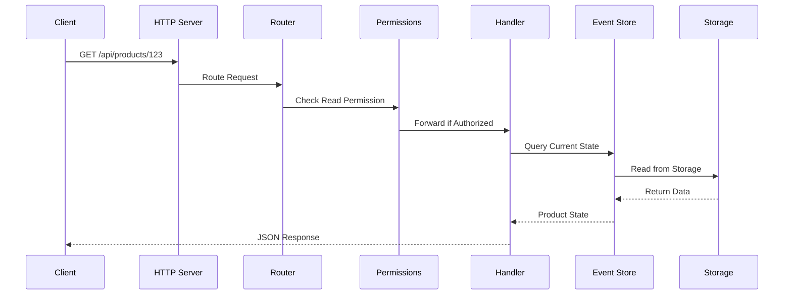
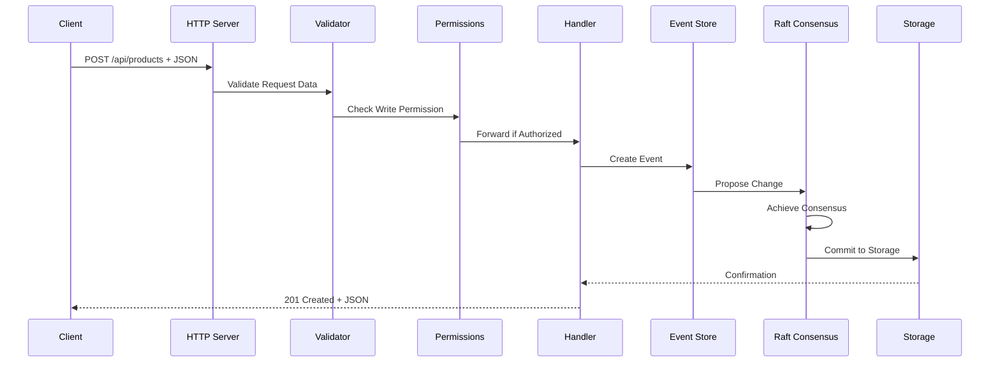
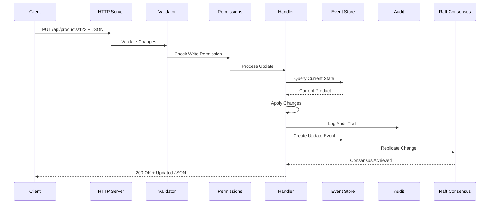
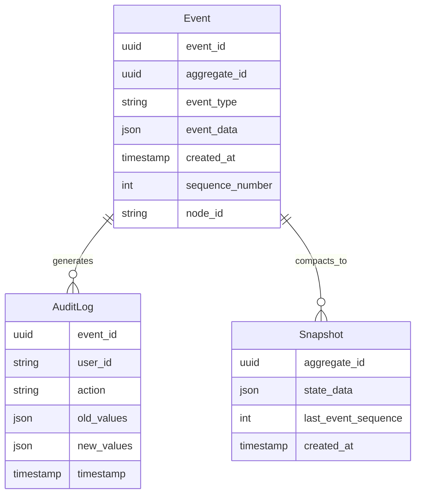
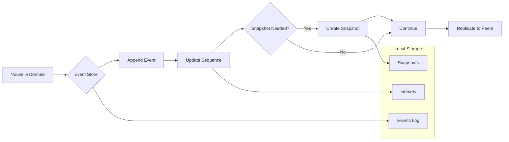
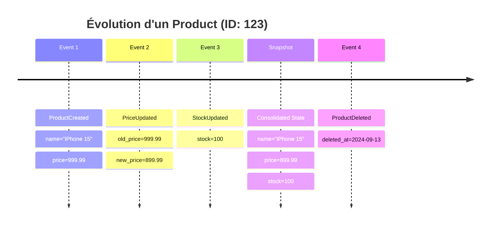
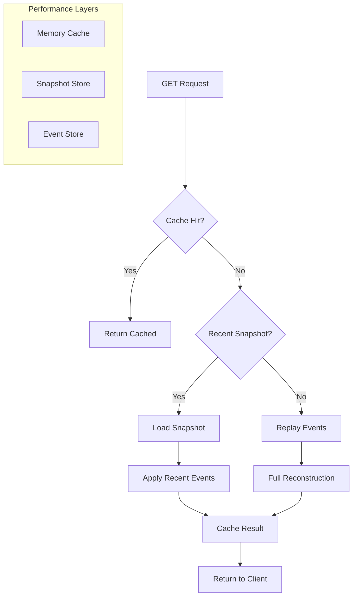

# Flux de Données dans Lithair

Ce document détaille comment les données circulent dans l'architecture Lithair, de la réception d'une requête HTTP jusqu'à la persistance distribuée.

## 🌊 Vue d'Ensemble du Flux



## 🔄 Flux Détaillé par Opération

### 1. Requête GET (Lecture)



**Flux de données :**
1. **Requête HTTP** : Client → Serveur Hyper
2. **Routage** : Identification du handler via attributs `#[http(expose)]`
3. **Permissions** : Vérification RBAC via `#[permission(read = "...")]`
4. **Lecture état** : Reconstruction depuis Event Store
5. **Réponse JSON** : Sérialisation automatique

### 2. Requête POST (Création)



**Flux de données :**
1. **Désérialisation** : JSON → Struct Rust via Serde
2. **Validation** : Vérification via attributs `#[http(validate = "...")]`
3. **Permissions** : Check write via `#[permission(write = "...")]`
4. **Event Creation** : Génération événement avec ID unique
5. **Consensus** : Synchronisation via Raft entre nœuds
6. **Persistance** : Écriture atomique dans Event Store

### 3. Requête PUT (Modification)



**Flux de données :**
1. **Delta detection** : Comparaison état actuel vs modifications
2. **Audit automatique** : Si `#[lifecycle(audited)]` présent
3. **Versioning** : Gestion versions si `#[lifecycle(versioned = N)]`
4. **Event replay** : Reconstruction état depuis événements
5. **Réplication** : Propagation changement vers autres nœuds

## 🗄️ Architecture de Stockage

### Event Store Structure



### Flux de Persistance



## 🔄 Patterns de Données

### 1. CQRS (Command Query Responsibility Segregation)

```rust
// Commands (Write Side)
#[derive(DeclarativeModel)]
pub struct ProductCommand {
    #[http(method = "POST", path = "/api/products")]
    #[persistence(event_sourced)]
    pub create_product: CreateProduct,
    
    #[http(method = "PUT", path = "/api/products/{id}")]
    #[lifecycle(audited)]
    pub update_product: UpdateProduct,
}

// Queries (Read Side) 
#[derive(DeclarativeModel)]
pub struct ProductQuery {
    #[http(method = "GET", path = "/api/products")]
    #[db(indexed, optimized_for_read)]
    pub list_products: ProductList,
    
    #[http(method = "GET", path = "/api/products/{id}")]
    #[caching(ttl = 300)]
    pub get_product: Product,
}
```

### 2. Event Sourcing avec Snapshots



### 3. Aggregation et Projections

```rust
#[derive(DeclarativeModel)]
#[projection(from = "OrderEvent", update_on = ["OrderCreated", "OrderCancelled"])]
pub struct SalesMetrics {
    #[db(primary_key)]
    pub date: Date,
    
    #[aggregate(sum, source = "Order.total")]
    pub daily_revenue: f64,
    
    #[aggregate(count, source = "Order.id")]
    pub orders_count: i64,
    
    #[aggregate(avg, source = "Order.total")]
    pub avg_order_value: f64,
}
```

## ⚡ Optimisations de Performance

### 1. Lecture Optimisée



### 2. Écriture Optimisée

```rust
// Optimisations déclaratives
#[derive(DeclarativeModel)]
#[performance(
    batch_size = 100,           // Batch events
    async_replication = true,   // Async to followers  
    snapshot_frequency = 1000   // Snapshot every 1000 events
)]
pub struct HighThroughputModel {
    #[db(indexed, bloom_filter)]  // Fast lookups
    #[caching(write_behind)]      // Async writes
    pub high_frequency_field: String,
}
```

## 📊 Métriques de Flux

### Latences par Étape

```mermaid
gantt
    title Latence Typique d'une Requête POST
    dateFormat X
    axisFormat %L ms
    
    section HTTP Layer
    Request Parsing    :0, 0.1
    Firewall Check     :0.1, 0.2
    Routing           :0.2, 0.3
    
    section Application
    Validation        :0.3, 0.5
    Permissions      :0.5, 0.7
    Handler Logic    :0.7, 1.0
    
    section Persistence  
    Event Creation   :1.0, 1.2
    Raft Consensus   :1.2, 2.8
    Local Storage    :2.8, 3.0
    
    section Response
    Serialization    :3.0, 3.2
    HTTP Response    :3.2, 3.5
```

### Throughput par Composant

| Composant | Throughput (ops/s) | Goulot d'étranglement |
|-----------|-------------------|----------------------|
| HTTP Server | 50,000 | - |
| Firewall | 45,000 | IP lookup |
| Validation | 40,000 | Complex rules |
| Permissions | 35,000 | RBAC queries |
| Event Store | 15,000 | Disk I/O |
| Raft Consensus | 5,000 | Network + Consensus |

## 🔍 Debugging du Flux

### Tracing Distribué

```rust
// Automatic tracing with OpenTelemetry
#[derive(DeclarativeModel)]
#[tracing(
    enabled = true,
    sample_rate = 0.1,      // 10% of requests
    include_body = false     // Security
)]
pub struct TracedProduct {
    // Model fields...
}
```

### Logs Structurés

```json
{
  "timestamp": "2024-09-13T10:30:00Z",
  "level": "INFO", 
  "trace_id": "abc123",
  "span_id": "def456",
  "message": "Processing product creation",
  "context": {
    "model": "Product",
    "operation": "create",
    "user_id": "user_789",
    "request_size": 1024,
    "validation_time_ms": 2.3
  }
}
```

## 🛠️ Configuration du Flux

### Tuning Performance

```rust
// Configuration globale du flux
let config = LithairConfig {
    http_server: HttpConfig {
        worker_threads: num_cpus::get(),
        connection_pool: 1000,
        request_timeout: Duration::from_secs(30),
    },
    
    event_store: EventStoreConfig {
        batch_size: 100,
        sync_mode: SyncMode::Periodic(Duration::from_millis(10)),
        snapshot_threshold: 1000,
    },
    
    raft: RaftConfig {
        election_timeout: Duration::from_millis(300),
        heartbeat_interval: Duration::from_millis(50),
        max_payload_entries: 100,
    },
};
```

---

**💡 Résumé :** Le flux de données Lithair est conçu pour être **prévisible**, **traceable** et **optimisé** tout en maintenant la **cohérence distribuée** et la **sécurité** à chaque étape.