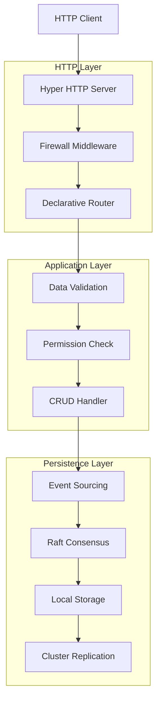
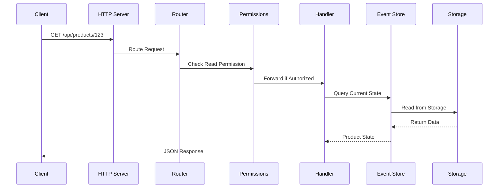
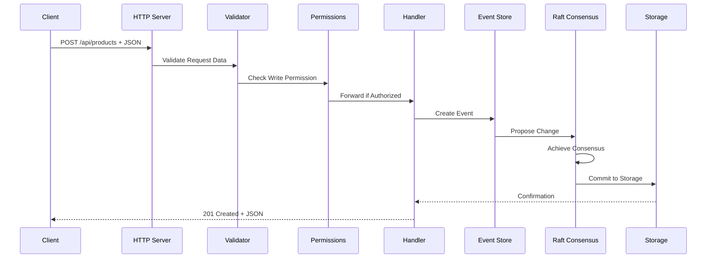
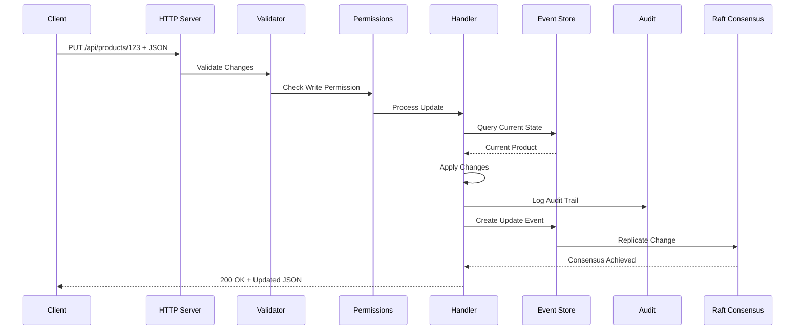
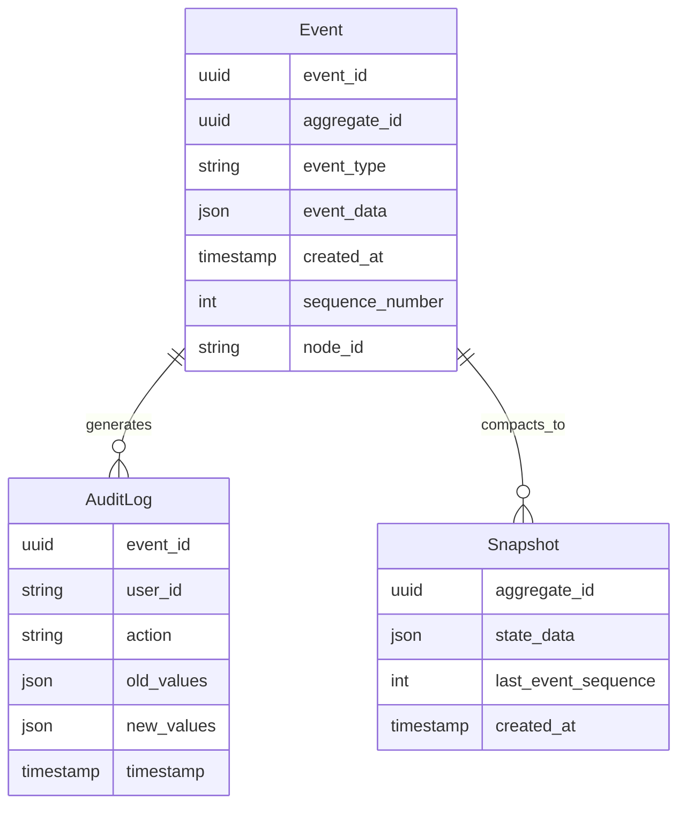
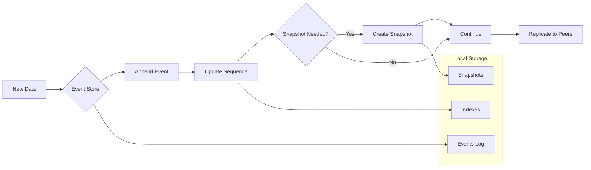
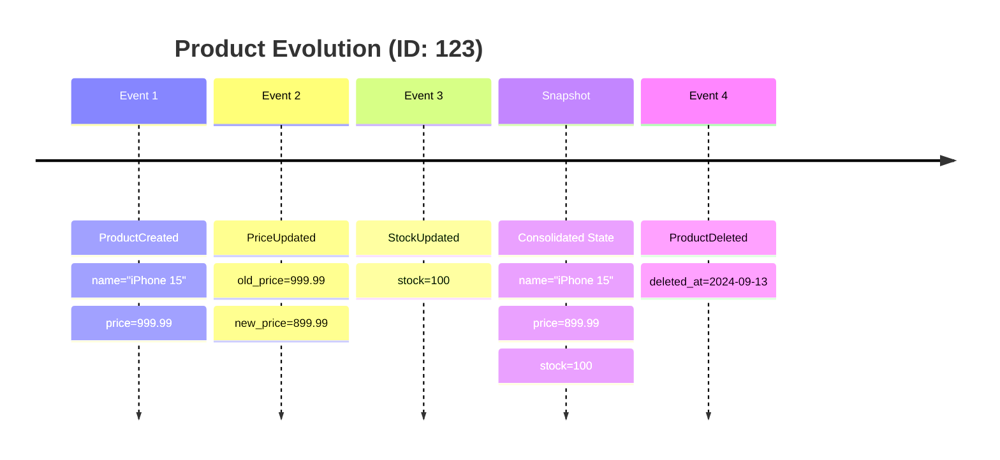
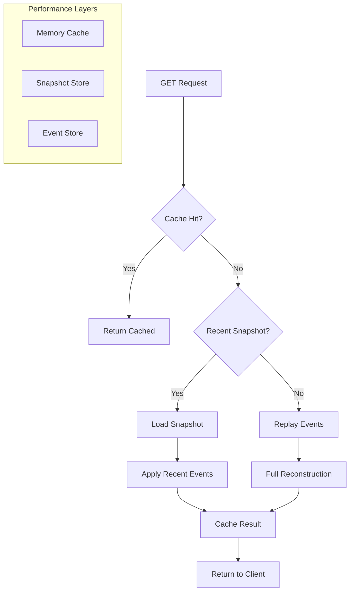

# Data Flow in Lithair

This document details how data flows through the Lithair architecture, from receiving an HTTP request to distributed persistence.

## Flow Overview



## Detailed Flow by Operation

### 1. GET Request (Read)



**Data flow:**
1. **HTTP Request**: Client → Hyper Server
2. **Routing**: Handler identification via `#[http(expose)]` attributes
3. **Permissions**: RBAC verification via `#[permission(read = "...")]`
4. **State Read**: Reconstruction from Event Store
5. **JSON Response**: Automatic serialization

### 2. POST Request (Create)



**Data flow:**
1. **Deserialization**: JSON → Rust Struct via Serde
2. **Validation**: Verification via `#[http(validate = "...")]` attributes
3. **Permissions**: Write check via `#[permission(write = "...")]`
4. **Event Creation**: Event generation with unique ID
5. **Consensus**: Raft synchronization between nodes
6. **Persistence**: Atomic write to Event Store

### 3. PUT Request (Update)



**Data flow:**
1. **Delta detection**: Current state vs modifications comparison
2. **Automatic audit**: If `#[lifecycle(audited)]` is present
3. **Versioning**: Version management if `#[lifecycle(versioned = N)]`
4. **Event replay**: State reconstruction from events
5. **Replication**: Change propagation to other nodes

## Storage Architecture

### Event Store Structure



### Persistence Flow



## Data Patterns

### 1. CQRS (Command Query Responsibility Segregation)

```rust
// Commands (Write Side)
#[derive(DeclarativeModel)]
pub struct ProductCommand {
    #[http(method = "POST", path = "/api/products")]
    #[persistence(event_sourced)]
    pub create_product: CreateProduct,

    #[http(method = "PUT", path = "/api/products/{id}")]
    #[lifecycle(audited)]
    pub update_product: UpdateProduct,
}

// Queries (Read Side)
#[derive(DeclarativeModel)]
pub struct ProductQuery {
    #[http(method = "GET", path = "/api/products")]
    #[db(indexed, optimized_for_read)]
    pub list_products: ProductList,

    #[http(method = "GET", path = "/api/products/{id}")]
    #[caching(ttl = 300)]
    pub get_product: Product,
}
```

### 2. Event Sourcing with Snapshots



### 3. Aggregation and Projections

```rust
#[derive(DeclarativeModel)]
#[projection(from = "OrderEvent", update_on = ["OrderCreated", "OrderCancelled"])]
pub struct SalesMetrics {
    #[db(primary_key)]
    pub date: Date,

    #[aggregate(sum, source = "Order.total")]
    pub daily_revenue: f64,

    #[aggregate(count, source = "Order.id")]
    pub orders_count: i64,

    #[aggregate(avg, source = "Order.total")]
    pub avg_order_value: f64,
}
```

## Performance Optimizations

### 1. Optimized Reads



### 2. Optimized Writes

```rust
// Declarative optimizations
#[derive(DeclarativeModel)]
#[performance(
    batch_size = 100,           // Batch events
    async_replication = true,   // Async to followers
    snapshot_frequency = 1000   // Snapshot every 1000 events
)]
pub struct HighThroughputModel {
    #[db(indexed, bloom_filter)]  // Fast lookups
    #[caching(write_behind)]      // Async writes
    pub high_frequency_field: String,
}
```

## Flow Metrics

### Latency by Stage

```mermaid
gantt
    title Typical POST Request Latency
    dateFormat X
    axisFormat %L ms

    section HTTP Layer
    Request Parsing    :0, 0.1
    Firewall Check     :0.1, 0.2
    Routing           :0.2, 0.3

    section Application
    Validation        :0.3, 0.5
    Permissions      :0.5, 0.7
    Handler Logic    :0.7, 1.0

    section Persistence
    Event Creation   :1.0, 1.2
    Raft Consensus   :1.2, 2.8
    Local Storage    :2.8, 3.0

    section Response
    Serialization    :3.0, 3.2
    HTTP Response    :3.2, 3.5
```

### Throughput by Component

| Component | Throughput (ops/s) | Bottleneck |
|-----------|-------------------|------------|
| HTTP Server | 50,000 | - |
| Firewall | 45,000 | IP lookup |
| Validation | 40,000 | Complex rules |
| Permissions | 35,000 | RBAC queries |
| Event Store | 15,000 | Disk I/O |
| Raft Consensus | 5,000 | Network + Consensus |

## Flow Debugging

### Distributed Tracing

```rust
// Automatic tracing with OpenTelemetry
#[derive(DeclarativeModel)]
#[tracing(
    enabled = true,
    sample_rate = 0.1,      // 10% of requests
    include_body = false     // Security
)]
pub struct TracedProduct {
    // Model fields...
}
```

### Structured Logs

```json
{
  "timestamp": "2024-09-13T10:30:00Z",
  "level": "INFO",
  "trace_id": "abc123",
  "span_id": "def456",
  "message": "Processing product creation",
  "context": {
    "model": "Product",
    "operation": "create",
    "user_id": "user_789",
    "request_size": 1024,
    "validation_time_ms": 2.3
  }
}
```

## Flow Configuration

### Performance Tuning

```rust
// Global flow configuration
let config = LithairConfig {
    http_server: HttpConfig {
        worker_threads: num_cpus::get(),
        connection_pool: 1000,
        request_timeout: Duration::from_secs(30),
    },

    event_store: EventStoreConfig {
        batch_size: 100,
        sync_mode: SyncMode::Periodic(Duration::from_millis(10)),
        snapshot_threshold: 1000,
    },

    raft: RaftConfig {
        election_timeout: Duration::from_millis(300),
        heartbeat_interval: Duration::from_millis(50),
        max_payload_entries: 100,
    },
};
```

---

**Summary:** Lithair's data flow is designed to be **predictable**, **traceable**, and **optimized** while maintaining **distributed consistency** and **security** at every step.
