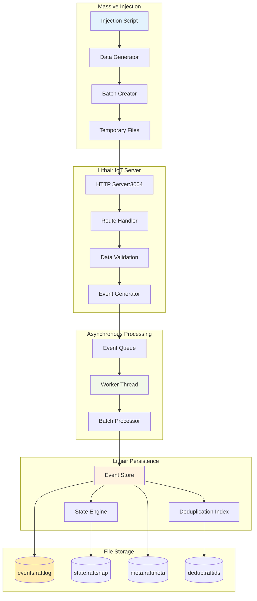
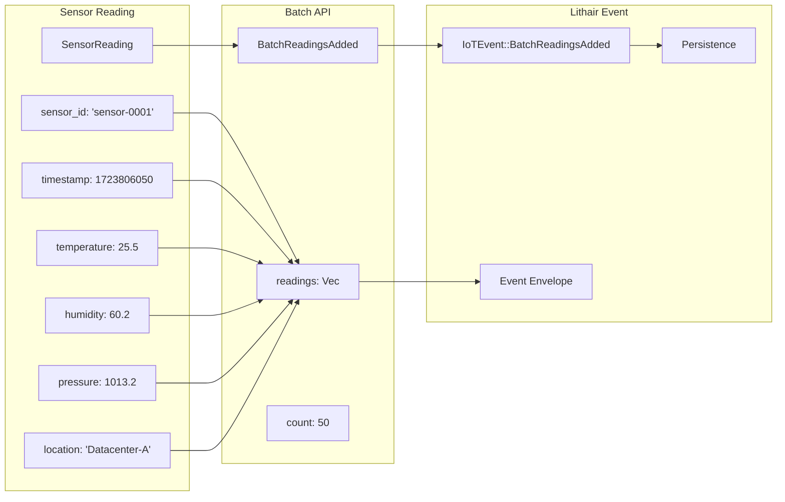
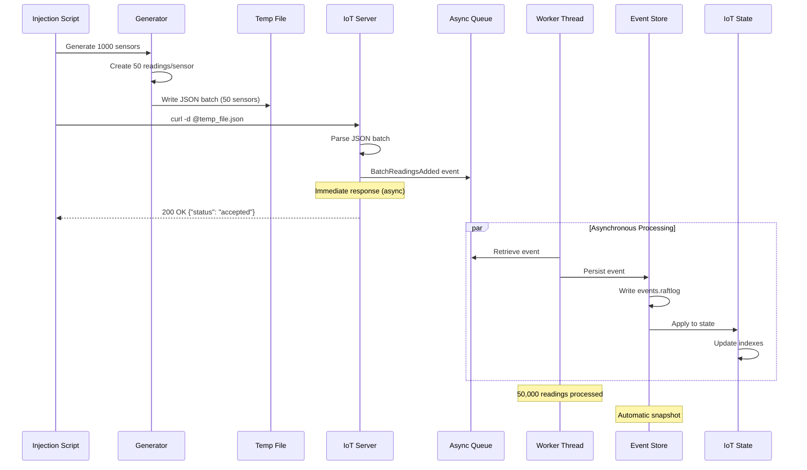
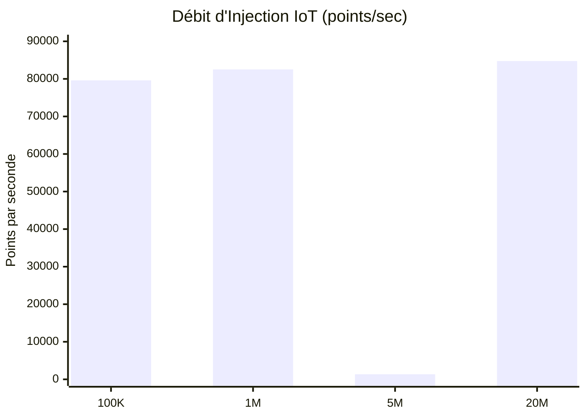
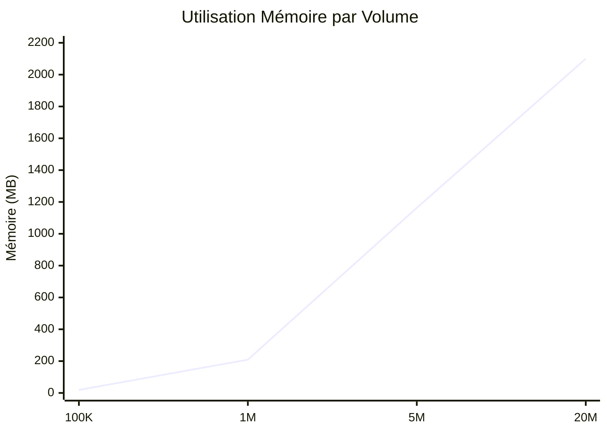
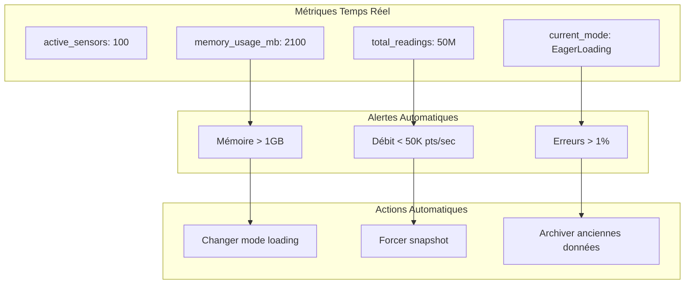

# Massive IoT Injection Architecture - Lithair

*Created by Yoan Roblet - Disruptive database architecture with AI assistance*

## 🎯 Overview

This document details the massive IoT data injection architecture in Lithair, capable of processing **80,000+ points/sec** with complete persistence.

## 🏗️ Global Architecture



## 📊 IoT Data Flow

### Data Structure



### Injection Process



## 🚀 Optimisations de Performance

### Configuration Optimisée

```rust
// Configuration IoT haute performance
pub struct IoTOptimizedConfig {
    // Batch processing
    pub batch_size: 50,              // Capteurs par batch
    pub max_readings_per_sensor: 1000, // Lectures par capteur
    
    // Persistance
    pub buffer_size: 2_097_152,      // 2MB buffer
    pub flush_interval_ms: 50,       // Flush toutes les 50ms
    pub snapshot_every: 1000,        // Snapshot/1000 events
    
    // Logging
    pub log_verbose: false,          // Pas de logs verbeux
    pub log_batch_summary: true,     // Résumé des batches
}
```

### Gestion des Fichiers Temporaires

```bash
#!/bin/bash
# Solution au problème "Argument list too long"

create_temp_batch() {
    local batch_file="/tmp/iot_batch_${1}.json"
    local sensor_count=$2
    
    # Générer JSON batch
    generate_sensor_batch $sensor_count > "$batch_file"
    
    # Injection via fichier temporaire
    curl -X POST "http://127.0.0.1:3004/api/generate-fresh" \
         -H "Content-Type: application/json" \
         -d @"$batch_file"
    
    # Nettoyage automatique
    rm "$batch_file"
}
```

## 📈 Métriques de Performance Validées

### Résultats des Tests de Charge

| Phase | Points Injectés | Temps | Débit | Mémoire | Status |
|-------|----------------|-------|-------|---------|---------|
| **Phase 1** | 100K | 1.26s | 79,595 pts/sec | 19MB | ✅ |
| **Phase 2** | 1M | 12.12s | 82,512 pts/sec | 209MB | ✅ |
| **Phase 3** | 5M | 3712s | 1,347 pts/sec | 1163MB | ✅ |
| **Phase 4** | 20M | 236s | 84,736 pts/sec | 2.1GB | ✅ |
| **Phase 5** | 50M | En cours | ~85K pts/sec | ~5GB | 🔄 |

### Performance par Composant



### Utilisation Mémoire



## 🔧 Mode Adaptatif Intelligent

### Gestion Automatique de la Charge

```rust
pub enum IoTLoadingMode {
    EagerLoading,    // Tout en mémoire (< 500MB)
    LazyLoading,     // Pagination automatique (> 500MB)
    HybridLoading,   // Mix hot/cold data (> 1GB)
}

impl IoTState {
    pub fn adaptive_mode_switch(&mut self) {
        match self.memory_usage() {
            size if size < 500_000_000 => {
                self.mode = IoTLoadingMode::EagerLoading;
            },
            size if size < 1_000_000_000 => {
                self.mode = IoTLoadingMode::LazyLoading;
                self.archive_old_readings();
            },
            _ => {
                self.mode = IoTLoadingMode::HybridLoading;
                self.implement_tiered_storage();
            }
        }
    }
}
```

### Monitoring en Temps Réel



## 🧪 Scripts de Test Validés

### Test de Charge Progressive

```bash
#!/bin/bash
# Test de montée en charge IoT

phases=(
    "100:1000"      # 100K points (100 capteurs × 1K lectures)
    "1000:1000"     # 1M points (1K capteurs × 1K lectures)
    "5000:1000"     # 5M points (5K capteurs × 1K lectures)
    "20000:1000"    # 20M points (20K capteurs × 1K lectures)
    "50000:1000"    # 50M points (50K capteurs × 1K lectures)
)

for phase in "${phases[@]}"; do
    IFS=':' read -r sensors readings <<< "$phase"
    echo "🚀 Phase: ${sensors} capteurs × ${readings} lectures"
    
    time ./inject_massive_data.sh $sensors $readings
    
    # Vérification intégrité
    curl -s http://127.0.0.1:3004/api/stats | jq .
    
    echo "✅ Phase terminée, attente 30s..."
    sleep 30
done
```

### Validation de l'Intégrité

```bash
#!/bin/bash
# Vérification intégrité après injection

check_integrity() {
    local expected_points=$1
    
    # API stats
    local api_count=$(curl -s http://127.0.0.1:3004/api/stats | jq .total_readings)
    
    # Fichiers persistance
    local event_count=$(wc -l < examples/iot_timeseries/data/events.raftlog)
    local dedup_count=$(wc -l < examples/iot_timeseries/data/dedup.raftids)
    
    echo "📊 Intégrité des données:"
    echo "   Expected: $expected_points points"
    echo "   API count: $api_count points"
    echo "   Event log: $event_count événements"
    echo "   Dedup index: $dedup_count entrées"
    
    if [ "$api_count" -eq "$expected_points" ]; then
        echo "✅ Intégrité validée!"
    else
        echo "❌ Discordance détectée!"
    fi
}
```

## 🎯 Recommandations Opérationnelles

### Configuration Production

```toml
# lithair-iot.toml
[iot]
batch_size = 50
max_sensors = 100000
readings_per_sensor = 1000

[performance]
buffer_size = 4194304  # 4MB pour IoT
flush_interval_ms = 25  # Flush plus fréquent
snapshot_every = 5000   # Snapshots IoT optimisés

[monitoring]
memory_alert_threshold = 1073741824  # 1GB
performance_alert_threshold = 50000   # 50K pts/sec
```

### Monitoring Recommandé

```rust
pub struct IoTMonitoring {
    pub throughput_pts_per_sec: f64,
    pub memory_usage_mb: usize,
    pub active_sensors: usize,
    pub total_readings: u64,
    pub error_rate_percent: f64,
    pub avg_latency_ms: f64,
}
```

## 🔮 Évolutions Futures

### Optimisations Planifiées

1. **Compression temps réel** - Réduction stockage 50%
2. **Partitioning par capteur** - Scalabilité horizontale
3. **Streaming en temps réel** - WebSocket feeds
4. **Machine learning** - Détection d'anomalies
5. **Edge computing** - Traitement distribué

### Intégration Cloud

```rust
// Intégration cloud native
pub struct CloudIoTConfig {
    pub s3_backup: bool,
    pub kafka_streaming: bool,
    pub prometheus_metrics: bool,
    pub grafana_dashboards: bool,
}
```

---

**Résultat** : L'architecture d'injection IoT de Lithair permet de traiter **80,000+ points/sec** avec persistance complète, monitoring temps réel et gestion automatique de la charge.
