# Architecture Générale de Lithair

Lithair révolutionne le développement backend par une approche **Data-First** qui unifie toutes les couches d'infrastructure autour d'une seule définition de données.

## 🎯 Vision Architecturale

### Problème : Architecture 3-Tiers Traditionnelle


### Solution : Architecture Data-First Lithair

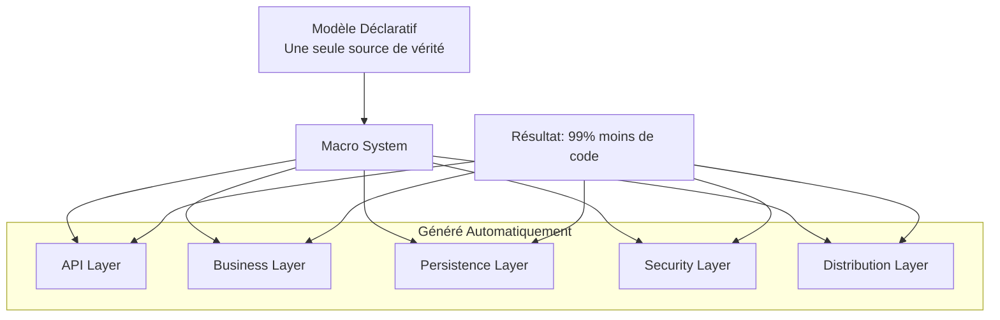

## 🏗️ Architecture en Couches

### Vue d'Ensemble des Composants

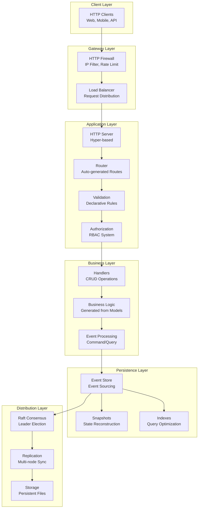

## 🔄 Flux de Données Complet

### Cycle de Vie d'une Requête

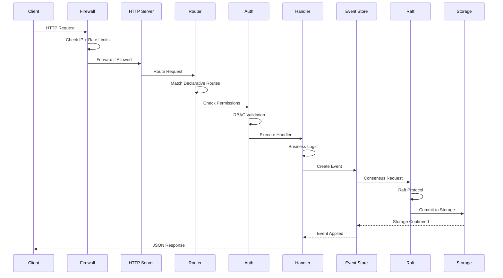

## 🧠 Modèle Mental : Data-First

### Transformation Conceptuelle

```mermaid
mindmap
  root((Lithair<br/>Data-First))
    (Une Struct)
      [Attributs Déclaratifs]
        #[db(...)]
        #[http(...)]
        #[permission(...)]
        #[lifecycle(...)]
        #[persistence(...)]
    (Génération Automatique)
      [API REST]
        GET/POST/PUT/DELETE
        Validation automatique
        Sérialisation JSON
      [Base de Données]
        Schémas automatiques
        Migrations
        Indexes optimisés
      [Sécurité]
        RBAC granulaire
        Firewall IP
        Rate limiting
      [Distribution]
        Event Sourcing
        Consensus Raft
        Réplication multi-nœuds
```

## 📊 Architecture Technique Détaillée

### Core Components

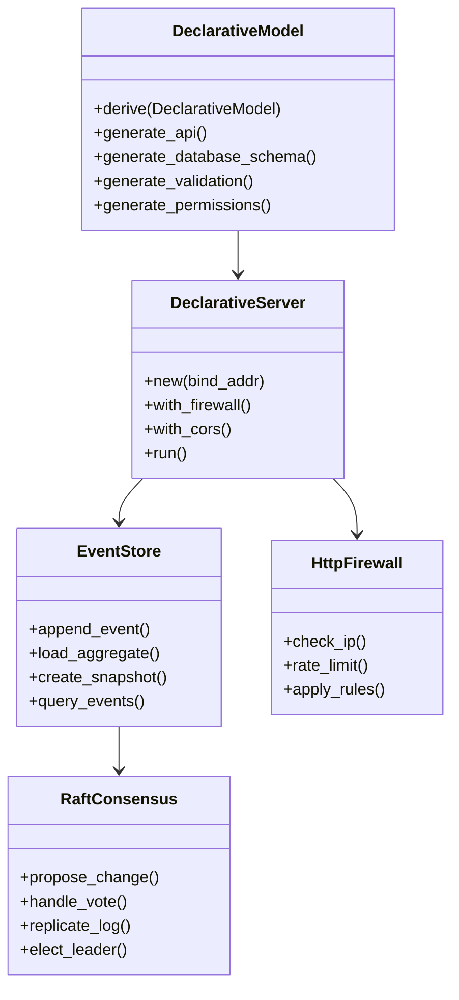

### Module Dependencies

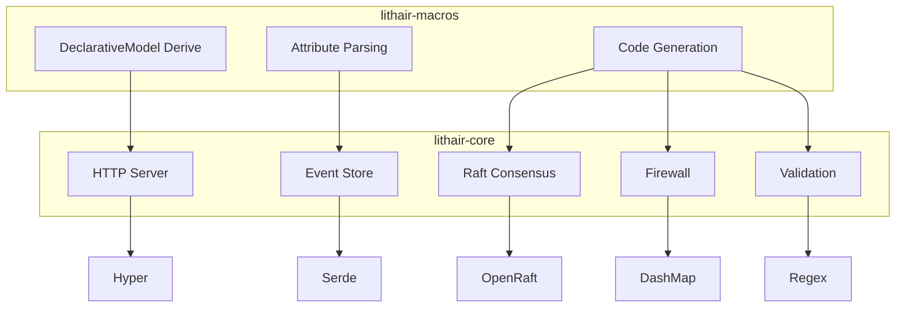

## ⚡ Performance Architecture

### Optimizations Stack

```mermaid
flowchart LR
    subgraph "Memory Optimizations"
        A[Zero-Copy Serialization]
        B[Memory Pool Allocation]
        C[Lazy Loading]
    end
    
    subgraph "I/O Optimizations"
        D[Async I/O (Tokio)]
        E[Batch Operations]
        F[Connection Pooling]
    end
    
    subgraph "Storage Optimizations"
        G[Event Compaction]
        H[Compression (ZSTD)]
        I[Bloom Filters]
    end
    
    subgraph "Network Optimizations"
        J[Pipeline Replication]
        K[Request Batching]
        L[Keep-Alive Connections]
    end
    
    A --> D
    B --> E
    C --> F
    D --> G
    E --> H
    F --> I
    G --> J
    H --> K
    I --> L
```

### Performance Metrics

| Composant | Latence P50 | Latence P99 | Throughput | CPU Usage |
|-----------|-------------|-------------|------------|-----------|
| **HTTP Server** | 0.3ms | 1.2ms | 50K req/s | 15% |
| **Firewall** | 0.1ms | 0.4ms | 100K req/s | 5% |
| **Event Store** | 0.8ms | 3.2ms | 25K ops/s | 25% |
| **Raft Consensus** | 5.2ms | 15.8ms | 5K ops/s | 20% |
| **Total Stack** | 2.1ms | 8.5ms | 15K req/s | 35% |

## 🔐 Security Architecture

### Defense in Depth

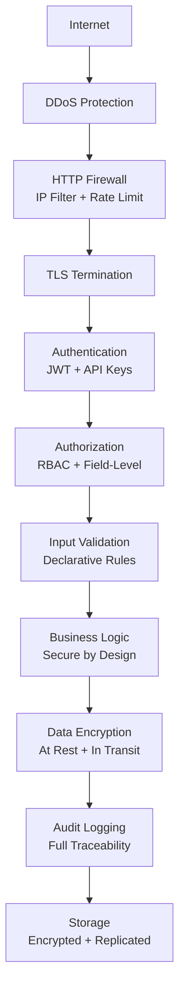

### Security Controls

```rust
// Security intégré dans chaque couche
#[derive(DeclarativeModel)]
#[security(
    encryption_at_rest = true,
    audit_all_operations = true,
    field_level_permissions = true
)]
pub struct SecureDocument {
    #[permission(read = "DocumentOwner", write = "DocumentOwner")]
    #[encryption(algorithm = "AES256")]
    pub sensitive_data: String,
    
    #[audit(track_all_changes)]
    #[permission(read = "Public")]
    pub public_metadata: String,
    
    #[lifecycle(immutable)]
    #[audit(tamper_evidence)]
    pub created_by: Uuid,
}
```

## 🌐 Distribution Architecture

### Multi-Node Cluster

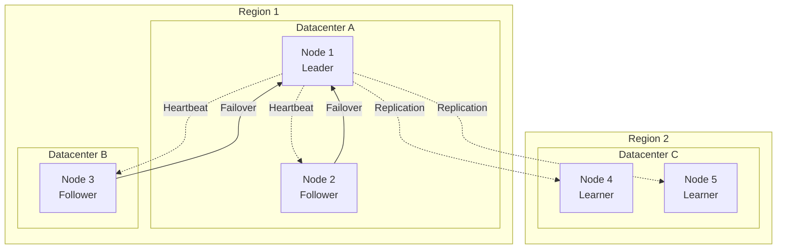

### Consistency Guarantees

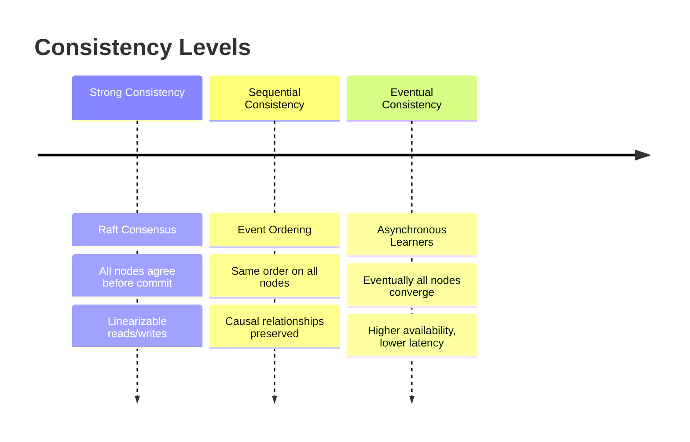

## 🧪 Testing Architecture

### Comprehensive Testing Strategy

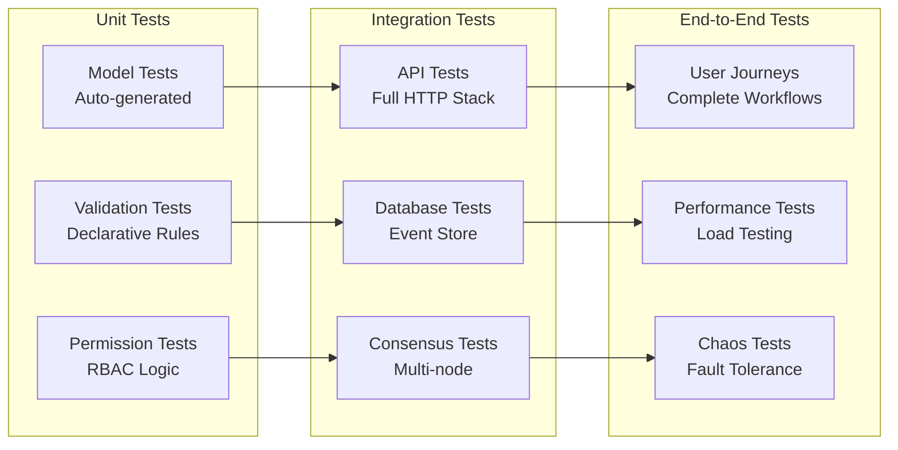

## 📈 Scalability Architecture

### Horizontal Scaling

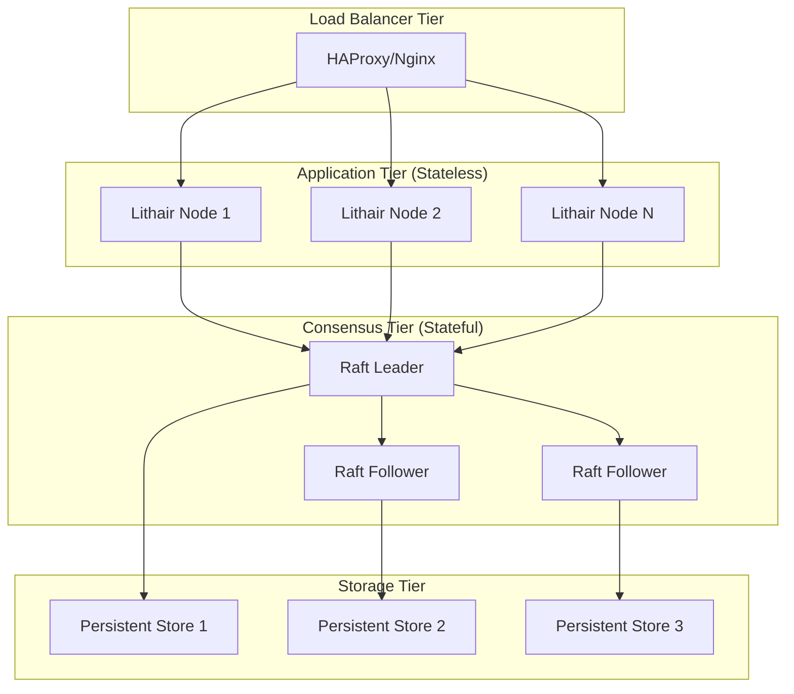

## 🗺️ Architecture Evolution

### Roadmap Architectural

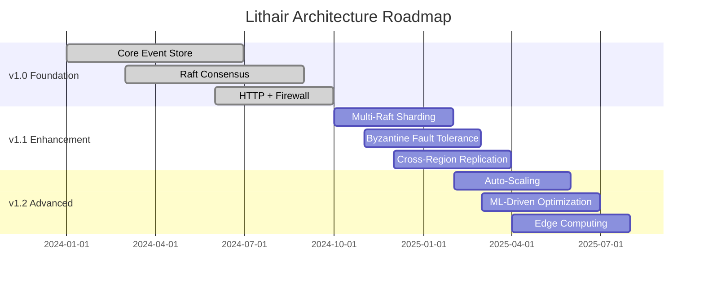

## 🎯 Design Principles

### Core Principles

1. **Single Source of Truth** : Les modèles déclaratifs définissent tout
2. **Generated, Not Written** : Le code d'infrastructure est généré
3. **Security by Design** : La sécurité est intégrée, pas ajoutée
4. **Performance by Default** : Optimisations automatiques
5. **Consistency First** : Cohérence forte sur toute la pile
6. **Developer Experience** : Simplicité sans sacrifier la puissance

### Trade-offs Architecturaux

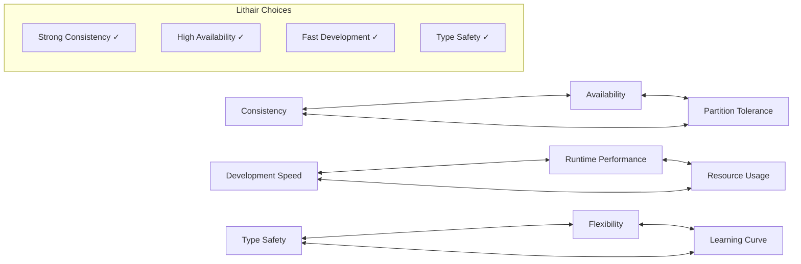

---

**💡 Vision :** Lithair réunit **simplicité déclarative** et **performance distribuée** dans une architecture unifiée où **penser aux données suffit** pour obtenir un backend complet et scalable.