# Lithair Architecture Overview

Lithair revolutionizes backend development with a **Data-First** approach that unifies all infrastructure layers around a single data definition.

## Vision

### Problem: Traditional 3-Tier Architecture

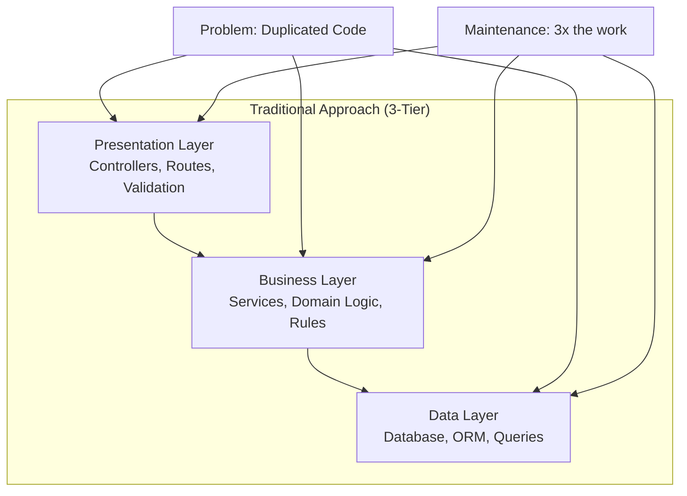

### Solution: Lithair Data-First Architecture

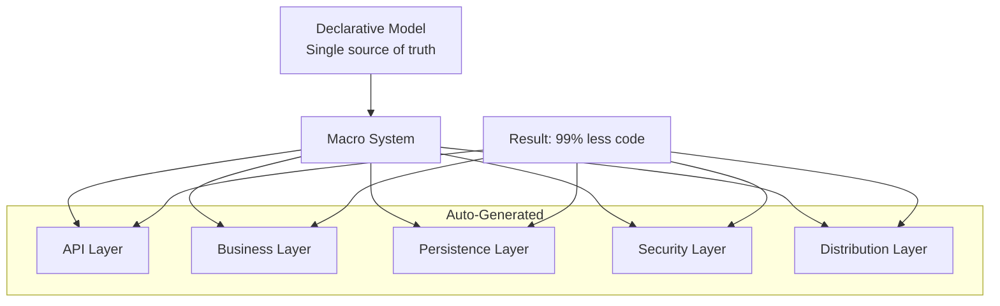

## Layered Architecture

### Component Overview

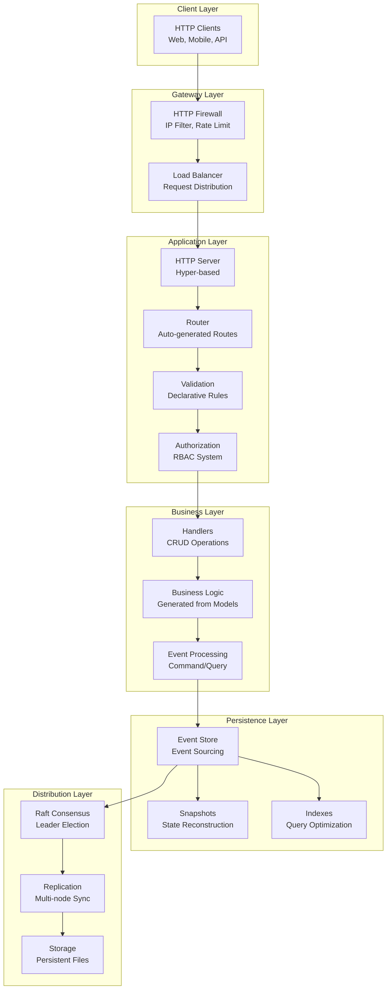

## Complete Data Flow

### Request Lifecycle

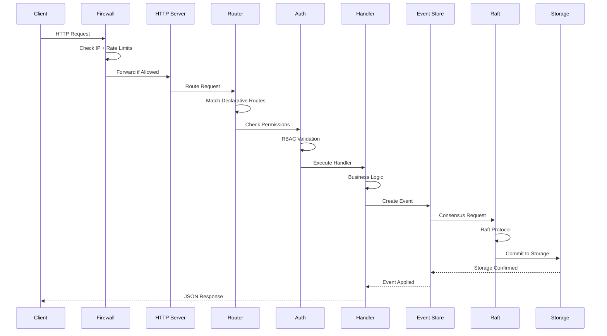

## Mental Model: Data-First

### Conceptual Transformation

```mermaid
mindmap
  root((Lithair<br/>Data-First))
    (One Struct)
      [Declarative Attributes]
        #[db(...)]
        #[http(...)]
        #[permission(...)]
        #[lifecycle(...)]
        #[persistence(...)]
    (Auto Generation)
      [REST API]
        GET/POST/PUT/DELETE
        Automatic validation
        JSON serialization
      [Database]
        Automatic schemas
        Migrations
        Optimized indexes
      [Security]
        Granular RBAC
        IP Firewall
        Rate limiting
      [Distribution]
        Event Sourcing
        Raft Consensus
        Multi-node replication
```

## Technical Architecture

### Core Components

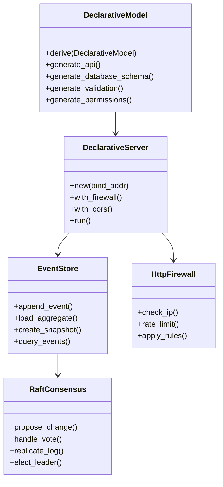

### Module Dependencies

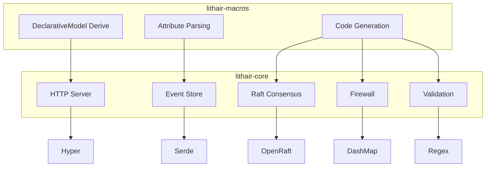

## Performance Architecture

### Optimization Stack

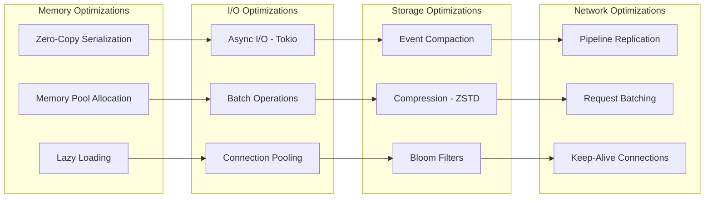

### Performance Metrics

| Component | P50 Latency | P99 Latency | Throughput | CPU Usage |
|-----------|-------------|-------------|------------|-----------|
| **HTTP Server** | 0.3ms | 1.2ms | 50K req/s | 15% |
| **Firewall** | 0.1ms | 0.4ms | 100K req/s | 5% |
| **Event Store** | 0.8ms | 3.2ms | 25K ops/s | 25% |
| **Raft Consensus** | 5.2ms | 15.8ms | 5K ops/s | 20% |
| **Total Stack** | 2.1ms | 8.5ms | 15K req/s | 35% |

## Security Architecture

### Defense in Depth

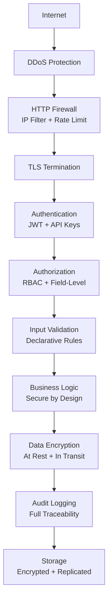

## Distribution Architecture

### Multi-Node Cluster

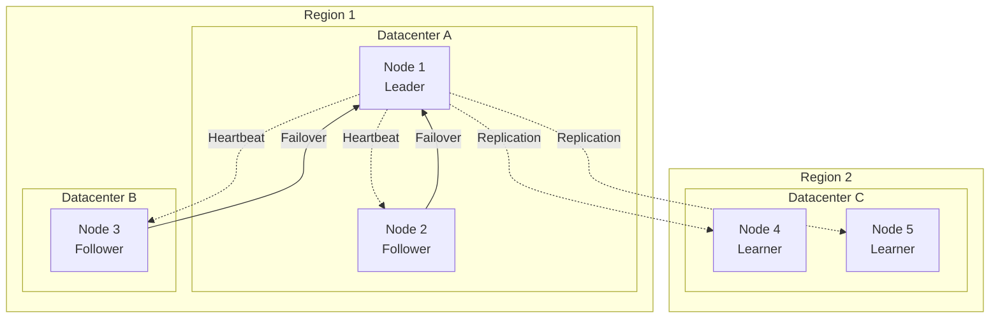

### Consistency Guarantees

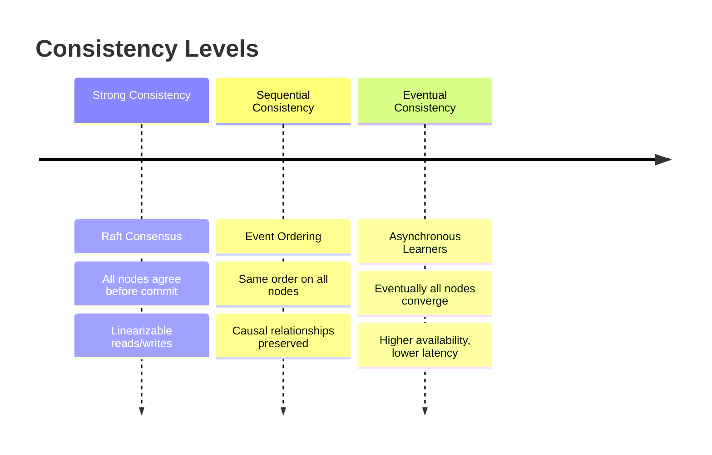

## Design Principles

### Core Principles

1. **Single Source of Truth**: Declarative models define everything
2. **Generated, Not Written**: Infrastructure code is generated
3. **Security by Design**: Security is built-in, not bolted on
4. **Performance by Default**: Automatic optimizations
5. **Consistency First**: Strong consistency across the stack
6. **Developer Experience**: Simplicity without sacrificing power

### Architectural Trade-offs

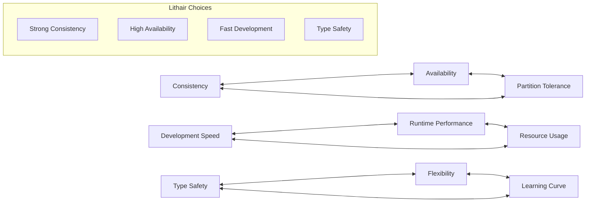

---

**Vision:** Lithair combines **declarative simplicity** and **distributed performance** in a unified architecture where **thinking about data is enough** to get a complete, scalable backend.
