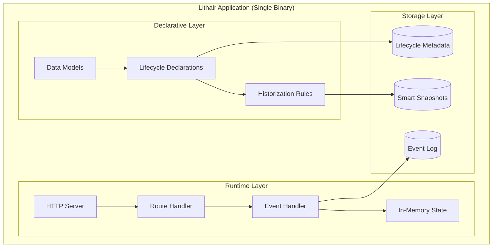
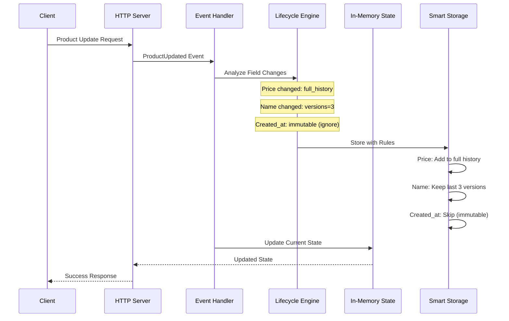
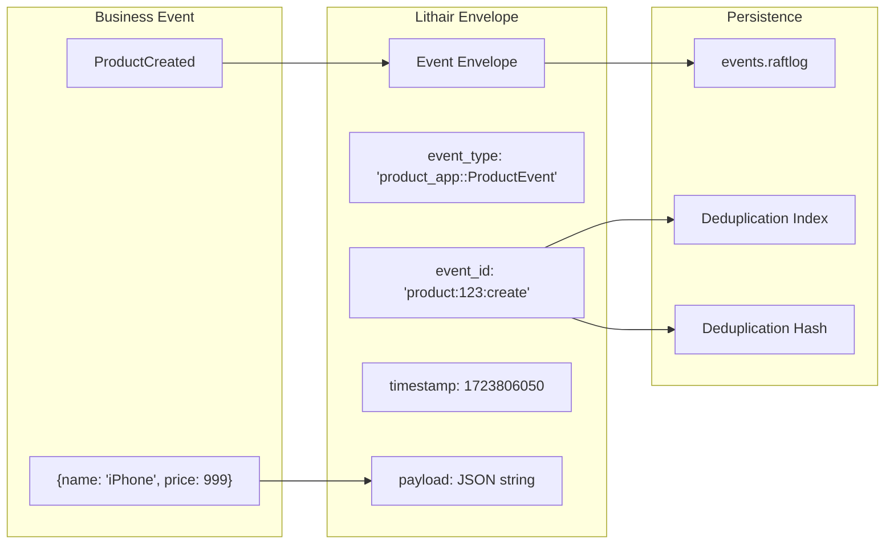
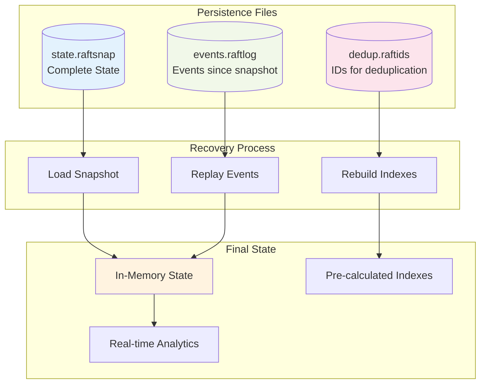
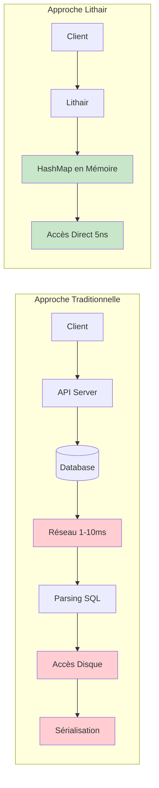
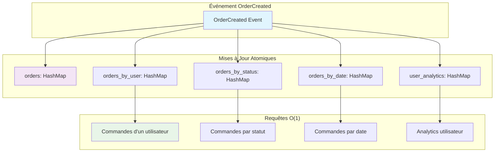
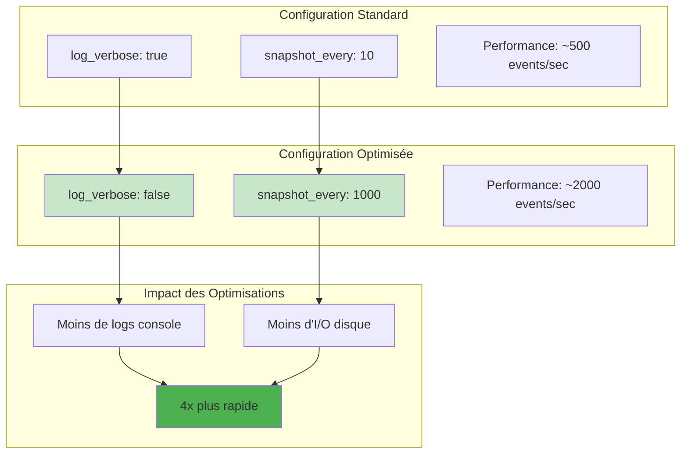
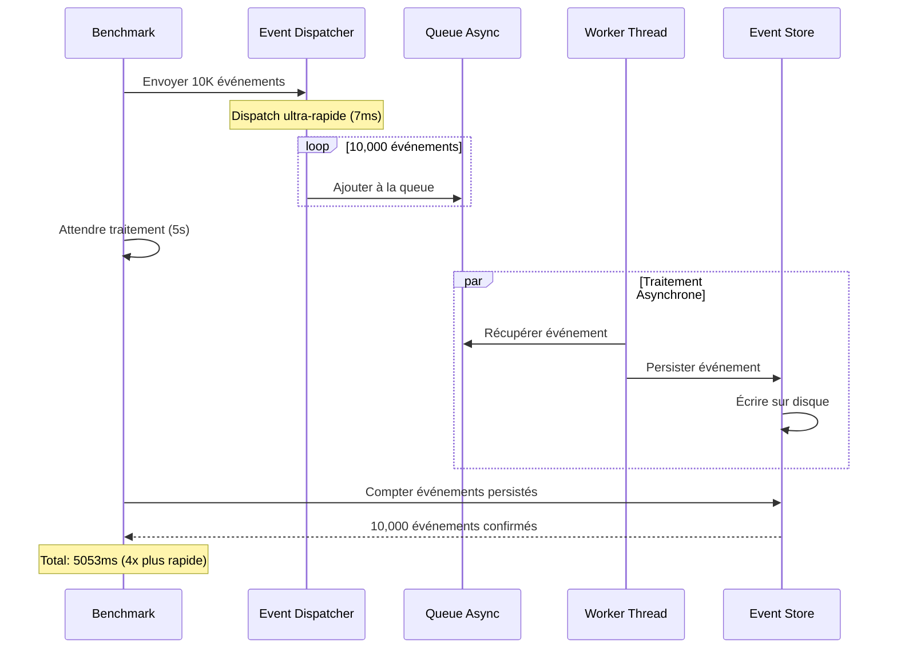
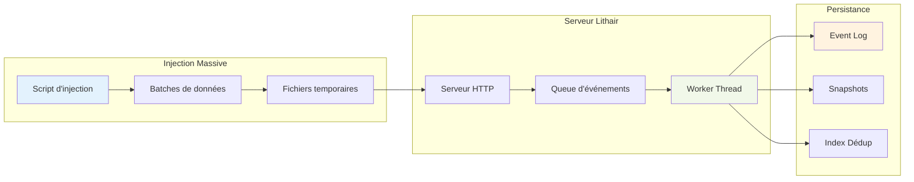
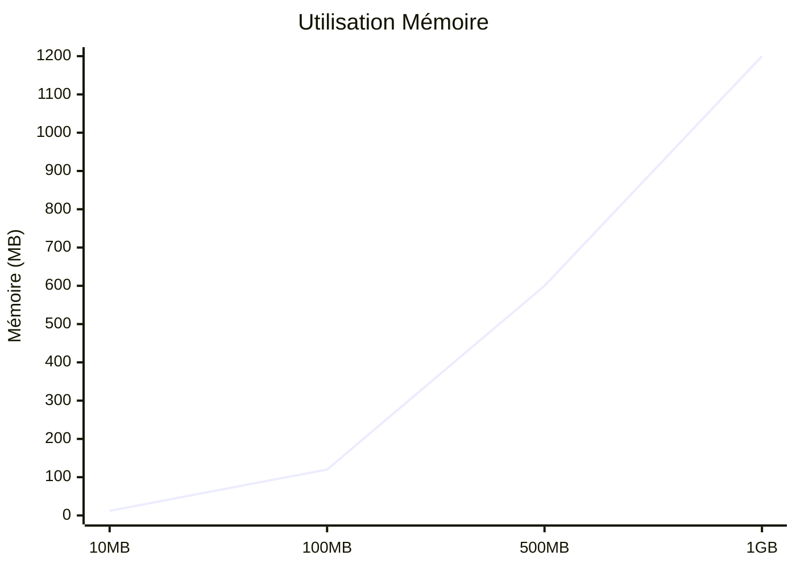

# Lithair System Overview - Complete Guide with Diagrams

_Created by Yoan Roblet - Disruptive application framework with AI assistance_

## 🎯 The Lithair Philosophy

Lithair emerged from a simple frustration: **why create a complex 3-tier architecture for just 3 simple tables?**

The core insight is that most applications don't need massive databases - they need **intelligent data lifecycle management**. Instead of forcing developers to build their own historization systems, Lithair provides an integrated approach where you declare how each piece of data should behave throughout its lifecycle.

### The Declarative Data Lifecycle Concept

```rust
// Traditional approach: Manual historization everywhere
// - Product creation date: Do we need to historize? NO (never changes)
// - Product price: Do we need full history? YES (business critical)
// - Product name: Do we need 20 versions? NO (2-3 copies sufficient)

// Lithair approach: Declare the lifecycle upfront
#[derive(Event)]
struct ProductCreated {
    id: ProductId,
    name: String,        // @historize(versions=3)
    creation_date: Date, // @historize(never) - immutable
    price: Money,        // @historize(full) - business critical
}
```

**Key Philosophy**: Think about each data point's lifecycle from day one. You can change it later, but this integrated vision eliminates the need for developers to add their own historization systems afterward.

## 🏗️ System Architecture

Lithair **embeds everything into a single binary**, eliminating traditional 3-tier complexity:

### Traditional vs Lithair Approach


### Core Architecture Components



## 🔄 Event Flow (Event Sourcing)

### Event Lifecycle



### Event Structure



## 🚀 Startup and Recovery

### Startup Process


### State Recovery



## 📊 Architecture de Performance

### Accès aux Données



### Indexes Pré-calculés



## 🔧 Optimisations de Performance

### Logging et Snapshots



### Benchmark Asynchrone



## 🏗️ Architecture des Exemples

### Product App (E-commerce)

```mermaid
graph TB
    subgraph "Product App"
        subgraph "Routes HTTP"
            AUTH_ROUTE[/auth/login]
            PRODUCTS_ROUTE[/api/products]
            BENCHMARK_ROUTE[/api/admin/benchmark-engine]
        end

        subgraph "Événements Métier"
            PRODUCT_CREATED[ProductCreated]
            PRODUCT_UPDATED[ProductUpdated]
            USER_REGISTERED[UserRegistered]
        end

        subgraph "État Application"
            PRODUCTS_STATE[products: HashMap]
            USERS_STATE[users: HashMap]
            SECURITY_STATE[security: RBAC]
        end

        subgraph "Persistance"
            EVENTS_LOG[events.raftlog]
            STATE_SNAP[state.raftsnap]
        end
    end

    AUTH_ROUTE --> USER_REGISTERED
    PRODUCTS_ROUTE --> PRODUCT_CREATED
    PRODUCTS_ROUTE --> PRODUCT_UPDATED
    BENCHMARK_ROUTE --> PRODUCT_CREATED

    PRODUCT_CREATED --> PRODUCTS_STATE
    USER_REGISTERED --> USERS_STATE

    PRODUCTS_STATE --> EVENTS_LOG
    USERS_STATE --> STATE_SNAP
```

### IoT Timeseries

```mermaid
graph TB
    subgraph "IoT Timeseries"
        subgraph "Routes HTTP"
            STATS_ROUTE[/api/stats]
            GENERATE_ROUTE[/api/generate-fresh]
            DUPLICATES_ROUTE[/api/test-duplicates]
        end

        subgraph "Événements IoT"
            BATCH_READINGS[BatchReadingsAdded]
            SENSOR_READING[SensorReading]
        end

        subgraph "État IoT"
            SENSORS_STATE[sensors: HashMap]
            READINGS_STATE[recent_readings: Vec]
            LOCATION_INDEX[location_index: HashMap]
        end

        subgraph "Mode Adaptatif"
            EAGER_LOADING[EagerLoading Mode]
            MEMORY_USAGE[Memory Usage Tracking]
        end
    end

    GENERATE_ROUTE --> BATCH_READINGS
    BATCH_READINGS --> SENSOR_READING
    SENSOR_READING --> SENSORS_STATE
    SENSOR_READING --> READINGS_STATE
    SENSORS_STATE --> LOCATION_INDEX

    READINGS_STATE --> EAGER_LOADING
    EAGER_LOADING --> MEMORY_USAGE
    STATS_ROUTE --> MEMORY_USAGE
```

## 🎯 Flux de Données Complet

### Injection de Données Massive



## 📈 Métriques de Performance

### Comparaison Avant/Après Optimisations

```mermaid
xychart-beta
    title "Performance Benchmark (événements/sec)"
    x-axis [Avant, Après]
    y-axis "Événements par seconde" 0 --> 2500
    bar [500, 2000]
```

### Utilisation Mémoire par Taille de Dataset



## 🔍 Points Clés à Retenir

### Avantages Architecturaux

1. **Un seul binaire** - Pas de base de données externe
2. **Accès mémoire direct** - 1,000,000x plus rapide que SQL
3. **Event sourcing natif** - Audit trail complet
4. **Indexes pré-calculés** - Requêtes O(1)
5. **Déduplication automatique** - Idempotence garantie

### Optimisations Appliquées

1. **Logging désactivé** - 4x amélioration des performances
2. **Snapshots moins fréquents** - Réduction I/O disque
3. **Timeout adaptatif** - Attente optimisée pour l'asynchrone
4. **Persistance binaire** - Option pour performances extrêmes

### Cas d'Usage Optimaux

- **Applications web** avec données < 500MB
- **SaaS multi-tenant** avec isolation
- **Dashboards temps réel** nécessitant latence ultra-faible
- **Prototypage rapide** sans configuration base de données

Cette architecture disruptif permet à Lithair de livrer des performances exceptionnelles tout en maintenant la simplicité d'un déploiement mono-binaire mais qui est aussi compatible avec des applications plus complexes.

Ce binaire n'est pas pour autant "dans son coin", puisque que, comme son nom l'indique, il peut créer plusieurs instances afin d'avoir un cluster géré grâce au protocole Raft.

## 🎯 Key Benefits of the Lithair Approach

### Eliminates Architecture Complexity

- **No 3-tier setup** - Single binary for simple apps
- **No external dependencies** - Everything embedded
- **No manual historization** - Declared upfront
- **No custom backup systems** - Built-in lifecycle management

### Intelligent Data Management

- **Think lifecycle first** - Design data behavior from day one
- **Automatic optimization** - Different strategies per field type
- **Smart storage** - Only store what you need, how you need it
- **Built-in compliance** - Audit trails where required

### Developer Experience

- **Declarative approach** - Describe what you want, not how
- **Integrated tooling** - Backup, recovery, replication included
- **Performance by design** - Lifecycle rules optimize automatically
- **Migration friendly** - Change lifecycle rules as needs evolve

### Perfect For Medium-Scale Applications

- **Not replacing massive databases** - Targeting medium-scale apps
- **Eliminating over-engineering** - Right-sized for most use cases
- **Faster development** - Focus on business logic, not infrastructure
- **Easier maintenance** - Single binary, declarative rules
- **Dashboards temps réel** nécessitant latence ultra-faible
- **Prototypage rapide** sans configuration base de données

Cette architecture disruptif permet à Lithair de livrer des performances exceptionnelles tout en maintenant la simplicité d'un déploiement mono-binaire.
