# Lithair System Overview - Complete Guide with Diagrams

_Created by Yoan Roblet - Disruptive application framework with AI assistance_

## The Lithair Philosophy

Lithair emerged from a simple frustration: **why create a complex 3-tier architecture for just 3 simple tables?**

The core insight is that most applications don't need massive databases - they need **intelligent data lifecycle management**. Instead of forcing developers to build their own historization systems, Lithair provides an integrated approach where you declare how each piece of data should behave throughout its lifecycle.

### The Declarative Data Lifecycle Concept

```rust
// Traditional approach: Manual historization everywhere
// - Product creation date: Do we need to historize? NO (never changes)
// - Product price: Do we need full history? YES (business critical)
// - Product name: Do we need 20 versions? NO (2-3 copies sufficient)

// Lithair approach: Declare the lifecycle upfront
#[derive(Event)]
struct ProductCreated {
    id: ProductId,
    name: String,        // @historize(versions=3)
    creation_date: Date, // @historize(never) - immutable
    price: Money,        // @historize(full) - business critical
}
```

**Key Philosophy**: Think about each data point's lifecycle from day one. You can change it later, but this integrated vision eliminates the need for developers to add their own historization systems afterward.

## System Architecture

Lithair **embeds everything into a single binary**, eliminating traditional 3-tier complexity:

### Traditional vs Lithair Approach

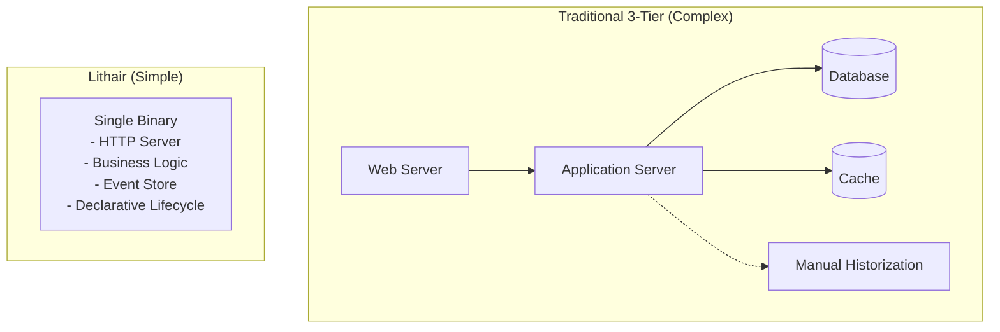

### Core Architecture Components

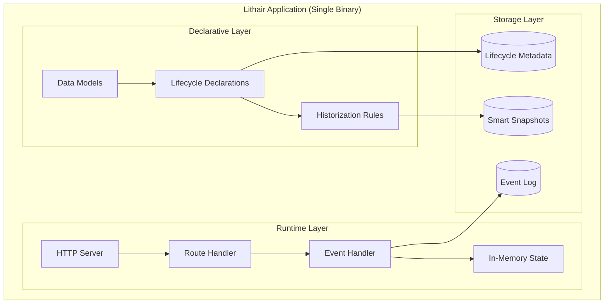

## Event Flow (Event Sourcing)

### Event Lifecycle

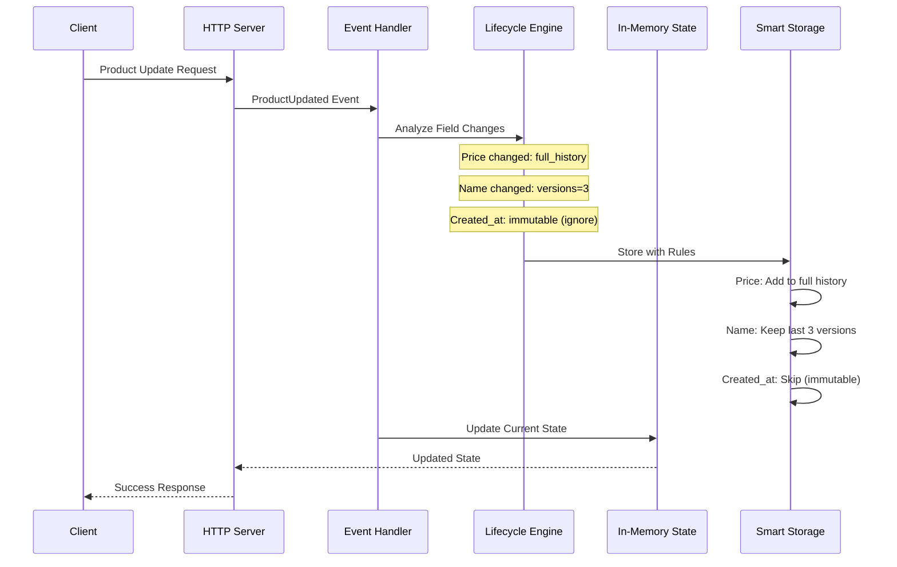

### Event Structure

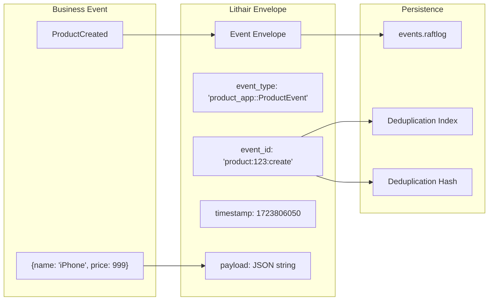

## Startup and Recovery

### Startup Process

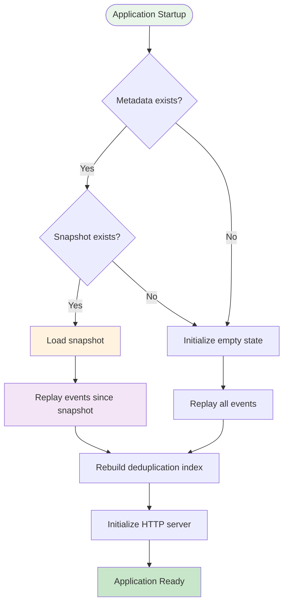

### State Recovery

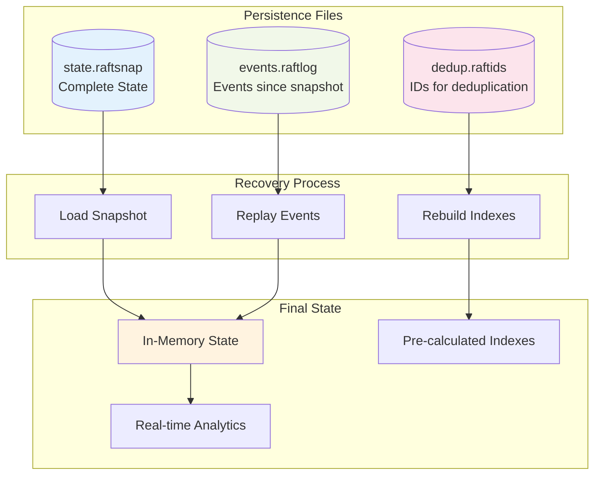

## Performance Architecture

### Data Access

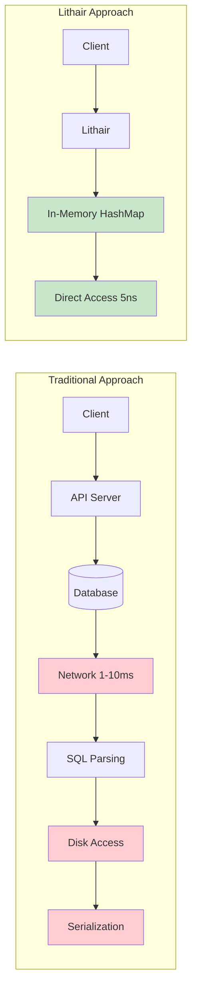

### Pre-calculated Indexes

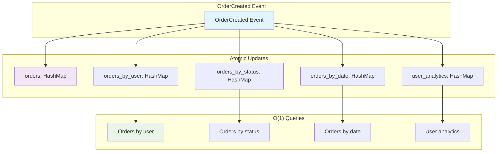

## Performance Optimizations

### Logging and Snapshots

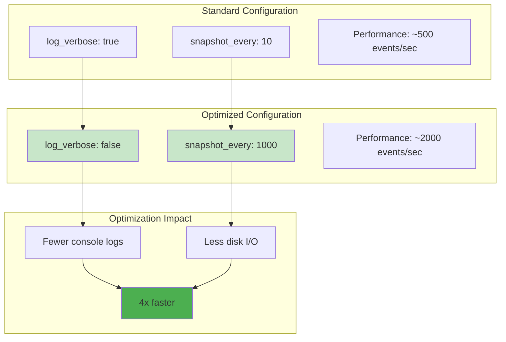

### Async Benchmark

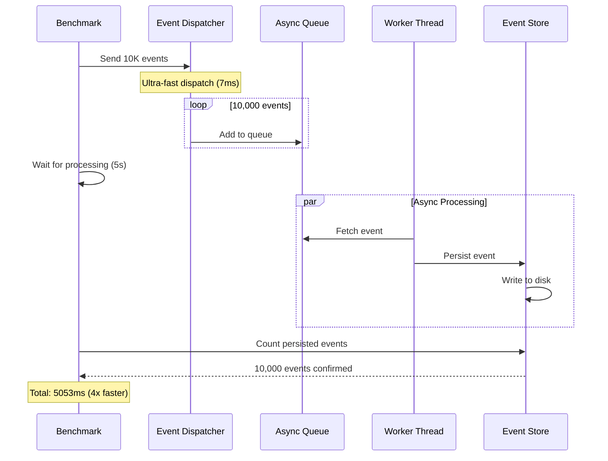

## Example Architectures

### Product App (E-commerce)

```mermaid
graph TB
    subgraph "Product App"
        subgraph "HTTP Routes"
            AUTH_ROUTE[/auth/login]
            PRODUCTS_ROUTE[/api/products]
            BENCHMARK_ROUTE[/api/admin/benchmark-engine]
        end

        subgraph "Business Events"
            PRODUCT_CREATED[ProductCreated]
            PRODUCT_UPDATED[ProductUpdated]
            USER_REGISTERED[UserRegistered]
        end

        subgraph "Application State"
            PRODUCTS_STATE[products: HashMap]
            USELT_STATE[users: HashMap]
            SECURITY_STATE[security: RBAC]
        end

        subgraph "Persistence"
            EVENTS_LOG[events.raftlog]
            STATE_SNAP[state.raftsnap]
        end
    end

    AUTH_ROUTE --> USER_REGISTERED
    PRODUCTS_ROUTE --> PRODUCT_CREATED
    PRODUCTS_ROUTE --> PRODUCT_UPDATED
    BENCHMARK_ROUTE --> PRODUCT_CREATED

    PRODUCT_CREATED --> PRODUCTS_STATE
    USER_REGISTERED --> USELT_STATE

    PRODUCTS_STATE --> EVENTS_LOG
    USELT_STATE --> STATE_SNAP
```

### IoT Timeseries

```mermaid
graph TB
    subgraph "IoT Timeseries"
        subgraph "HTTP Routes"
            STATS_ROUTE[/api/stats]
            GENERATE_ROUTE[/api/generate-fresh]
            DUPLICATES_ROUTE[/api/test-duplicates]
        end

        subgraph "IoT Events"
            BATCH_READINGS[BatchReadingsAdded]
            SENSOR_READING[SensorReading]
        end

        subgraph "IoT State"
            SENSOLT_STATE[sensors: HashMap]
            READINGS_STATE[recent_readings: Vec]
            LOCATION_INDEX[location_index: HashMap]
        end

        subgraph "Adaptive Mode"
            EAGER_LOADING[EagerLoading Mode]
            MEMORY_USAGE[Memory Usage Tracking]
        end
    end

    GENERATE_ROUTE --> BATCH_READINGS
    BATCH_READINGS --> SENSOR_READING
    SENSOR_READING --> SENSOLT_STATE
    SENSOR_READING --> READINGS_STATE
    SENSOLT_STATE --> LOCATION_INDEX

    READINGS_STATE --> EAGER_LOADING
    EAGER_LOADING --> MEMORY_USAGE
    STATS_ROUTE --> MEMORY_USAGE
```

## Complete Data Flow

### Massive Data Injection

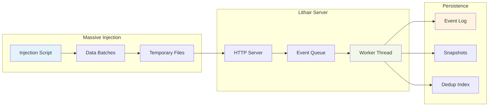

## Performance Metrics

### Before/After Optimization Comparison

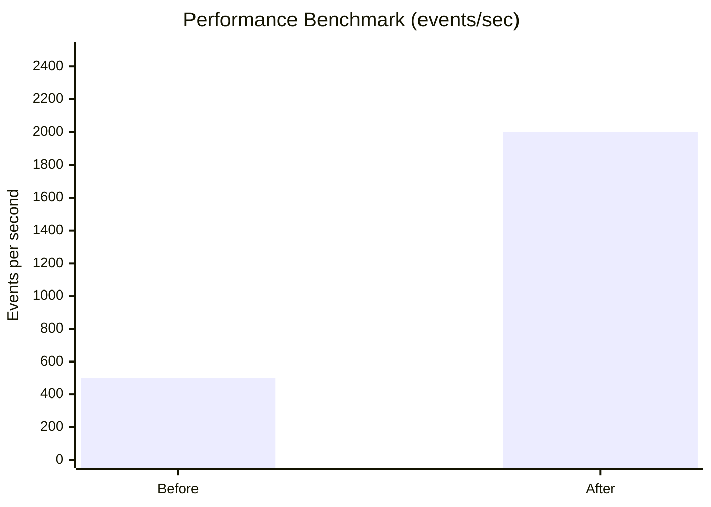

### Memory Usage by Dataset Size


## Key Takeaways

### Architectural Advantages

1. **Single binary** - No external database
2. **Direct memory access** - 1,000,000x faster than SQL
3. **Native event sourcing** - Complete audit trail
4. **Pre-calculated indexes** - O(1) queries
5. **Automatic deduplication** - Guaranteed idempotence

### Applied Optimizations

1. **Logging disabled** - 4x performance improvement
2. **Less frequent snapshots** - Reduced disk I/O
3. **Adaptive timeout** - Optimized async waiting
4. **Binary persistence** - Option for extreme performance

### Optimal Use Cases

- **Web applications** with data < 500MB
- **Multi-tenant SaaS** with isolation
- **Real-time dashboards** requiring ultra-low latency
- **Rapid prototyping** without database configuration

## Key Benefits of the Lithair Approach

### Eliminates Architecture Complexity

- **No 3-tier setup** - Single binary for simple apps
- **No external dependencies** - Everything embedded
- **No manual historization** - Declared upfront
- **No custom backup systems** - Built-in lifecycle management

### Intelligent Data Management

- **Think lifecycle first** - Design data behavior from day one
- **Automatic optimization** - Different strategies per field type
- **Smart storage** - Only store what you need, how you need it
- **Built-in compliance** - Audit trails where required

### Developer Experience

- **Declarative approach** - Describe what you want, not how
- **Integrated tooling** - Backup, recovery, replication included
- **Performance by design** - Lifecycle rules optimize automatically
- **Migration friendly** - Change lifecycle rules as needs evolve

### Perfect For Medium-Scale Applications

- **Not replacing massive databases** - Targeting medium-scale apps
- **Eliminating over-engineering** - Right-sized for most use cases
- **Faster development** - Focus on business logic, not infrastructure
- **Easier maintenance** - Single binary, declarative rules

This disruptive architecture allows Lithair to deliver exceptional performance while maintaining the simplicity of a single-binary deployment.

The binary is not isolated - as the name suggests, it can create multiple instances to form a cluster managed via the Raft consensus protocol.
