# Diagrammes Lithair

Collection complète de tous les diagrammes Mermaid utilisés dans la documentation Lithair, organisés par catégorie et cas d'usage.

## 🏗️ Architecture Générale

### Vue d'Ensemble du Système

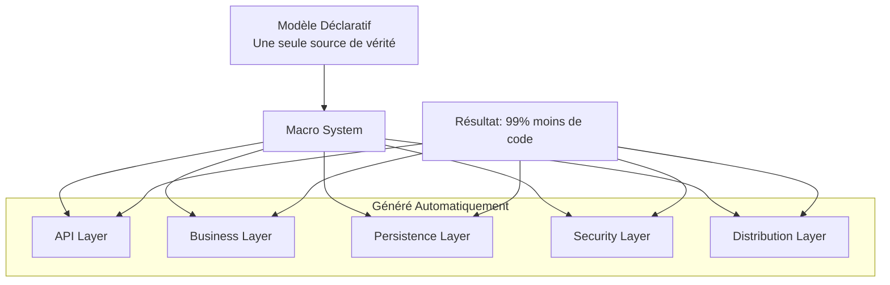

### Architecture en Couches

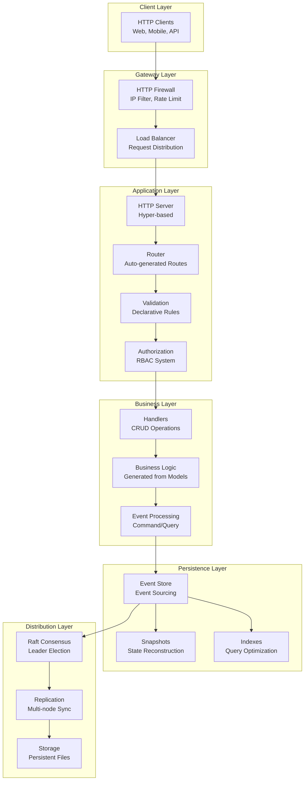

## 🔄 Flux de Données

### Cycle de Vie d'une Requête HTTP

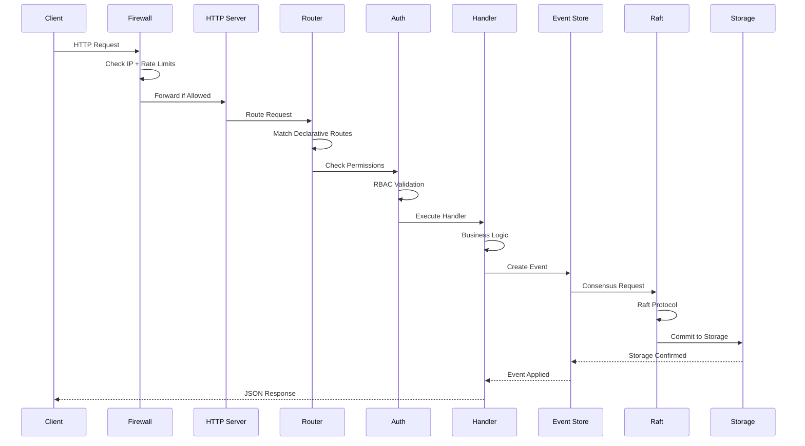

### Flux Event Sourcing

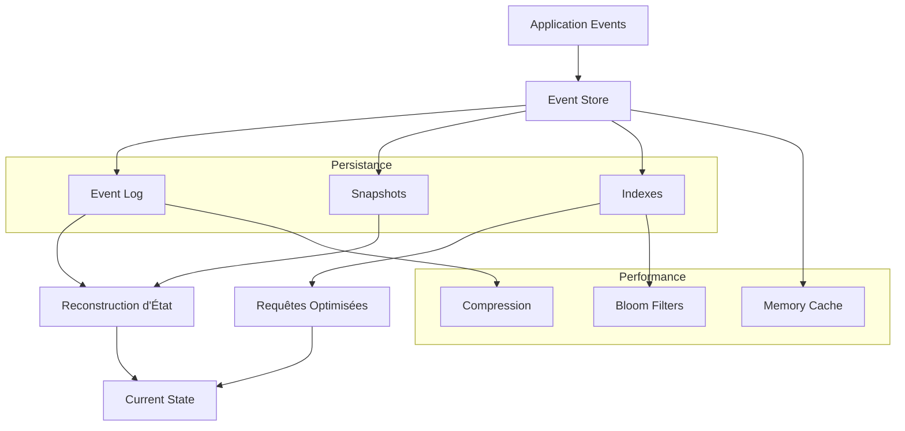

## 🛡️ Module HTTP Firewall

### Flux de Protection

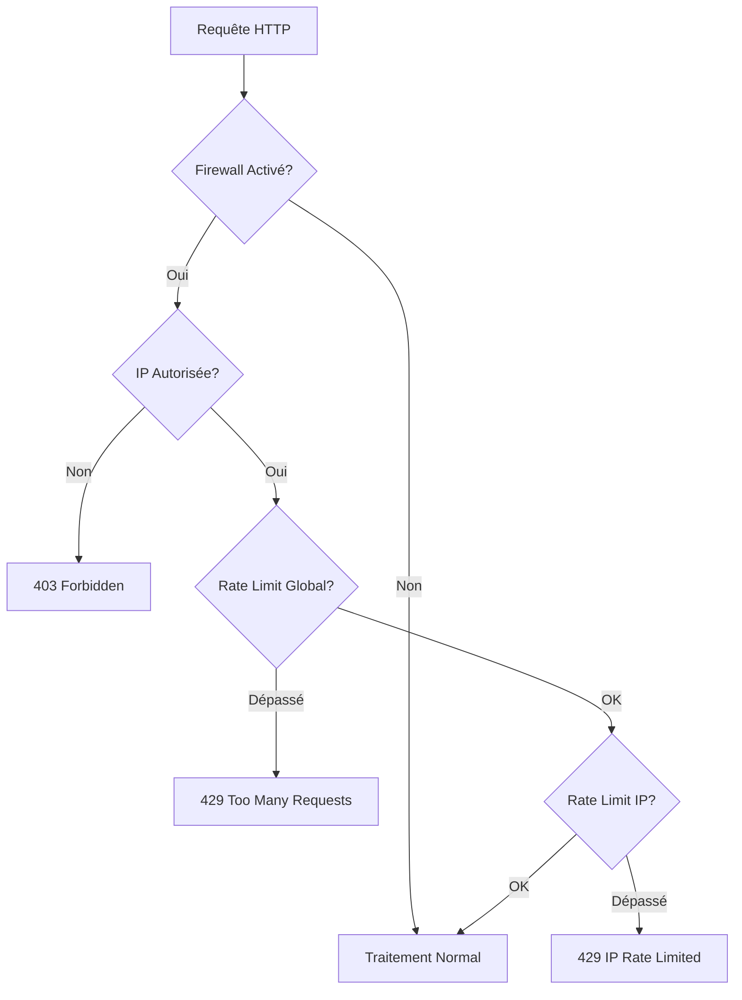

## ⚖️ Consensus Raft

### États des Nœuds

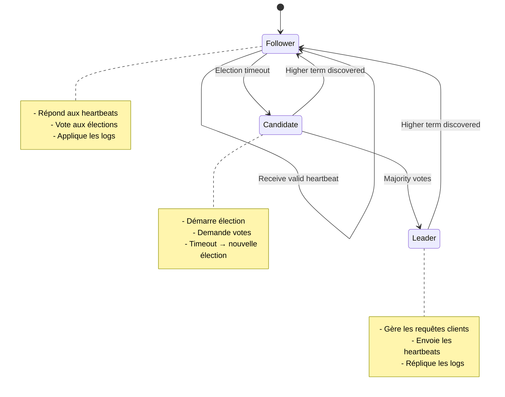

### Flux de Réplication

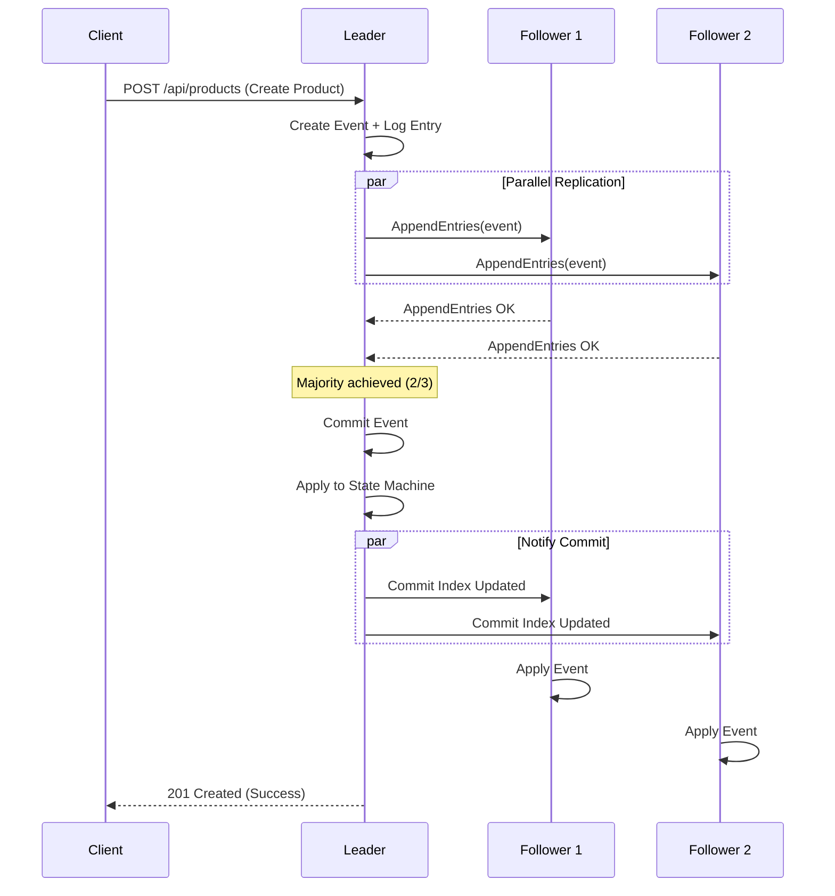

### Cluster Multi-Nœuds

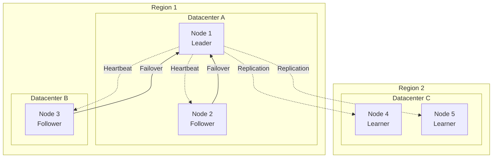

## 📊 Stockage et Persistance

### Architecture Event Store

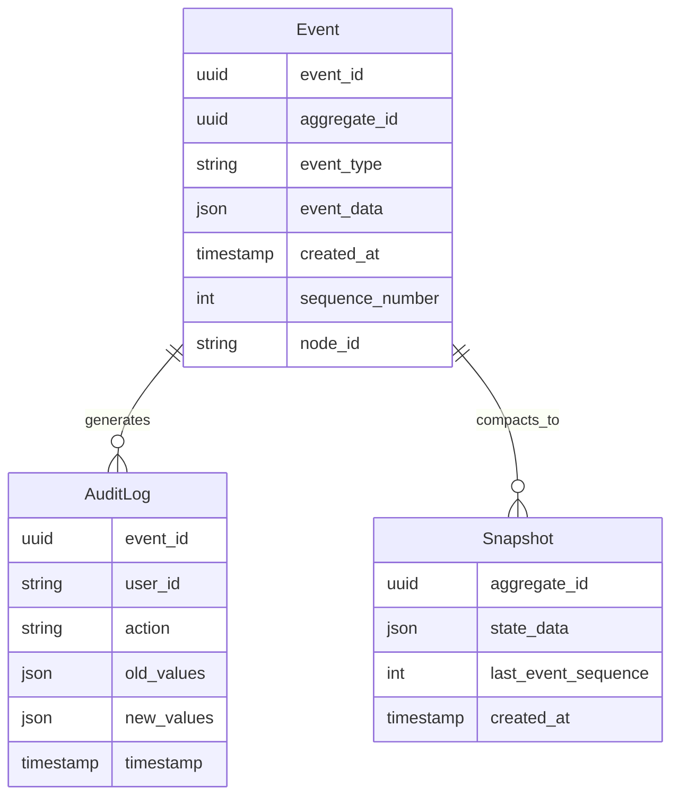

### Cycle de Vie des Données

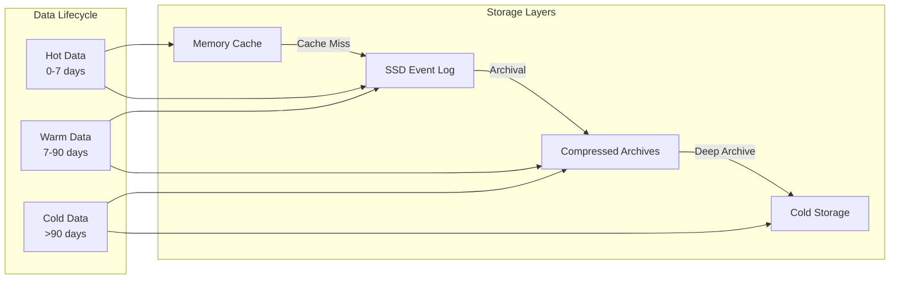

### Patterns CQRS

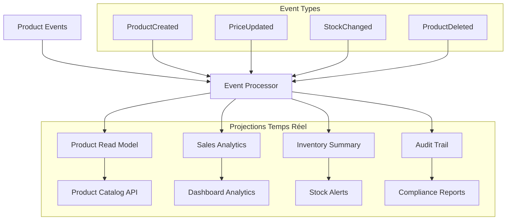

## 🧠 Modèles Déclaratifs

### Transformation Data-First

```mermaid
mindmap
  root((Lithair<br/>Data-First))
    (Une Struct)
      [Attributs Déclaratifs]
        #[db(...)]
        #[http(...)]
        #[permission(...)]
        #[lifecycle(...)]
        #[persistence(...)]
    (Génération Automatique)
      [API REST]
        GET/POST/PUT/DELETE
        Validation automatique
        Sérialisation JSON
      [Base de Données]
        Schémas automatiques
        Migrations
        Indexes optimisés
      [Sécurité]
        RBAC granulaire
        Firewall IP
        Rate limiting
      [Distribution]
        Event Sourcing
        Consensus Raft
        Réplication multi-nœuds
```

## 🔐 Architecture Sécurisée

### Defense in Depth

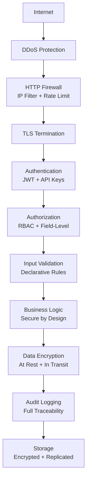

## ⚡ Optimisations Performance

### Stack d'Optimisations

```mermaid
flowchart LR
    subgraph "Memory Optimizations"
        A[Zero-Copy Serialization]
        B[Memory Pool Allocation]
        C[Lazy Loading]
    end
    
    subgraph "I/O Optimizations"
        D[Async I/O (Tokio)]
        E[Batch Operations]
        F[Connection Pooling]
    end
    
    subgraph "Storage Optimizations"
        G[Event Compaction]
        H[Compression (ZSTD)]
        I[Bloom Filters]
    end
    
    subgraph "Network Optimizations"
        J[Pipeline Replication]
        K[Request Batching]
        L[Keep-Alive Connections]
    end
    
    A --> D
    B --> E
    C --> F
    D --> G
    E --> H
    F --> I
    G --> J
    H --> K
    I --> L
```

### Métriques de Latence

```mermaid
gantt
    title Latence Typique d'une Requête POST
    dateFormat X
    axisFormat %L ms
    
    section HTTP Layer
    Request Parsing    :0, 0.1
    Firewall Check     :0.1, 0.2
    Routing           :0.2, 0.3
    
    section Application
    Validation        :0.3, 0.5
    Permissions      :0.5, 0.7
    Handler Logic    :0.7, 1.0
    
    section Persistence  
    Event Creation   :1.0, 1.2
    Raft Consensus   :1.2, 2.8
    Local Storage    :2.8, 3.0
    
    section Response
    Serialization    :3.0, 3.2
    HTTP Response    :3.2, 3.5
```

## 📈 Scalabilité

### Scaling Horizontal

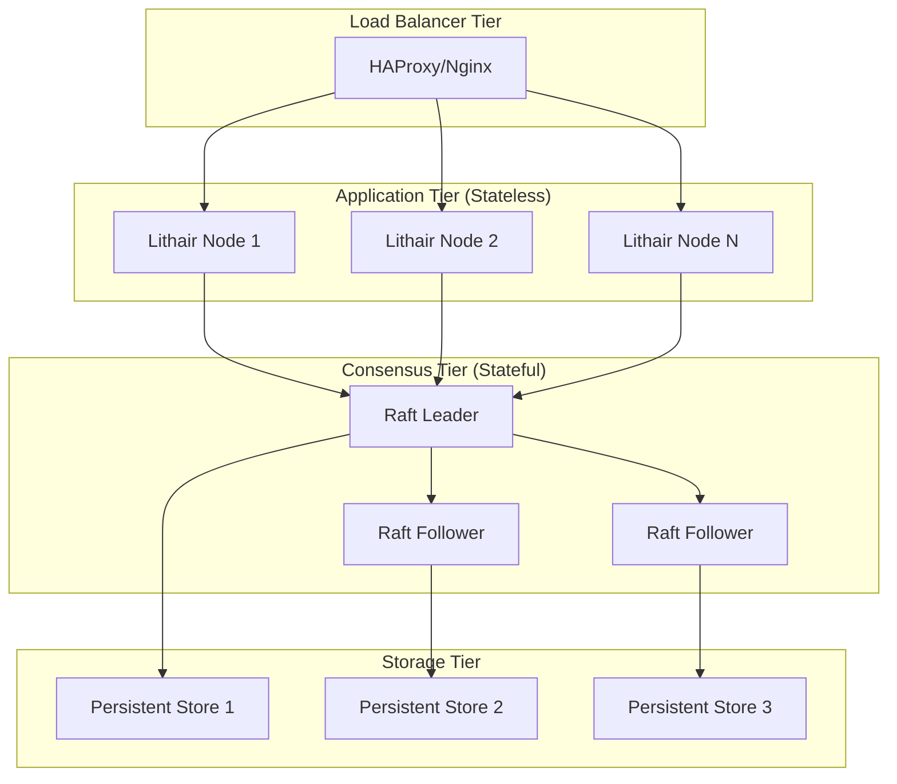

## 🧪 Architecture de Test

### Stratégie de Tests

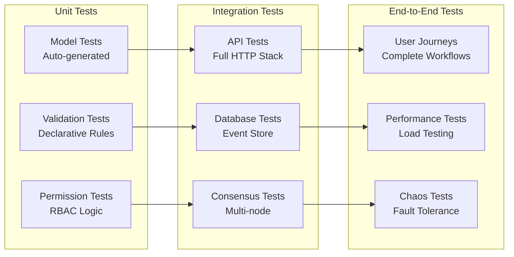

## 🗺️ Évolution Temporelle

### Roadmap Architecture

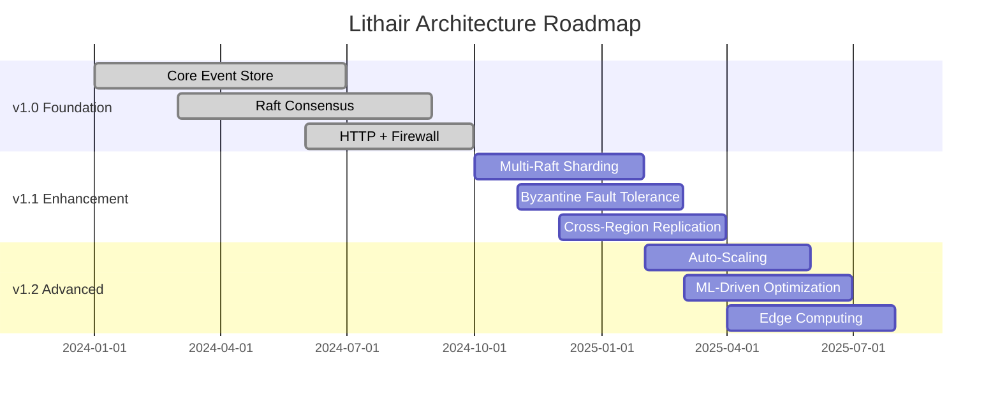

### Evolution d'un Product

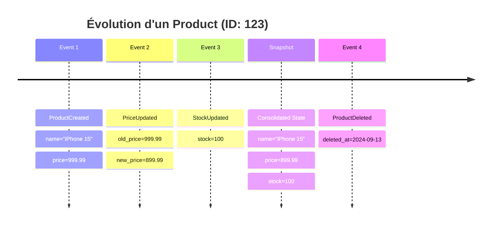

## 📊 Métriques et Monitoring

### Distribution du Stockage

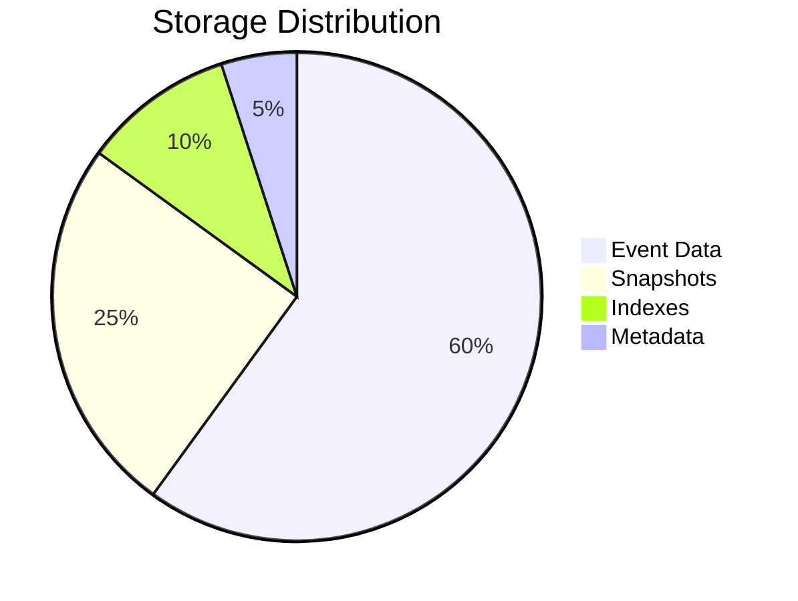

### Analyse Temporelle des Events

```mermaid
gantt
    title Analyse Temporelle des Events
    dateFormat YYYY-MM-DD
    axisFormat %m/%d
    
    section Product Lifecycle
    Created        :milestone, created, 2024-01-01, 0d
    Price Updates  :price-updates, 2024-01-01, 2024-12-31
    Stock Changes  :stock-changes, 2024-01-01, 2024-12-31
    Discontinued   :milestone, discontinued, 2024-10-15, 0d
    
    section Analytics Windows
    Daily Metrics  :daily, 2024-01-01, 2024-12-31
    Weekly Reports :weekly, 2024-01-01, 2024-12-31
    Monthly Summary:monthly, 2024-01-01, 2024-12-31
```

## 🎯 Trade-offs Architecturaux

### Équilibres de Conception

```mermaid
graph LR
    A[Consistency] <--> B[Availability]
    B <--> C[Partition Tolerance]
    C <--> A
    
    D[Development Speed] <--> E[Runtime Performance]
    E <--> F[Resource Usage]
    F <--> D
    
    G[Type Safety] <--> H[Flexibility]
    H <--> I[Learning Curve]
    I <--> G
    
    subgraph "Lithair Choices"
        J[Strong Consistency ✓]
        K[High Availability ✓]
        L[Fast Development ✓]
        M[Type Safety ✓]
    end
```

---

**💡 Usage :** Ces diagrammes peuvent être copiés directement dans des documents Markdown avec support Mermaid ou utilisés dans des outils comme GitHub, GitLab, ou Notion.