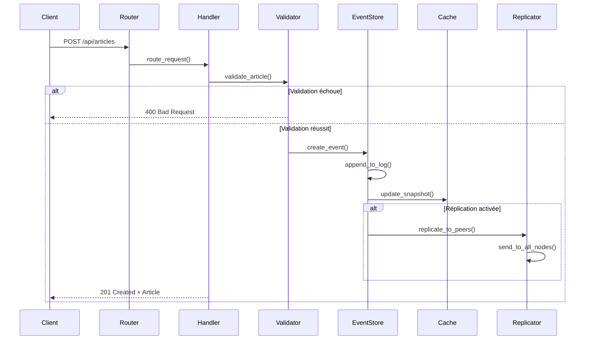
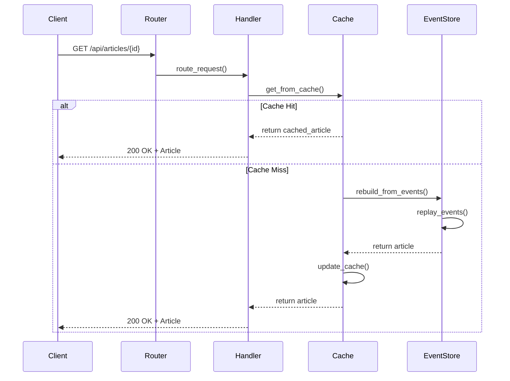
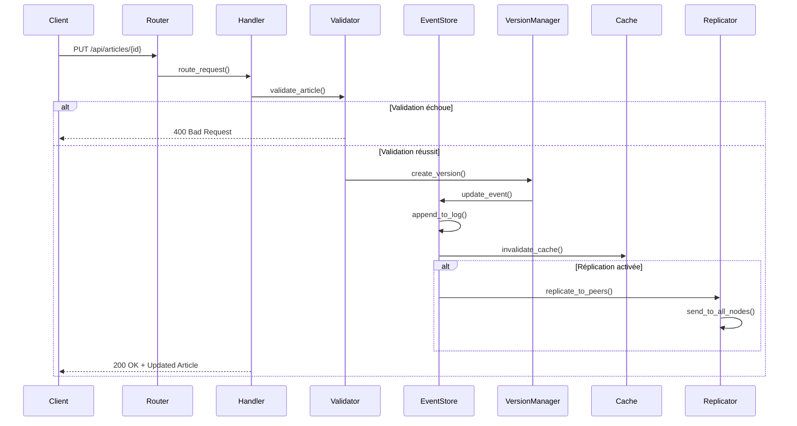
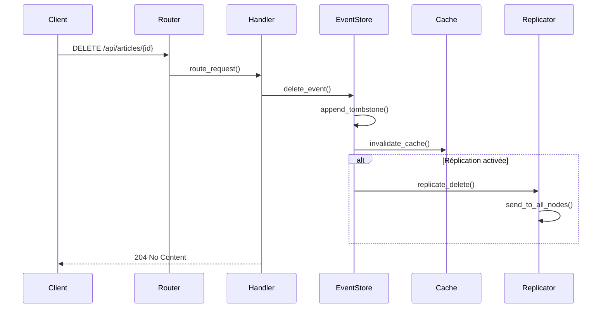

# Diagrammes de Séquence - Opérations CRUD

Cette documentation montre les flux d'exécution pour chaque opération CRUD, générés automatiquement à partir de l'architecture Lithair.

## CREATE - Création d'un Article

### Étapes clés
1. **Validation**: Vérification automatique des contraintes déclaratives
2. **Event Sourcing**: Ajout de l'événement au log d'événements
3. **Cache**: Mise à jour du snapshot en mémoire
4. **Réplication**: Distribution aux nœuds du cluster (si activée)

---

## READ - Lecture d'un Article

### Optimisations
- **Cache First**: Recherche d'abord dans le cache mémoire
- **Event Replay**: Reconstruction depuis les événements si cache miss
- **Zero-Copy**: Pas de copie inutile des données

---

## UPDATE - Modification d'un Article

### Fonctionnalités
- **Versioning**: Conservation des N dernières versions (configurable)
- **Audit Trail**: Enregistrement automatique de toutes les modifications
- **Cache Invalidation**: Mise à jour intelligente du cache
- **Réplication**: Propagation aux autres nœuds

---

## DELETE - Suppression d'un Article

### Caractéristiques
- **Soft Delete**: Utilisation de tombstones dans l'event log
- **Cache Cleanup**: Invalidation immédiate du cache
- **Réplication**: Propagation de la suppression

---

## Notes Techniques

### Event Sourcing
Toutes les opérations sont enregistrées comme des événements immuables :
- **CREATE**: `ArticleCreated { id, data, timestamp }`
- **UPDATE**: `ArticleUpdated { id, changes, version, timestamp }`
- **DELETE**: `ArticleDeleted { id, timestamp }`

### Performance
- **Latence moyenne**: < 5ms pour les opérations en cache
- **Throughput**: > 10,000 req/s sur un seul nœud
- **Réplication**: Async pour ne pas bloquer les écritures

### Consistance
- **Strong Consistency**: Lectures et écritures sur le même nœud
- **Eventual Consistency**: Réplication entre nœuds
- **Conflict Resolution**: Last-Write-Wins avec timestamps
