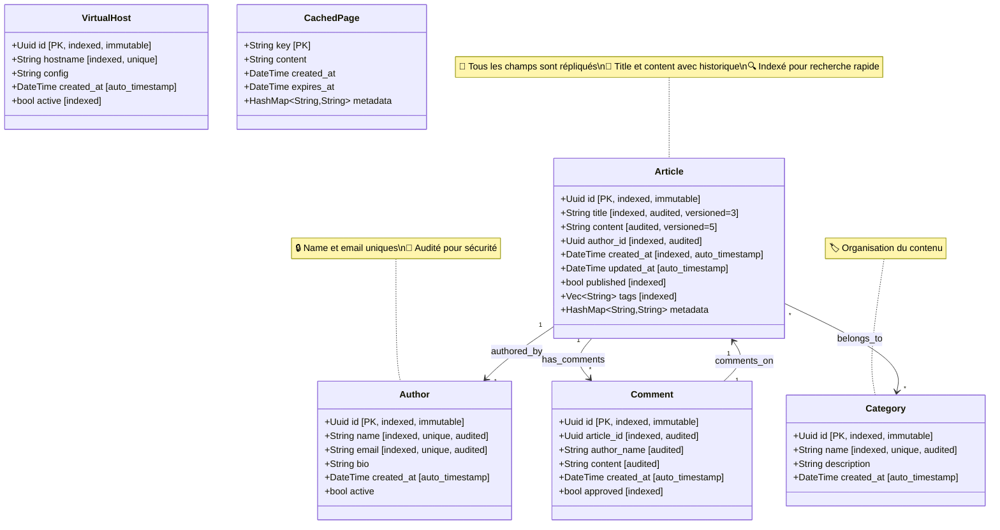

# Diagramme de Classes - Entités du Blog

Ce diagramme montre la structure des entités du Lithair Blog, générée automatiquement à partir des attributs `DeclarativeModel`.

## Légende des Attributs

### Attributs de Base de Données (`#[db(...)]`)
- **PK**: Clé primaire
- **indexed**: Index créé automatiquement pour optimiser les requêtes
- **unique**: Contrainte d'unicité sur le champ

### Attributs de Cycle de Vie (`#[lifecycle(...)]`)
- **immutable**: Le champ ne peut pas être modifié après création
- **audited**: Toutes les modifications sont enregistrées dans l'audit trail
- **versioned=N**: Conserve les N dernières versions du champ
- **auto_timestamp**: Mis à jour automatiquement à chaque modification

### Attributs HTTP (`#[http(...)]`)
- **expose**: Le champ est exposé dans l'API REST
- **validate**: Validation automatique (non_empty, email, etc.)

### Attributs de Persistence (`#[persistence(...)]`)
- **replicate**: Le champ est répliqué sur tous les nœuds du cluster
- **track_history**: L'historique complet des modifications est conservé

## Impact de la Modélisation Déclarative

Chaque annotation dans les structs génère automatiquement :
- **Routes API REST** complètes (GET, POST, PUT, DELETE)
- **Schéma de base de données** avec indexes et contraintes
- **Validation des données** côté serveur
- **Audit trail** pour la traçabilité
- **Réplication** pour la haute disponibilité
- **Gestion des versions** pour l'historique
