# Diagramme de Classes - Entités du Blog

Ce diagramme montre la structure des entités du Lithair Blog, générée automatiquement à partir des attributs `DeclarativeModel`.

```mermaid
classDiagram
    %% Lithair Blog - Entity Class Diagram
    %% Auto-generated from DeclarativeModel structs

    class Article {
        +Uuid id [PK, indexed, immutable]
        +String title [indexed, audited, versioned=3]
        +String content [audited, versioned=5]
        +Uuid author_id [indexed, audited]
        +DateTime created_at [indexed, auto_timestamp]
        +DateTime updated_at [auto_timestamp]
        +bool published [indexed]
        +Vec~String~ tags [indexed]
        +HashMap~String,String~ metadata
    }

    class Author {
        +Uuid id [PK, indexed, immutable]
        +String name [indexed, unique, audited]
        +String email [indexed, unique, audited]
        +String bio
        +DateTime created_at [auto_timestamp]
        +bool active
    }

    class Category {
        +Uuid id [PK, indexed, immutable]
        +String name [indexed, unique, audited]
        +String description
        +DateTime created_at [auto_timestamp]
    }

    class Comment {
        +Uuid id [PK, indexed, immutable]
        +Uuid article_id [indexed, audited]
        +String author_name [audited]
        +String content [audited]
        +DateTime created_at [auto_timestamp]
        +bool approved [indexed]
    }

    class VirtualHost {
        +Uuid id [PK, indexed, immutable]
        +String hostname [indexed, unique]
        +String config
        +DateTime created_at [auto_timestamp]
        +bool active [indexed]
    }

    class CachedPage {
        +String key [PK]
        +String content
        +DateTime created_at
        +DateTime expires_at
        +HashMap~String,String~ metadata
    }

    %% Relations entre entités
    Article "1" --> "1" Author : authored_by
    Article "1" --> "*" Comment : has_comments
    Article "*" --> "*" Category : belongs_to
    Comment "1" --> "1" Article : comments_on

    %% Notes sur les attributs déclaratifs
    note for Article "🔄 Tous les champs sont répliqués\n📝 Title et content avec historique\n🔍 Indexé pour recherche rapide"
    note for Author "🔒 Name et email uniques\n📝 Audité pour sécurité"
    note for Category "🏷️ Organisation du contenu"
```

## Légende des Attributs

### Attributs de Base de Données (`#[db(...)]`)
- **PK**: Clé primaire
- **indexed**: Index créé automatiquement pour optimiser les requêtes
- **unique**: Contrainte d'unicité sur le champ

### Attributs de Cycle de Vie (`#[lifecycle(...)]`)
- **immutable**: Le champ ne peut pas être modifié après création
- **audited**: Toutes les modifications sont enregistrées dans l'audit trail
- **versioned=N**: Conserve les N dernières versions du champ
- **auto_timestamp**: Mis à jour automatiquement à chaque modification

### Attributs HTTP (`#[http(...)]`)
- **expose**: Le champ est exposé dans l'API REST
- **validate**: Validation automatique (non_empty, email, etc.)

### Attributs de Persistence (`#[persistence(...)]`)
- **replicate**: Le champ est répliqué sur tous les nœuds du cluster
- **track_history**: L'historique complet des modifications est conservé

## Impact de la Modélisation Déclarative

Chaque annotation dans les structs génère automatiquement :
- **Routes API REST** complètes (GET, POST, PUT, DELETE)
- **Schéma de base de données** avec indexes et contraintes
- **Validation des données** côté serveur
- **Audit trail** pour la traçabilité
- **Réplication** pour la haute disponibilité
- **Gestion des versions** pour l'historique
