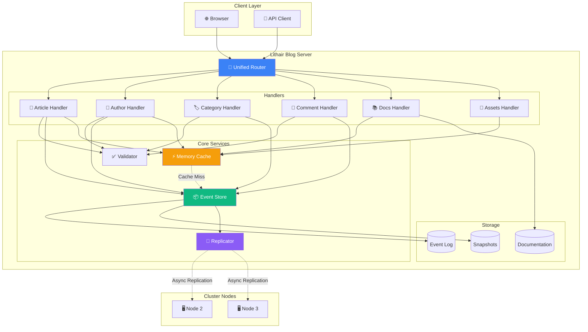

# Architecture Globale - Lithair Blog

Ce diagramme montre l'architecture complète du système Lithair Blog.

## Composants Principaux

### Client Layer
- **Browser**: Interface web HTML/CSS/JS servie par le serveur
- **API Client**: Applications externes utilisant l'API REST

### Lithair Blog Server

#### Router (Unified)
- Point d'entrée unique pour toutes les requêtes
- Routage automatique basé sur les chemins
- Un seul serveur, un seul port

#### Handlers
Générés automatiquement depuis les `DeclarativeModel` :
- **Article Handler**: CRUD pour les articles
- **Author Handler**: Gestion des auteurs
- **Category Handler**: Organisation du contenu
- **Comment Handler**: Système de commentaires
- **Docs Handler**: Documentation avec cache
- **Assets Handler**: Frontend assets (CSS/JS/images)

#### Core Services
- **Validator**: Validation déclarative des données
- **Event Store**: Persistence event-sourced
- **Memory Cache**: Cache haute performance
- **Replicator**: Distribution aux nœuds du cluster

#### Storage
- **Event Log**: Journal immuable des événements
- **Snapshots**: États consolidés pour performance
- **Documentation**: Markdown + Mermaid diagrams

### Cluster Nodes
- Réplication asynchrone pour haute disponibilité
- Chaque nœud peut servir les lectures
- Leader election pour les écritures

## Flux de Données

1. **Requête entrante** → Router analyse le chemin
2. **Dispatch** → Handler approprié selon l'entité
3. **Validation** → Vérification des contraintes déclaratives
4. **Persistence** → Event Store + Cache update
5. **Réplication** → Distribution async aux peers
6. **Réponse** → Retour au client avec données

## Caractéristiques

### Performance
- **Cache-First**: Lectures ultra-rapides depuis la mémoire
- **Zero-Copy**: Minimisation des allocations
- **Async I/O**: Non-blocking pour haute concurrence

### Scalabilité
- **Horizontal**: Ajout de nœuds pour plus de throughput
- **Vertical**: Optimisé pour utiliser tous les CPU cores

### Résilience
- **Event Sourcing**: Reconstruction possible depuis les événements
- **Snapshots**: Recovery rapide
- **Replication**: Tolérance aux pannes

### Simplicité
- **Déclaratif**: Configuration par annotations
- **Auto-Generated**: APIs et handlers générés automatiquement
- **Un seul serveur**: Pas de microservices complexes
