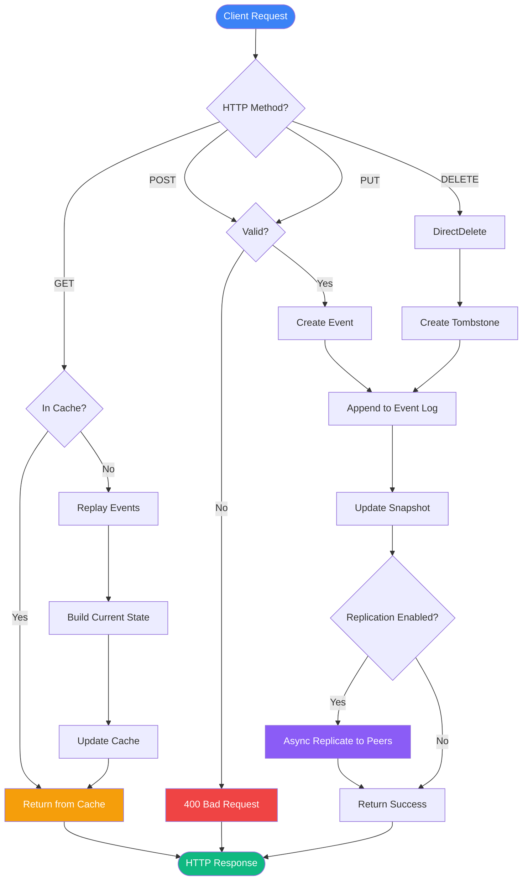

# Flux de Données - Lithair Blog

Ce diagramme montre le flux de traitement des données pour chaque type de requête HTTP.

## Description des Flux

### Flux de Lecture (GET)
1. **Cache Check**: Vérification dans le cache mémoire
2. **Cache Hit**: Retour immédiat si trouvé (< 1ms)
3. **Cache Miss**: Reconstruction depuis l'event log
4. **Event Replay**: Rejeu de tous les événements pour l'entité
5. **Build State**: Construction de l'état actuel
6. **Update Cache**: Mise en cache pour les prochaines lectures

### Flux d'Écriture (POST/PUT)
1. **Validation**: Vérification des contraintes déclaratives
2. **Create Event**: Création de l'événement immuable
3. **Append Log**: Ajout au journal d'événements
4. **Update Snapshot**: Mise à jour du snapshot en mémoire
5. **Async Replicate**: Distribution aux nœuds du cluster (non-bloquant)
6. **Success**: Retour au client

### Flux de Suppression (DELETE)
1. **Create Tombstone**: Création d'un marqueur de suppression
2. **Append Log**: Ajout au journal (soft delete)
3. **Update Snapshot**: Invalidation du cache
4. **Async Replicate**: Propagation aux peers
5. **Success**: Confirmation de suppression

## Optimisations

### Performance
- **Cache-First Strategy**: Priorité au cache pour les lectures
- **Zero-Copy Event Replay**: Pas d'allocation inutile
- **Async Replication**: Écritures non-bloquantes
- **Batch Events**: Groupement des événements similaires

### Consistance
- **Append-Only Log**: Journal immuable garantissant l'ordre
- **Snapshot Consistency**: État toujours cohérent avec les événements
- **Eventual Consistency**: Réplication async avec convergence garantie

### Scalabilité
- **Read Scalability**: Cache distribué sur tous les nœuds
- **Write Scalability**: Leader election pour coordonner les écritures
- **Storage Scalability**: Event log compressé et nettoyé périodiquement

## Patterns Utilisés

### Event Sourcing
- Tous les changements sont des événements immuables
- Reconstruction de l'état possible à tout moment
- Audit trail complet et automatique

### CQRS (Command Query Responsibility Segregation)
- Séparation lectures (cache) / écritures (event log)
- Optimisation indépendante de chaque côté

### Cache-Aside Pattern
- Application gère le cache
- Cache miss déclenche le chargement depuis la source
- Invalidation explicite lors des écritures
