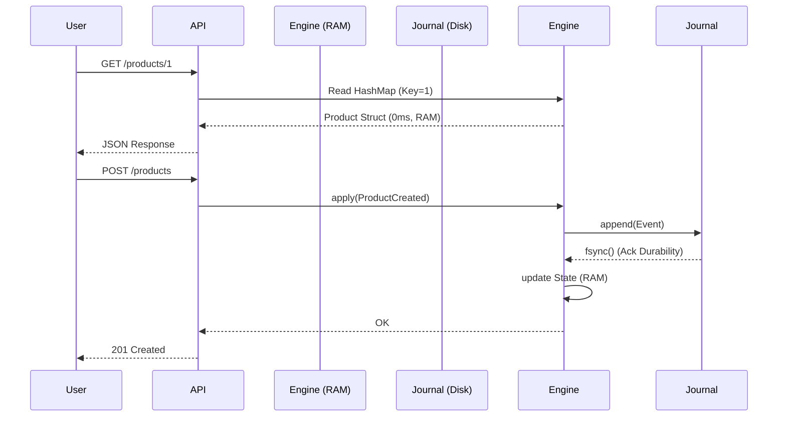

# 📚 Lithair Storage Engine: Architecture & Internals

This document details the storage architecture of Lithair, a "Memory-First" hybrid engine designed for extreme performance while guaranteeing data durability.

## 1. Philosophy: The "Memory Image" Pattern

Unlike traditional databases (PostgreSQL, MySQL) that read and write to disk (B-Trees), Lithair operates on the **System Prevayler** (or Memory Image) principle:

1.  **State is in RAM**: The entire database resides in random access memory. Reads are instantaneous (nanoseconds).
2.  **Disk is a Log**: Only mutations (events) are written to disk, sequentially.
3.  **Restart is a Replay**: On startup, the system re-reads the event log to reconstruct the in-memory state.



## 2. The Global Log (`events.raftlog`)

This is the single source of truth. It contains the immutable sequence of all changes.

### Hybrid Format

Lithair supports two persistence formats, configurable via `LT_STORAGE_FORMAT`.

#### Binary Mode (Production - Recommended)

Uses a **Length-Prefixed Framing** format to ensure robust reading without delimiters (which could be present in binary data).
Each entry in `events.raftlog` follows this precise layout:

```
[Length (u64 LE) - 8 bytes] [Payload (Bincode) - N bytes]
```

- **Length**: A 64-bit unsigned integer in Little Endian indicating the Payload size.
- **Payload**: An `EventEnvelope` structure serialized via `bincode`.

#### JSON Mode (Debug)

Uses **Newline Delimited JSON (NDJSON)**.
Each line is a valid JSON object representing an `EventEnvelope`, followed by a newline character `\n`.

### 📦 EventEnvelope

All events, regardless of their type, are wrapped in a standard envelope before persistence:

```rust
pub struct EventEnvelope {
    pub event_type: String,   // "product_app::ProductEvent"
    pub event_id: String,     // UUID for deduplication
    pub timestamp: u64,       // Unix timestamp
    pub payload: String,      // Serialized JSON or Bincode
    pub aggregate_id: Option<String> // "prod_123" (for indexing)
}
```

## 3. Snapshots & Compaction (`state.raftsnap`)

To avoid replaying 10 years of history at startup:

1.  **Snapshot**: Periodically, the full memory state is dumped to disk (`state.raftsnap`).
2.  **Compaction**: The event log (`events.raftlog`) is truncated (cleared) or archived.
3.  **Recovery**: On startup, the Snapshot is loaded + the few recent events since the snapshot.

## 4. Indexing (`events.raftidx`)

Although Lithair reads from RAM, it maintains an on-disk index to enable administrative features (e.g., "Show me the history of product X").

Format: JSON Lines

```json
{"aggregate_id": "prod_123", "offset": 4096}
{"aggregate_id": "order_555", "offset": 5120}
```

This index allows jumping directly to the correct location in the log file to re-read a specific entity's history without scanning the entire file.

## 5. ACID Guarantees

### ⚛️ Atomicity

Lithair uses a **Global Log** (`events.raftlog`). This guarantees that transactions touching multiple entities (e.g., Create Order + Decrement Stock) are atomic.

- Either the global event is written, or it is not.
- The order is strictly sequential and deterministic.

### 🔒 Consistency

The application applies business rules BEFORE generating the event. If a rule fails (e.g., Insufficient Stock), no event is generated.
The data model (`ModelSpec`) enforces uniqueness constraints (via a HashMap Index in RAM) and foreign keys.

### 🛡️ Isolation

Lithair (in current single-node mode) processes writes sequentially (Single Writer Principle). There are no write "race conditions".
Reads can be concurrent (RwLock).

### 💾 Durability

By default, Lithair calls `fsync` after every event write.

- `LT_FSYNC_ON_APPEND=true`: Maximum Durability (Zero Data Loss).
- `LT_FSYNC_ON_APPEND=false`: Maximum Performance (Risk of losing last milliseconds in OS crash).

## 6. Performance & Limitations

### ⚡ Performance (Reads vs Writes)

- **Reads**: O(1) or O(log N) in pure memory. No disk I/O, no cache miss, no deserialization on the fly. It is 100x to 1000x faster than a classic SQL query.
- **Writes**: Limited by the sequential write speed of the disk (and `fsync`). Lithair uses an **Async Writer** to avoid blocking the main thread during I/O.

### This is NOT a universal replacement for PostgreSQL

- **RAM Limit**: Your database MUST fit in memory. For 99% of projects (SaaS, medium E-commerce), this is true (a few GB). For Big Data (Petabytes), this is not suitable.
- **Startup**: Startup time depends on the size of the Snapshot to load.

### Ideal Use Cases

- **E-commerce / Retail**: Real-time stock management, carts, product catalogs.
- **IoT / Gaming**: Massive event ingestion, real-time leaderboards.
- **Financial Systems**: Immutable ledger, perfect auditability by design.

## 7. Deep Dive: Internals & Contributing

This section details low-level mechanisms for contributors working on the core engine (`lithair-core`).

### 🔄 Write Path Lifecycle

1.  **API Call**: User calls a command via API.
2.  **Deduplication Check**: Engine checks if `event_id` already exists in the in-memory `HashSet` (`engine.event_hashes`).
3.  **Apply (Memory)**: `engine.apply_event(evt)` acquires the write `RwLock` on State and applies mutation (`evt.apply(&mut state)`).
4.  **Persist (Disk)**:
    - Event is converted to `EventEnvelope`.
    - It is serialized (Bincode with Framing or JSON).
    - It is pushed to a `BufWriter` (Memory Buffer).
    - If `fsync_on_append = true` (default), buffer is flushed immediately and `fsync` is called on file descriptor to guarantee durability.
5.  **Indexing**: ID is added to deduplication `HashSet` in memory and persisted in `dedup.raftids`.

### 🔎 Read Path Lifecycle

- It is a simple memory access: `engine.state().read()`.
- Zero Disk I/O.
- Zero deserialization at read time (object is already in RAM).

### 💥 Crash Resilience (Tail Corruption)

The "Length-Prefixed" binary format offers natural resilience against partial crashes (power failure during write).

During restart (`read_all_event_bytes` in `persistence.rs`), the engine reads sequentially:

1.  Reads 8 bytes (Length).
2.  Checks if file contains enough bytes for Payload (`cursor + length <= file_size`).
3.  If yes, reads Payload and continues.
4.  If no (Unexpected EOF), it stops cleanly and logs a warning: `⚠️ Warning: Incomplete payload at end of file`.

**Result**: The database restarts in a consistent state (the last corrupted event is ignored), guaranteeing atomicity (All or Nothing).

### 🧬 Code Structure (`lithair-core`)

- **`engine/mod.rs`**: The Orchestrator.
  - Initializes `EventStore` and `StateEngine`.
  - Manages `replay_events_and_build_dedup_set`.
  - Coordinates snapshots (`save_state_snapshot`).
- **`engine/persistence.rs`**: Low-level I/O Layer.
  - Manages files (`fs::File`, `BufWriter`).
  - Implements binary framing (`append_binary_event_bytes`).
  - Manages rotation (`maybe_rotate`).
- **`engine/events.rs`**: Storage Business Logic.
  - `EventStore`: Storage Facade (Single vs Multi file).
  - `EventEnvelope`: Persisted data structure.
  - Manages persistent deduplication (`dedup.raftids`).
- **`model.rs`**: Declarative Meta-Model.
  - Defines `FieldPolicy` (Unique, Indexed, Retention).
  - Used by application to validate constraints before event generation.

### 🔮 Technical Roadmap

1.  **Raft Replication**: Implement consensus protocol for High Availability (Leader/Follower).
2.  **Async Scc2**: Migrate from `RwLock` to `scc::HashMap` for non-blocking reads even during writes.
3.  **Incremental Snapshots**: Save only state delta.
