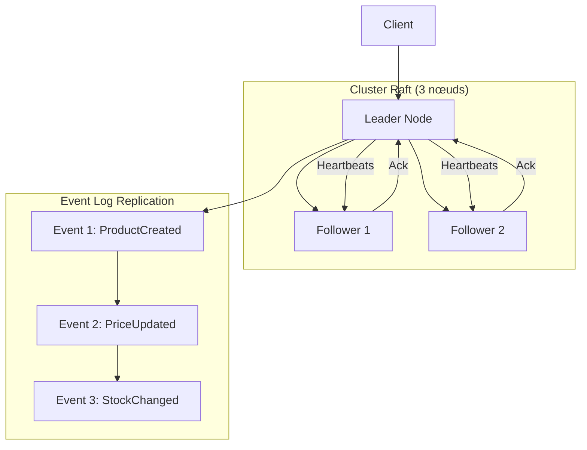
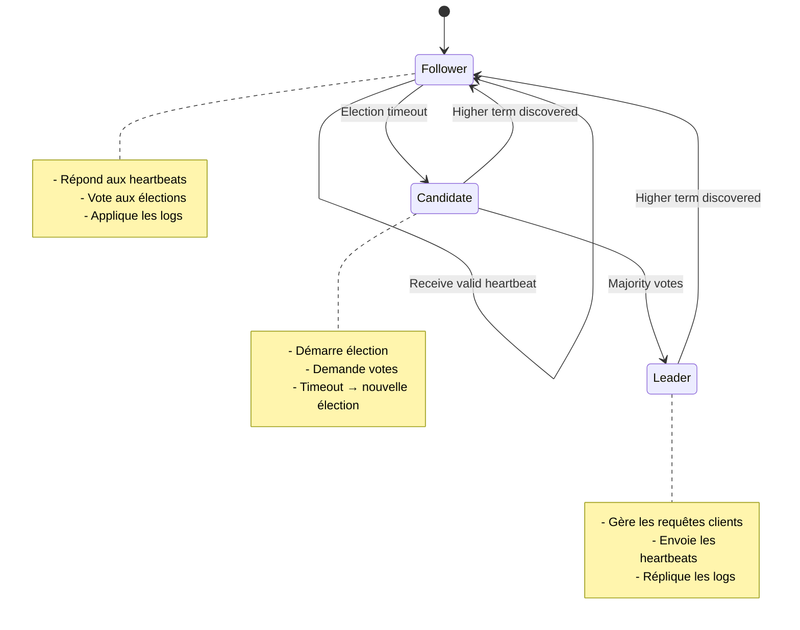
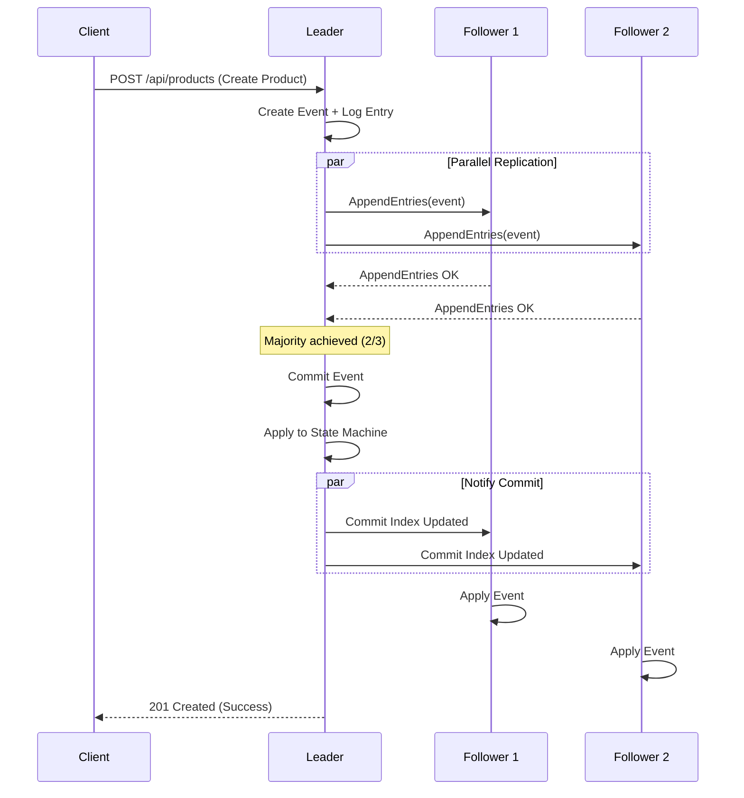
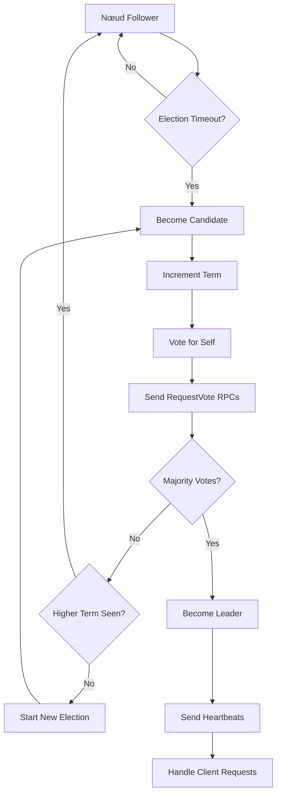
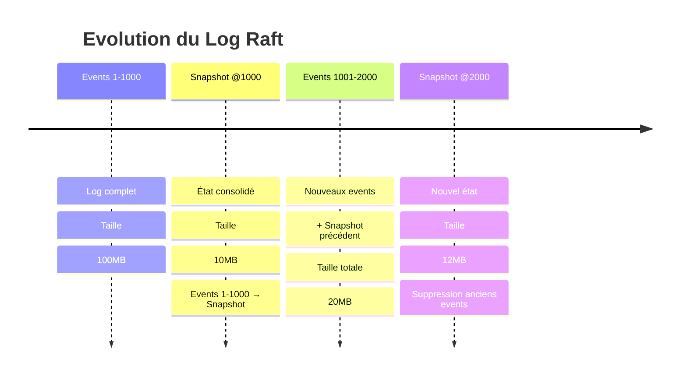
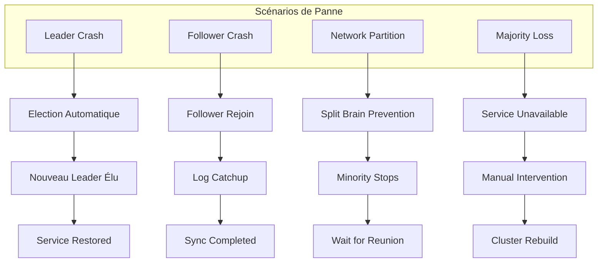
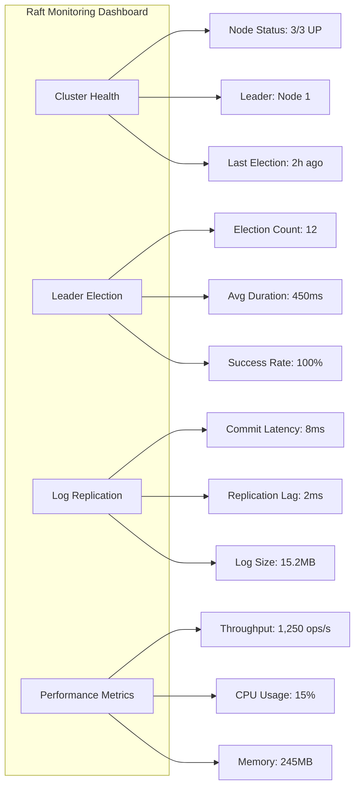

# Module Consensus Raft

Le module de consensus Raft de Lithair assure la cohérence des données dans un environnement distribué, avec une intégration transparente dans le système d'event sourcing.

## 🎯 Vue d'Ensemble

Le consensus Raft dans Lithair permet de maintenir un état cohérent entre plusieurs nœuds, garantissant que toutes les modifications de données sont appliquées dans le même ordre sur tous les nœuds du cluster.



## ⚙️ Architecture du Consensus

### États des Nœuds



### Flux de Réplication



## 🔧 Configuration

### Configuration Basique

```rust
use lithair_core::consensus::RaftConfig;

let raft_config = RaftConfig {
    node_id: 1,
    cluster_nodes: vec![
        "127.0.0.1:8080".to_string(),
        "127.0.0.1:8081".to_string(), 
        "127.0.0.1:8082".to_string(),
    ],
    data_dir: "./data/node1".into(),
    
    // Timings
    election_timeout_ms: 300,
    heartbeat_interval_ms: 50,
    
    // Performance
    max_payload_entries: 100,
    snapshot_threshold: 10000,
    
    ..Default::default()
};
```

### Intégration avec DeclarativeModel

```rust
#[derive(DeclarativeModel)]
#[consensus(
    enabled = true,
    node_id = 1,
    cluster_size = 3,
    data_dir = "./consensus_data"
)]
pub struct DistributedProduct {
    #[db(primary_key, indexed)]
    #[http(expose)]
    #[persistence(replicate, consistent_read)]
    pub id: Uuid,
    
    #[http(expose, validate = "non_empty")]
    #[persistence(replicate, track_history)]
    #[lifecycle(audited)]
    pub name: String,
    
    #[http(expose, validate = "min_value(0.01)")]
    #[persistence(replicate, consistent_read)]
    pub price: f64,
}
```

## 📊 Algorithme Raft Détaillé

### 1. Élection du Leader



### 2. Cohérence des Logs

```mermaid
gantt
    title Réplication d'Event sur 3 Nœuds
    dateFormat X
    axisFormat %s
    
    section Leader
    Receive Event    :0, 1
    Create Log Entry :1, 2
    Send to Followers:2, 3
    Wait Majority    :3, 5
    Commit Event     :5, 6
    
    section Follower 1
    Receive Entry    :3, 4
    Persist to Log   :4, 5
    Send ACK         :5, 5.5
    Apply Event      :6, 7
    
    section Follower 2  
    Receive Entry    :3, 4
    Persist to Log   :4, 5
    Send ACK         :5, 5.5
    Apply Event      :6, 7
```



## 🔄 Event Sourcing Distribué

### Structure des Events

```rust
#[derive(Clone, Debug, Serialize, Deserialize)]
pub struct RaftEvent {
    pub event_id: Uuid,
    pub aggregate_id: Uuid,
    pub event_type: String,
    pub event_data: serde_json::Value,
    pub sequence_number: u64,
    pub term: u64,
    pub timestamp: chrono::DateTime<chrono::Utc>,
    pub node_id: u32,
}
```

### Log Compaction via Snapshots



## ⚡ Performance et Optimisations

### Métriques de Performance

| Métrique | Valeur Typique | Configuration |
|----------|---------------|---------------|
| **Latence consensus** | 5-15ms | 3 nœuds, LAN |
| **Throughput** | 5,000 ops/s | Batch size 100 |
| **Recovery time** | <2s | Snapshot récent |
| **Network usage** | 50KB/s/nœud | État stable |
| **Election time** | 300-600ms | Election timeout |

### Optimisations Configurables

```rust
#[derive(DeclarativeModel)]
#[consensus(
    // Performance optimizations
    batch_mode = true,              // Batch multiple events
    pipeline_replication = true,    // Pipeline AppendEntries
    compress_entries = true,        // Compress large payloads
    
    // Consistency trade-offs  
    read_consistency = "eventually", // "strong" | "eventually"
    async_apply = true,             // Non-blocking state machine
    
    // Network optimizations
    max_inflight_requests = 10,     // Concurrent RPCs
    heartbeat_batch_size = 50,      // Batch heartbeats
)]
pub struct OptimizedModel {
    // Model fields...
}
```

## 🛡️ Gestion des Pannes

### Scénarios de Panne



### Recovery Automatique

```rust
// Configuration de tolérance aux pannes
#[derive(DeclarativeModel)]
#[consensus(
    fault_tolerance = "byzantine",   // "crash" | "byzantine"  
    auto_recovery = true,           // Automatic node recovery
    backup_strategy = "continuous", // Continuous backups
    
    // Recovery timeouts
    leader_election_timeout_ms = 300,
    node_reconnect_timeout_ms = 10000,
    snapshot_recovery_timeout_ms = 30000,
)]
pub struct FaultTolerantModel {
    // Model with automatic fault tolerance
}
```

## 📈 Monitoring du Consensus

### Métriques Raft

```rust
// Métriques automatiques exposées
pub struct RaftMetrics {
    // État du cluster
    pub current_term: u64,
    pub current_leader: Option<u32>, 
    pub cluster_size: u32,
    pub healthy_nodes: u32,
    
    // Performance
    pub commit_latency_ms: f64,
    pub replication_lag_ms: f64,
    pub throughput_ops_per_sec: f64,
    
    // Élections
    pub election_count: u64,
    pub last_election_duration_ms: u64,
    
    // Logs
    pub log_size_entries: u64,
    pub last_applied_index: u64,
    pub commit_index: u64,
}
```

### Dashboards de Monitoring



## 🧪 Testing et Validation

### Tests de Consensus

```rust
#[tokio::test]
async fn test_leader_election() {
    let cluster = TestCluster::new(3).await;
    
    // Arrêter le leader actuel
    cluster.stop_leader().await;
    
    // Vérifier qu'une nouvelle élection a lieu
    tokio::time::sleep(Duration::from_millis(500)).await;
    assert!(cluster.has_leader().await);
    
    // Vérifier que le service continue
    let response = cluster
        .post("/api/products")
        .json(&test_product())
        .send()
        .await?;
    
    assert_eq!(response.status(), 201);
}

#[tokio::test]
async fn test_split_brain_prevention() {
    let cluster = TestCluster::new(5).await;
    
    // Créer partition réseau (2 vs 3)
    cluster.partition_network(&[0, 1], &[2, 3, 4]).await;
    
    // Vérifier qu'une seule partition reste active
    tokio::time::sleep(Duration::from_secs(1)).await;
    
    assert_eq!(cluster.active_partitions(), 1);
    assert!(cluster.majority_partition().is_serving());
    assert!(!cluster.minority_partition().is_serving());
}
```

### Chaos Engineering

```bash
# Tests de résilience automatisés
chaos-raft \
    --scenario leader_crash \
    --duration 300s \
    --cluster localhost:8080,localhost:8081,localhost:8082 \
    --load-test-concurrent 100

# Résultats attendus:
# - Availability: >99.9%
# - Max interruption: <500ms  
# - Data consistency: 100%
```

## 🚀 Exemples d'Usage

### Cluster 3 Nœuds Local

```bash
# Terminal 1 - Node 1 (Leader)
cargo run --bin raft_node -- \
    --node-id 1 \
    --port 8080 \
    --peers 127.0.0.1:8081,127.0.0.1:8082 \
    --data-dir ./data/node1

# Terminal 2 - Node 2 (Follower)  
cargo run --bin raft_node -- \
    --node-id 2 \
    --port 8081 \
    --peers 127.0.0.1:8080,127.0.0.1:8082 \
    --data-dir ./data/node2
    
# Terminal 3 - Node 3 (Follower)
cargo run --bin raft_node -- \
    --node-id 3 \
    --port 8082 \
    --peers 127.0.0.1:8080,127.0.0.1:8081 \
    --data-dir ./data/node3
```

### Test du Consensus

```bash
# Créer des données sur le leader
curl -X POST http://127.0.0.1:8080/api/products \
    -H "Content-Type: application/json" \
    -d '{"name": "Test Product", "price": 19.99}'

# Vérifier cohérence sur les followers  
curl http://127.0.0.1:8081/api/products | jq '.[]'
curl http://127.0.0.1:8082/api/products | jq '.[]'

# Les 3 nœuds doivent avoir les mêmes données
```

## 🗺️ Roadmap

### v1.1 (Prochain)
- ✅ Byzantine Fault Tolerance
- ✅ Multi-Raft (sharding)
- ✅ Witness nodes (non-voting)
- ✅ Learner mode pour scaling lecture

### v1.2 (Futur)  
- 🔄 Cross-datacenter replication
- 🔄 Consensus sur événements cryptographiquement signés
- 🔄 Auto-scaling cluster
- 🔄 Consensus-as-a-Service

---

**💡 Note :** Le consensus Raft dans Lithair est optimisé pour la cohérence forte tout en maintenant des performances élevées pour les applications temps réel.