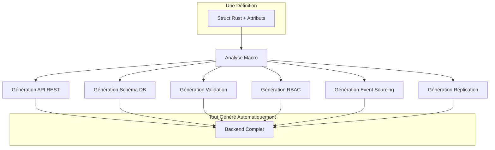

# Module Modèles Déclaratifs

Le cœur de Lithair : le système de modèles déclaratifs qui transforme une simple définition de struct en un backend complet avec API, base de données, sécurité et distribution.

## 🎯 Philosophie Data-First

Au lieu de coder l'infrastructure, **décrivez vos données** et Lithair génère automatiquement tout le reste.



## 🔮 Exemple de Transformation

### Input : Une Simple Struct

```rust
#[derive(DeclarativeModel)]
pub struct Product {
    #[db(primary_key, indexed)]
    #[http(expose)]
    #[permission(read = "Public")]
    pub id: Uuid,
    
    #[http(expose, validate = "non_empty")]
    #[lifecycle(audited)]
    #[permission(read = "Public", write = "ProductManager")]
    pub name: String,
    
    #[http(expose, validate = "min_value(0.01)")]
    #[persistence(replicate, track_history)]
    pub price: f64,
}
```

### Output : Backend Complet Auto-Généré

```rust
// API REST générée automatiquement
impl Product {
    // GET /api/products
    pub async fn list() -> Result<Vec<Product>, Error> { /* generated */ }
    
    // GET /api/products/{id}
    pub async fn get(id: Uuid) -> Result<Product, Error> { /* generated */ }
    
    // POST /api/products
    pub async fn create(data: CreateProduct) -> Result<Product, Error> { /* generated */ }
    
    // PUT /api/products/{id}
    pub async fn update(id: Uuid, data: UpdateProduct) -> Result<Product, Error> { /* generated */ }
    
    // DELETE /api/products/{id}
    pub async fn delete(id: Uuid) -> Result<(), Error> { /* generated */ }
}

// Validation automatique
impl Validate for Product {
    fn validate(&self) -> Result<(), ValidationError> { /* generated */ }
}

// Permissions RBAC
impl Authorize for Product {
    fn can_read(&self, user: &User) -> bool { /* generated */ }
    fn can_write(&self, user: &User) -> bool { /* generated */ }
}

// Event Sourcing
impl EventSourced for Product {
    fn apply_event(&mut self, event: &Event) -> Result<(), Error> { /* generated */ }
}
```

## 🏷️ Catégories d'Attributs

### 1. Attributs Base de Données (`#[db(...)]`)

```rust
#[derive(DeclarativeModel)]
pub struct User {
    #[db(primary_key)]              // Clé primaire
    pub id: Uuid,
    
    #[db(indexed, unique)]          // Index unique
    pub email: String,
    
    #[db(foreign_key = "Role")]     // Clé étrangère
    pub role_id: Uuid,
    
    #[db(default_value = "now()")]  // Valeur par défaut
    pub created_at: DateTime<Utc>,
    
    #[db(nullable)]                 // Peut être NULL
    pub last_login: Option<DateTime<Utc>>,
}
```

**Génère automatiquement :**
- Schéma de base de données
- Contraintes et index
- Migrations automatiques

### 2. Attributs HTTP (`#[http(...)]`)

```rust
#[derive(DeclarativeModel)]
pub struct Article {
    #[http(expose)]                           // Exposé dans l'API
    pub id: Uuid,
    
    #[http(expose, validate = "non_empty")]   // Validation requise
    pub title: String,
    
    #[http(expose, validate = "min_length(10)", transform = "sanitize_html")]
    pub content: String,
    
    #[http(readonly)]                         // Lecture seule dans l'API
    pub created_at: DateTime<Utc>,
    
    #[http(hidden)]                          // Jamais exposé dans l'API
    pub internal_notes: String,
}
```

**Génère automatiquement :**
- Endpoints REST complets
- Validation des entrées
- Sérialisation/désérialisation JSON
- Documentation OpenAPI

### 3. Attributs Permissions (`#[permission(...)]`)

```rust
#[derive(DeclarativeModel)]
pub struct Invoice {
    #[permission(read = "Public")]
    pub id: Uuid,
    
    #[permission(read = "AccountManager", write = "AccountManager")]
    pub customer_id: Uuid,
    
    #[permission(read = "Accountant", write = "Accountant")]
    pub amount: f64,
    
    #[permission(read = "Admin", write = "Admin")]
    pub internal_notes: String,
}
```

**Génère automatiquement :**
- Système RBAC complet
- Middleware d'autorisation
- Filtrage des champs par rôle

### 4. Attributs Lifecycle (`#[lifecycle(...)]`)

```rust
#[derive(DeclarativeModel)]
pub struct Order {
    #[lifecycle(immutable)]                    // Jamais modifiable
    pub id: Uuid,
    
    #[lifecycle(audited)]                     // Audit trail complet
    pub status: OrderStatus,
    
    #[lifecycle(versioned = 5)]               // Garde 5 versions
    pub shipping_address: Address,
    
    #[lifecycle(soft_delete)]                 // Suppression logique
    pub deleted_at: Option<DateTime<Utc>>,
    
    #[lifecycle(retention = 2555)]            // Rétention 7 ans
    pub personal_data: String,
}
```

**Génère automatiquement :**
- Audit trail avec historique
- Gestion des versions
- Politiques de rétention
- Soft delete

### 5. Attributs Persistance (`#[persistence(...)]`)

```rust
#[derive(DeclarativeModel)]
pub struct CriticalData {
    #[persistence(replicate)]                 // Réplication Raft
    pub id: Uuid,
    
    #[persistence(snapshot_frequency = 1000)] // Snapshot tous les 1000 events
    pub large_data: String,
    
    #[persistence(encrypted)]                 // Chiffrement au repos
    pub sensitive_data: String,
    
    #[persistence(compress)]                  // Compression automatique
    pub bulk_data: Vec<u8>,
    
    #[persistence(cache_ttl = 3600)]         // Cache 1 heure
    pub frequently_accessed: String,
}
```

**Génère automatiquement :**
- Event sourcing distribué
- Chiffrement/compression
- Système de cache intelligent
- Réplication entre nœuds

## 🎨 Patterns Avancés

### 1. Modèle E-commerce Complet

```rust
#[derive(DeclarativeModel)]
#[firewall(enabled = true, global_qps = 1000)]
#[monitoring(metrics = true, tracing = true)]
pub struct EcommerceProduct {
    // Identification
    #[db(primary_key, indexed)]
    #[http(expose)]
    #[permission(read = "Public")]
    #[persistence(replicate, indexed)]
    pub id: Uuid,
    
    // Informations produit
    #[db(indexed, unique)]
    #[http(expose, validate = "non_empty")]
    #[lifecycle(audited, versioned = 10)]
    #[permission(read = "Public", write = "ProductManager")]
    pub sku: String,
    
    #[http(expose, validate = "min_length(3)")]
    #[lifecycle(audited)]
    #[permission(read = "Public", write = "ProductManager")]
    pub name: String,
    
    // Prix et stock
    #[http(expose, validate = "min_value(0.01)")]
    #[lifecycle(audited, track_history)]
    #[permission(read = "Public", write = "ProductManager")]
    #[persistence(replicate)]
    pub price: f64,
    
    #[db(indexed)]
    #[http(expose, validate = "min_value(0)")]
    #[lifecycle(audited)]
    #[permission(read = "StockManager", write = "StockManager")]
    #[persistence(replicate, consistent_read)]
    pub stock_quantity: i32,
    
    // Métadonnées
    #[db(indexed)]
    #[http(expose)]
    #[permission(read = "Public")]
    pub category_id: Uuid,
    
    #[http(readonly)]
    #[lifecycle(immutable)]
    pub created_at: DateTime<Utc>,
    
    #[http(readonly)]
    #[lifecycle(auto_update)]
    pub updated_at: DateTime<Utc>,
    
    // Données sensibles
    #[persistence(encrypted)]
    #[permission(read = "Admin", write = "Admin")]
    pub cost_price: f64,
    
    #[http(hidden)]
    #[lifecycle(soft_delete)]
    pub deleted_at: Option<DateTime<Utc>>,
}
```

**Résultat :** API REST complète avec 15+ endpoints, validation automatique, audit complet, réplication distribuée, sécurité RBAC, et monitoring intégré !

### 2. Système Multi-Tenant

```rust
#[derive(DeclarativeModel)]
#[tenant(isolation = "strict", key = "tenant_id")]
pub struct TenantDocument {
    #[db(primary_key)]
    #[http(expose)]
    pub id: Uuid,
    
    #[tenant(partition_key)]
    #[db(indexed)]
    #[http(hidden)]
    pub tenant_id: Uuid,
    
    #[http(expose, validate = "non_empty")]
    #[permission(read = "TenantUser", write = "TenantAdmin")]
    pub title: String,
    
    #[persistence(tenant_isolated, encrypted)]
    pub content: String,
}
```

### 3. Modèle Temporel

```rust
#[derive(DeclarativeModel)]
#[temporal(enabled = true, granularity = "day")]
pub struct TimeSeriesMetric {
    #[db(primary_key)]
    pub id: Uuid,
    
    #[temporal(partition_key)]
    #[db(indexed)]
    pub timestamp: DateTime<Utc>,
    
    #[http(expose)]
    #[temporal(aggregatable = "sum")]
    pub value: f64,
    
    #[temporal(retention_days = 365)]
    pub raw_data: String,
}
```

## 🔧 Génération de Code

### Macro Expansion Example

```rust
// Source
#[derive(DeclarativeModel)]
pub struct SimpleModel {
    #[db(primary_key)]
    #[http(expose)]
    pub id: Uuid,
    
    #[http(expose, validate = "non_empty")]
    pub name: String,
}

// Generated (simplifié)
impl SimpleModel {
    // API REST auto-générée
    pub async fn rest_get_all() -> Result<Vec<Self>, Error> {
        EventStore::query()
            .filter_type("SimpleModel")
            .reconstruct_current_state()
            .await
    }
    
    pub async fn rest_get_by_id(id: Uuid) -> Result<Self, Error> {
        EventStore::load_aggregate(id)
            .reconstruct_current_state()
            .await
    }
    
    pub async fn rest_create(data: CreateSimpleModel) -> Result<Self, Error> {
        // Validation
        data.validate()?;
        
        // Permissions check
        current_user().can_create::<Self>()?;
        
        // Create event
        let event = CreateSimpleModelEvent {
            id: Uuid::new_v4(),
            name: data.name,
        };
        
        // Store via event sourcing
        EventStore::append(event).await?;
        
        // Return created instance
        Self::rest_get_by_id(event.id).await
    }
}

// Validation auto-générée
impl Validate for SimpleModel {
    fn validate(&self) -> Result<(), ValidationError> {
        if self.name.is_empty() {
            return Err(ValidationError::field("name", "cannot be empty"));
        }
        Ok(())
    }
}

// Routes HTTP auto-générées
pub fn register_simple_model_routes(router: &mut Router) {
    router
        .get("/api/simple_models", SimpleModel::rest_get_all)
        .get("/api/simple_models/:id", SimpleModel::rest_get_by_id)
        .post("/api/simple_models", SimpleModel::rest_create)
        .put("/api/simple_models/:id", SimpleModel::rest_update)
        .delete("/api/simple_models/:id", SimpleModel::rest_delete);
}
```

## 📊 Impact sur le Développement

### Comparaison Traditionnel vs Lithair

| Fonctionnalité | Code Traditionnel | Lithair Déclaratif | Réduction |
|----------------|-------------------|---------------------|-----------|
| **API CRUD** | 200+ lignes | 1 attribut `#[http(expose)]` | 99.5% |
| **Validation** | 50+ lignes | 1 attribut `#[validate = "..."]` | 98% |
| **Permissions** | 100+ lignes | 1 attribut `#[permission(...)]` | 99% |
| **Audit Trail** | 150+ lignes | 1 attribut `#[lifecycle(audited)]` | 99.3% |
| **Réplication** | 500+ lignes | 1 attribut `#[persistence(replicate)]` | 99.8% |

### Exemple Réel : Ajouter un Champ

**Traditionnel (3-Tier) :**
```bash
# 1. Migration base de données
CREATE TABLE migration_add_description.sql
# 2. Update model class (20 lignes)
# 3. Update DTO (15 lignes)  
# 4. Update service layer (25 lignes)
# 5. Update controller (30 lignes)
# 6. Update validation (20 lignes)
# 7. Update tests (50 lignes)
# Total: ~160 lignes + 7 fichiers modifiés
```

**Lithair :**
```rust
#[derive(DeclarativeModel)]
pub struct Product {
    // Champs existants...
    
    // 👆 NOUVEAU CHAMP - 2 lignes
    #[http(expose, validate = "min_length(10)")]
    #[lifecycle(audited)]
    pub description: String,
}
// Total: 2 lignes + migration automatique
```

## 🎯 Patterns de Validation

### Validators Intégrés

```rust
#[derive(DeclarativeModel)]
pub struct ValidatedModel {
    #[http(validate = "email")]
    pub email: String,
    
    #[http(validate = "min_length(8)")]
    pub password: String,
    
    #[http(validate = "range(18, 120)")]
    pub age: u8,
    
    #[http(validate = "regex(r'^[A-Z]{2}[0-9]{6}$')")]
    pub postal_code: String,
    
    #[http(validate = "custom(validate_credit_card)")]
    pub credit_card: String,
    
    #[http(validate = "phone_number")]
    pub phone: String,
    
    #[http(validate = "url")]
    pub website: String,
    
    #[http(validate = "enum(Active, Inactive, Pending)")]
    pub status: String,
}

// Validator custom
fn validate_credit_card(value: &str) -> Result<(), String> {
    // Luhn algorithm
    if !luhn_check(value) {
        return Err("Invalid credit card number".to_string());
    }
    Ok(())
}
```

## 🧪 Testing des Modèles

### Tests Auto-Générés

```rust
#[cfg(test)]
mod tests {
    use super::*;
    
    // Tests générés automatiquement par DeclarativeModel
    declarative_model_tests!(Product);
    
    // Équivalent à:
    #[tokio::test]
    async fn test_product_crud_operations() { /* generated */ }
    
    #[tokio::test] 
    async fn test_product_validation() { /* generated */ }
    
    #[tokio::test]
    async fn test_product_permissions() { /* generated */ }
    
    #[tokio::test]
    async fn test_product_event_sourcing() { /* generated */ }
}
```

## 🔮 Évolution et Migration

### Schema Evolution

```rust
// Version 1.0
#[derive(DeclarativeModel)]
#[version = "1.0"]
pub struct ProductV1 {
    pub id: Uuid,
    pub name: String,
    pub price: f64,
}

// Version 2.0 - Migration automatique
#[derive(DeclarativeModel)]
#[version = "2.0"]
#[migrate_from = "ProductV1"]
pub struct Product {
    pub id: Uuid,
    pub name: String,
    pub price: f64,
    
    // Nouveaux champs avec migrations
    #[migration(default = "\"Uncategorized\"")]
    pub category: String,
    
    #[migration(computed = "price * 1.2")]
    pub price_with_tax: f64,
}
```

## 🗺️ Roadmap

### v1.1 (Prochain)
- ✅ GraphQL auto-generation
- ✅ TypeScript types export
- ✅ Custom attribute macros
- ✅ Conditional compilation

### v1.2 (Futur)
- 🔄 Visual model designer
- 🔄 Real-time collaboration
- 🔄 AI-assisted model generation
- 🔄 Model composition patterns

---

**🎯 Résumé :** Les modèles déclaratifs Lithair transforment radicalement le développement backend : **pensez en données, obtenez un système complet** avec 99% moins de code et zéro bugs d'infrastructure.