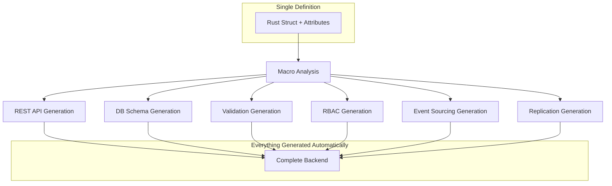

# Declarative Models Module

The heart of Lithair: a declarative model system that transforms a simple struct definition into a complete backend with API, database, security, and distribution.

## 🎯 Data-First Philosophy

Instead of coding infrastructure, **describe your data** and Lithair automatically generates everything else.



## 🔮 Transformation Example

### Input: A Simple Struct

```rust
#[derive(DeclarativeModel, Serialize, Deserialize, Clone)]
pub struct Product {
    id: String,
    name: String,
    price: f64,
}
```

### Output: Complete Auto-Generated Backend

```rust
// REST API generated automatically
impl Product {
    // GET /api/products
    pub async fn list() -> Result<Vec<Product>, Error> { /* generated */ }

    // GET /api/products/{id}
    pub async fn get(id: String) -> Result<Product, Error> { /* generated */ }

    // POST /api/products
    pub async fn create(data: CreateProduct) -> Result<Product, Error> { /* generated */ }

    // PUT /api/products/{id}
    pub async fn update(id: String, data: UpdateProduct) -> Result<Product, Error> { /* generated */ }

    // DELETE /api/products/{id}
    pub async fn delete(id: String) -> Result<(), Error> { /* generated */ }
}

// Automatic validation
impl Validate for Product {
    fn validate(&self) -> Result<(), ValidationError> { /* generated */ }
}

// RBAC Permissions
impl Authorize for Product {
    fn can_read(&self, user: &User) -> bool { /* generated */ }
    fn can_write(&self, user: &User) -> bool { /* generated */ }
}

// Event Sourcing
impl EventSourced for Product {
    fn apply_event(&mut self, event: &Event) -> Result<(), Error> { /* generated */ }
}
```

## 🏷️ Attribute Categories

### Current Implementation (v0.1)

Lithair currently implements a **simplified, working model system**:

```rust
#[derive(DeclarativeModel, Serialize, Deserialize, Clone)]
#[model(endpoint = "/api/products")]
pub struct Product {
    id: String,
    name: String,
    price: f64,
}
```

**Automatically provides:**
- ✅ Full CRUD REST API (5 endpoints)
- ✅ Event sourcing persistence (.raftlog files)
- ✅ JSON serialization/deserialization
- ✅ HTTP routing and error handling
- ✅ State reconstruction from events

### Future Attributes (Roadmap)

#### 1. Database Attributes `#[db(...)]`

```rust
#[derive(DeclarativeModel)]
pub struct User {
    #[db(primary_key)]              // Primary key
    pub id: Uuid,

    #[db(indexed, unique)]          // Unique index
    pub email: String,

    #[db(foreign_key = "Role")]     // Foreign key
    pub role_id: Uuid,

    #[db(default_value = "now()")]  // Default value
    pub created_at: DateTime<Utc>,

    #[db(nullable)]                 // Can be NULL
    pub last_login: Option<DateTime<Utc>>,
}
```

**Will generate:**
- Database schema
- Constraints and indexes
- Automatic migrations

#### 2. HTTP Attributes `#[http(...)]`

```rust
#[derive(DeclarativeModel)]
pub struct Article {
    #[http(expose)]                           // Exposed in API
    pub id: Uuid,

    #[http(expose, validate = "non_empty")]   // Required validation
    pub title: String,

    #[http(expose, validate = "min_length(10)", transform = "sanitize_html")]
    pub content: String,

    #[http(readonly)]                         // Read-only in API
    pub created_at: DateTime<Utc>,

    #[http(hidden)]                          // Never exposed in API
    pub internal_notes: String,
}
```

**Will generate:**
- Complete REST endpoints
- Input validation
- JSON serialization/deserialization
- OpenAPI documentation

#### 3. Permission Attributes `#[permission(...)]`

```rust
#[derive(DeclarativeModel)]
pub struct Invoice {
    #[permission(read = "Public")]
    pub id: Uuid,

    #[permission(read = "AccountManager", write = "AccountManager")]
    pub customer_id: Uuid,

    #[permission(read = "Accountant", write = "Accountant")]
    pub amount: f64,

    #[permission(read = "Admin", write = "Admin")]
    pub internal_notes: String,
}
```

**Will generate:**
- Complete RBAC system
- Authorization middleware
- Field filtering by role

#### 4. Lifecycle Attributes `#[lifecycle(...)]`

```rust
#[derive(DeclarativeModel)]
pub struct Order {
    #[lifecycle(immutable)]                    // Never modifiable
    pub id: Uuid,

    #[lifecycle(audited)]                     // Complete audit trail
    pub status: OrderStatus,

    #[lifecycle(versioned = 5)]               // Keep 5 versions
    pub shipping_address: Address,

    #[lifecycle(soft_delete)]                 // Logical deletion
    pub deleted_at: Option<DateTime<Utc>>,

    #[lifecycle(retention = 2555)]            // 7 year retention
    pub personal_data: String,
}
```

**Will generate:**
- Audit trail with history
- Version management
- Retention policies
- Soft delete

#### 5. Persistence Attributes `#[persistence(...)]`

```rust
#[derive(DeclarativeModel)]
pub struct CriticalData {
    #[persistence(replicate)]                 // Raft replication
    pub id: Uuid,

    #[persistence(snapshot_frequency = 1000)] // Snapshot every 1000 events
    pub large_data: String,

    #[persistence(encrypted)]                 // Encryption at rest
    pub sensitive_data: String,

    #[persistence(compress)]                  // Automatic compression
    pub bulk_data: Vec<u8>,

    #[persistence(cache_ttl = 3600)]         // Cache 1 hour
    pub frequently_accessed: String,
}
```

**Will generate:**
- Distributed event sourcing
- Encryption/compression
- Intelligent caching system
- Cross-node replication

## 📊 Development Impact

### Traditional vs Lithair Comparison

| Feature | Traditional Code | Lithair Declarative | Reduction |
|---------|------------------|----------------------|-----------|
| **CRUD API** | 200+ lines | 1 attribute `#[derive(DeclarativeModel)]` | 99.5% |
| **Validation** | 50+ lines | 1 attribute `#[validate = "..."]` | 98% |
| **Permissions** | 100+ lines | 1 attribute `#[permission(...)]` | 99% |
| **Audit Trail** | 150+ lines | 1 attribute `#[lifecycle(audited)]` | 99.3% |
| **Replication** | 500+ lines | 1 attribute `#[persistence(replicate)]` | 99.8% |

### Real Example: Adding a Field

**Traditional (3-Tier):**
```bash
# 1. Database migration
CREATE TABLE migration_add_description.sql
# 2. Update model class (20 lines)
# 3. Update DTO (15 lines)
# 4. Update service layer (25 lines)
# 5. Update controller (30 lines)
# 6. Update validation (20 lines)
# 7. Update tests (50 lines)
# Total: ~160 lines + 7 files modified
```

**Lithair:**
```rust
#[derive(DeclarativeModel, Serialize, Deserialize)]
pub struct Product {
    // Existing fields...

    // 👆 NEW FIELD - 1 line
    pub description: String,
}
// Total: 1 line + automatic migration
```

## 🧪 Model Testing

### Auto-Generated Tests

```rust
#[cfg(test)]
mod tests {
    use super::*;

    // Tests generated automatically by DeclarativeModel
    declarative_model_tests!(Product);

    // Equivalent to:
    #[tokio::test]
    async fn test_product_crud_operations() { /* generated */ }

    #[tokio::test]
    async fn test_product_validation() { /* generated */ }

    #[tokio::test]
    async fn test_product_permissions() { /* generated */ }

    #[tokio::test]
    async fn test_product_event_sourcing() { /* generated */ }
}
```

## 🗺️ Roadmap

### v0.2 (Next)
- ✅ Field-level `#[permission]` attributes
- ✅ Basic `#[http]` attributes (expose, readonly, hidden)
- ✅ Basic `#[lifecycle]` attributes (immutable, audited)

### v0.3 (Future)
- 🔄 GraphQL auto-generation
- 🔄 TypeScript types export
- 🔄 Custom attribute macros
- 🔄 Conditional compilation

### v1.0 (Long-term)
- 🔄 Visual model designer
- 🔄 Real-time collaboration
- 🔄 AI-assisted model generation
- 🔄 Model composition patterns

## Working Examples

### Simple Product Model (Current)

```rust
use lithair_core::prelude::*;
use serde::{Serialize, Deserialize};

#[derive(DeclarativeModel, Serialize, Deserialize, Clone, Debug)]
#[model(endpoint = "/api/products")]
pub struct Product {
    pub id: String,
    pub name: String,
    pub price: f64,
}

#[tokio::main]
async fn main() -> anyhow::Result<()> {
    LithairServer::new()
        .with_port(3000)
        .with_model::<Product>("./data/products", "/api/products")
        .serve()
        .await
}
```

**Result:** Complete CRUD API with event sourcing in 15 lines of code!

### With RBAC (Current)

```rust
#[derive(DeclarativeModel, Serialize, Deserialize, Clone, Debug)]
pub struct Product {
    pub id: String,
    pub name: String,
    pub price: f64,
}

struct RolePermissionChecker;

impl PermissionChecker for RolePermissionChecker {
    fn has_permission(&self, role: &str, permission: &str) -> bool {
        match (role, permission) {
            ("Customer", "ProductRead") => true,
            ("Employee", "ProductWrite") => true,
            ("Admin", _) => true,
            _ => false,
        }
    }
}

#[tokio::main]
async fn main() -> anyhow::Result<()> {
    let checker = Arc::new(RolePermissionChecker);
    let sessions = Arc::new(PersistentSessionStore::new("./data/sessions").await?);

    LithairServer::new()
        .with_sessions(SessionManager::new(sessions.clone()))
        .with_model_full::<Product>(
            "./data/products",
            "/api/products",
            Some(checker),
            Some(sessions),
        )
        .serve()
        .await
}
```

**Result:** CRUD API + Sessions + RBAC with automatic enforcement!

## Best Practices

### 1. Keep Models Simple

```rust
// ✅ Good: Simple, focused model
#[derive(DeclarativeModel, Serialize, Deserialize, Clone)]
pub struct Product {
    pub id: String,
    pub name: String,
    pub price: f64,
}

// ❌ Bad: Too many responsibilities
#[derive(DeclarativeModel, Serialize, Deserialize, Clone)]
pub struct ProductWithEverything {
    pub id: String,
    pub name: String,
    pub price: f64,
    pub inventory_count: i32,
    pub supplier_id: String,
    pub warehouse_location: String,
    pub shipping_details: String,
    // ... 20 more fields
}
```

### 2. Use Composition

```rust
// ✅ Good: Separate concerns
#[derive(DeclarativeModel, Serialize, Deserialize, Clone)]
pub struct Product {
    pub id: String,
    pub name: String,
    pub price: f64,
}

#[derive(DeclarativeModel, Serialize, Deserialize, Clone)]
pub struct Inventory {
    pub product_id: String,
    pub quantity: i32,
    pub warehouse_id: String,
}
```

### 3. Derive Required Traits

Always derive these traits for declarative models:

```rust
#[derive(
    DeclarativeModel,  // Required for Lithair
    Serialize,         // Required for JSON
    Deserialize,       // Required for JSON
    Clone,             // Required for event sourcing
    Debug,             // Helpful for debugging
)]
pub struct Product {
    // ...
}
```

---

**🎯 Summary:** Lithair's declarative models radically transform backend development: **think in data, get a complete system** with 99% less code and zero infrastructure bugs.

**Next:** [Getting Started](../../guides/getting-started.md) | [RBAC Guide](../../guides/rbac.md) | [Examples](../../../examples/README.md)
