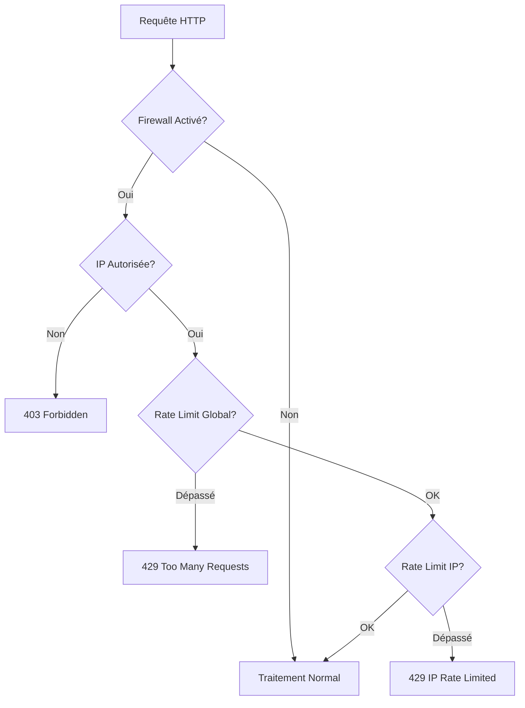
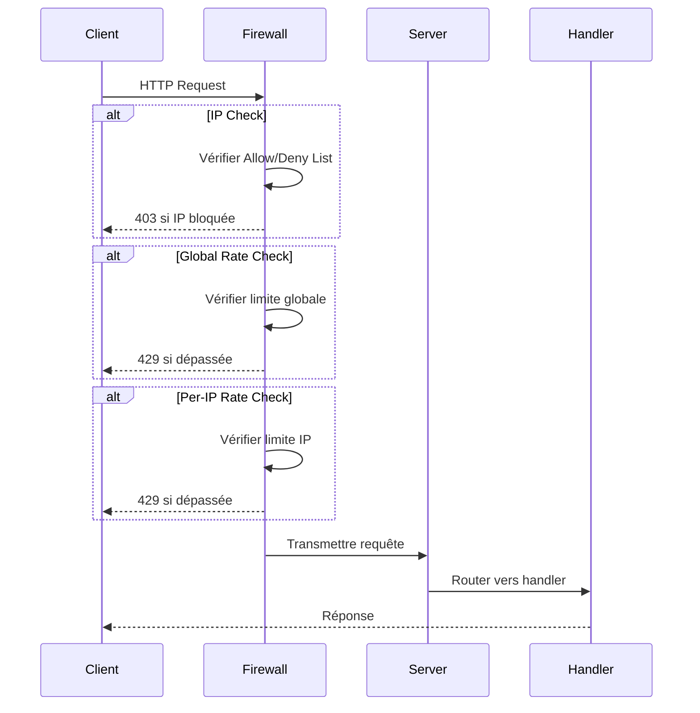

# Module HTTP Firewall

Le module HTTP Firewall de Lithair fournit un système de sécurité léger et performant, intégré directement dans le serveur HTTP déclaratif.

## 🛡️ Vue d'Ensemble

Le firewall Lithair est un middleware in-process appliqué avant le traitement des requêtes. Il offre une protection multicouche avec configuration flexible.



## ✨ Fonctionnalités

### 🔒 Filtrage IP
- **Allow List** : Autoriser uniquement des IPs spécifiques
- **Deny List** : Bloquer des IPs (priorité sur allow)
- **Correspondance** : IP exactes, sous-réseaux CIDR (ex: `192.168.0.0/16`, `fc00::/7`) et macros (`internal`, `private_v4`, `loopback`, `link_local`)

### ⚡ Rate Limiting
- **Limite globale** : QPS maximum pour tous les clients
- **Limite par IP** : QPS maximum par adresse IP
- **Fenêtres fixes** : Compteurs sur fenêtres de 1 seconde

### 🎯 Scope des Routes
- **Routes protégées** : Appliquer le firewall sur des préfixes spécifiques
- **Routes exemptées** : Bypasser complètement certaines routes
- **CORS friendly** : OPTIONS requests toujours autorisées

## 🔧 Configuration

### Priorité de Configuration
1. **Builder API** : `DeclarativeServer::with_firewall_config(cfg)`
2. **Attribut déclaratif** : `#[firewall(...)]` sur le modèle
3. **Variables d'environnement** : `RS_FW_*`

### Variables d'Environnement

```bash
# Activation
RS_FW_ENABLE=1                    # Active le firewall

# Filtrage IP
RS_FW_IP_ALLOW=internal,192.168.0.0/16,127.0.0.1  # IPs autorisées (CSV: IP exactes, CIDR, ou macros)
RS_FW_IP_DENY=10.0.0.5                           # IPs bloquées (CSV)

# Rate Limiting  
RS_FW_RATE_GLOBAL_QPS=1000        # Limite globale QPS
RS_FW_RATE_PERIP_QPS=100         # Limite par IP QPS
```

### Configuration Déclarative

```rust
#[derive(DeclarativeModel)]
#[firewall(
    enabled = true,
    allow = "127.0.0.1,192.168.1.0/24,internal",      // IPs autorisées (IP, CIDR, ou macros)
    deny = "10.0.0.5",                        // IPs bloquées
    protected = "/api/products,/admin",        // Routes protégées
    exempt = "/status,/health,/metrics",      // Routes exemptées
    global_qps = 1000,                        // QPS global
    per_ip_qps = 50                          // QPS par IP
)]
pub struct Product {
    // Modèle...
}
```

## 📊 Architecture Technique

### Flux de Traitement



### Structure des Données

```rust
pub struct FirewallConfig {
    pub enabled: bool,
    pub allowed_ips: HashSet<String>,
    pub denied_ips: HashSet<String>,
    pub protected_prefixes: Vec<String>,
    pub exempt_prefixes: Vec<String>,
    pub global_qps_limit: Option<u32>,
    pub per_ip_qps_limit: Option<u32>,
}

pub struct FirewallState {
    global_counter: AtomicU32,
    per_ip_counters: DashMap<String, AtomicU32>,
    last_reset: AtomicU64,
}
```

## 🚀 Exemples d'Usage

### Exemple Basique

```rust
use lithair_core::http::declarative_server::DeclarativeServer;

#[derive(DeclarativeModel)]
#[firewall(
    enabled = true,
    deny = "192.168.1.100",
    global_qps = 500
)]
pub struct User {
    #[db(primary_key)]
    #[http(expose)]
    pub id: Uuid,
}

// Le firewall s'active automatiquement
let server = DeclarativeServer::new("0.0.0.0:8080").await?;
server.run().await?;
```

### Protection API Complète

```rust
#[derive(DeclarativeModel)]
#[firewall(
    enabled = true,
    allow = "127.0.0.1,192.168.1.0/24",
    protected = "/api",
    exempt = "/health,/metrics,/status",
    global_qps = 1000,
    per_ip_qps = 100
)]
pub struct Product {
    #[db(primary_key, indexed)]
    #[http(expose)]
    #[permission(read = "Public")]
    pub id: Uuid,
    
    #[http(expose, validate = "non_empty")]
    #[permission(read = "Public", write = "ProductManager")]
    pub name: String,
}
```

## 📈 Métriques de Performance

| Configuration | Débit (req/s) | Latence (ms) | Overhead |
|---------------|---------------|--------------|----------|
| Sans firewall | 15,000 | 0.8 | - |
| Firewall IP seul | 14,500 | 0.9 | 3.3% |
| + Rate limiting global | 14,000 | 1.0 | 6.7% |
| + Rate limiting per-IP | 13,500 | 1.1 | 10% |

## 🔍 Codes de Réponse

### 403 Forbidden
```json
{
    "error": "forbidden",
    "message": "IP not in allow list"
}
```

### 429 Too Many Requests (Global)
```json
{
    "error": "rate_limited", 
    "message": "Global QPS limit exceeded"
}
```

### 429 Too Many Requests (Per-IP)
```json
{
    "error": "ip_rate_limited",
    "message": "Per-IP QPS limit exceeded"
}
```

## 🛠️ Exemples Pratiques

### Lancer la Démo Déclarative

```bash
# Démonstration avec configuration dans le modèle
cd examples/http_firewall_demo
bash run_declarative_demo.sh
```

### Tests de Charge
```bash
# Test basique
curl http://127.0.0.1:8081/status

# Test API protégée
curl http://127.0.0.1:8081/api/products

# Test rate limiting
for i in {1..10}; do
    curl http://127.0.0.1:8081/api/products &
done
```

## 🗺️ Roadmap

### v1.1 (Prochain)
- ✅ Support CIDR (192.168.1.0/24)
- ✅ Configuration par endpoint
- ✅ Token bucket avec burst

### v1.2 (Futur)
- 🔄 Rechargement config à chaud
- 🔄 Métriques détaillées
- 🔄 Whitelist/blacklist dynamiques
- 🔄 Intégration avec système de logs

## 🧪 Tests et Validation

### Tests Unitaires
```bash
# Tester le module firewall
cargo test firewall --lib

# Tests d'intégration
cargo test --test firewall_integration
```

### Benchmarks
```bash
# Benchmark performance firewall
cargo bench --bench firewall_performance
```

## 🔗 Intégrations

### Avec le Serveur Déclaratif
Le firewall s'intègre automatiquement avec `DeclarativeServer` via l'attribut `#[firewall(...)]`.

### Avec OpenTelemetry
```rust
// Métriques automatiques
firewall_requests_total{status="allowed|denied|rate_limited"}
firewall_response_time_seconds{filter_type="ip|global_rate|ip_rate"}
```

### Avec les Logs
```rust
[WARN] firewall: IP 192.168.1.100 denied (not in allow list)
[WARN] firewall: Global rate limit exceeded (1500/1000 QPS)
[INFO] firewall: Request allowed from 127.0.0.1 to /api/products
```

---

**💡 Note :** Le firewall Lithair est conçu pour être léger et performant, avec un overhead minimal sur les performances du serveur HTTP.