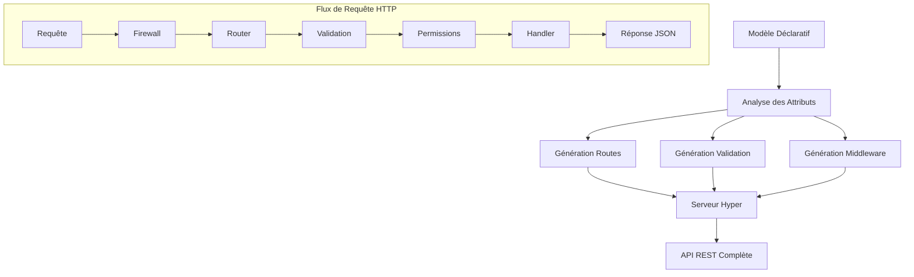
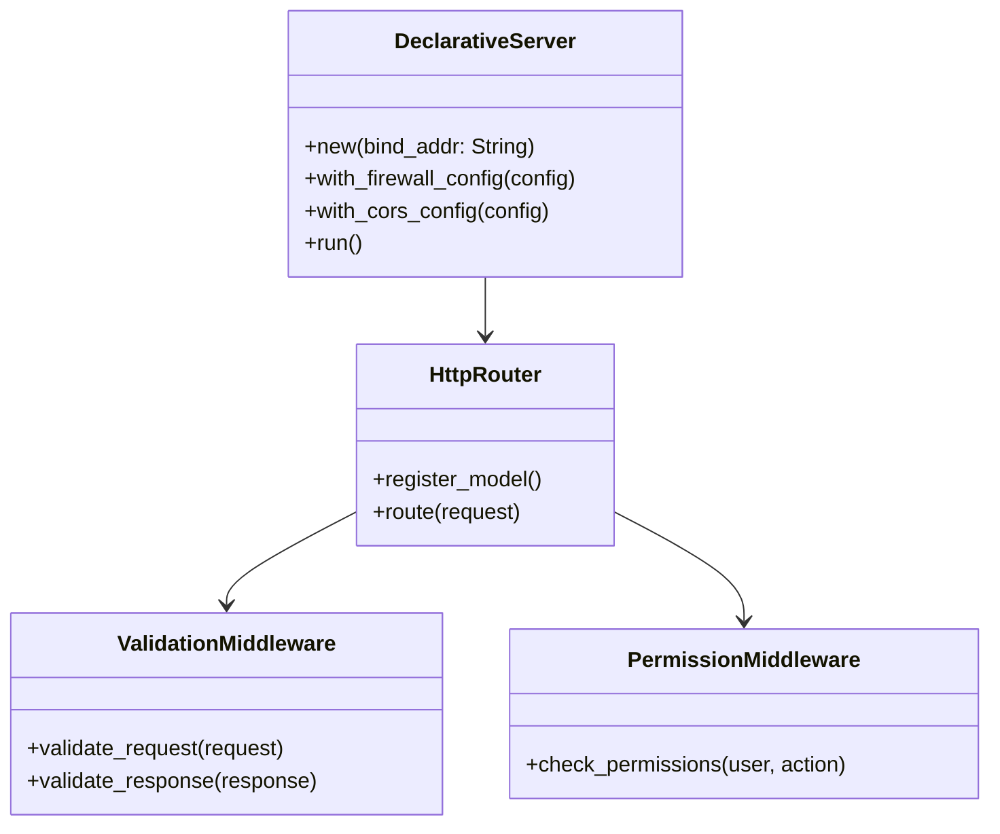
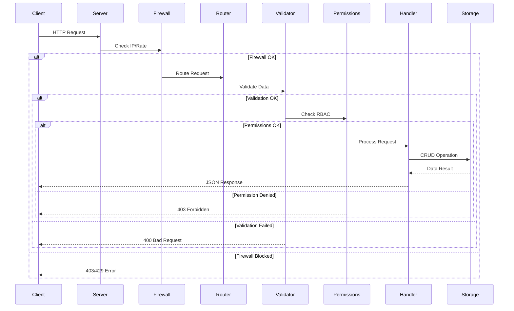

# Module Serveur HTTP

Le module serveur HTTP de Lithair fournit un serveur web haute performance basé sur Hyper, avec génération automatique d'API REST à partir des modèles déclaratifs.

## 🚀 Vue d'Ensemble

Le serveur HTTP Lithair transforme automatiquement vos modèles déclaratifs en API REST complètes, avec validation, authentification et documentation intégrées.



## ⚡ Fonctionnalités Principales

### 🔄 Génération Automatique d'API
- **CRUD complet** : GET, POST, PUT, DELETE auto-générés
- **Routes RESTful** : `/api/users`, `/api/users/{id}`, etc.
- **Validation intégrée** : Validation des données via attributs
- **Sérialisation JSON** : Serde automatique

### 🛡️ Sécurité Intégrée
- **RBAC** : Permissions basées sur les rôles
- **Firewall** : Protection IP et rate limiting
- **CORS** : Support CORS complet
- **Headers sécurisés** : Headers de sécurité automatiques

### 📊 Monitoring
- **Métriques** : Endpoints de monitoring intégrés
- **Health checks** : `/health`, `/status`, `/metrics`
- **Logging** : Logs structurés avec tracing

## 🏗️ Architecture

### Composants Principaux



### Stack Technologique
- **Hyper** : Serveur HTTP async haute performance
- **Tokio** : Runtime async
- **Serde** : Sérialisation/désérialisation JSON
- **Tower** : Middleware et services
- **OpenTelemetry** : Observabilité

## 🔧 Configuration

### Serveur Basique

```rust
use lithair_core::http::declarative_server::DeclarativeServer;

#[tokio::main]
async fn main() -> Result<(), Box<dyn std::error::Error>> {
    let server = DeclarativeServer::new("127.0.0.1:8080").await?;
    server.run().await?;
    Ok(())
}
```

### Configuration Avancée

```rust
use lithair_core::http::{DeclarativeServer, FirewallConfig, CorsConfig};

let firewall_config = FirewallConfig {
    enabled: true,
    allowed_ips: vec!["127.0.0.1".to_string()],
    global_qps_limit: Some(1000),
    per_ip_qps_limit: Some(100),
    ..Default::default()
};

let cors_config = CorsConfig {
    allow_origins: vec!["http://localhost:3000".to_string()],
    allow_methods: vec!["GET", "POST", "PUT", "DELETE"],
    allow_headers: vec!["Content-Type", "Authorization"],
    ..Default::default()
};

let server = DeclarativeServer::new("127.0.0.1:8080")
    .await?
    .with_firewall_config(firewall_config)
    .with_cors_config(cors_config);

server.run().await?;
```

## 📝 Modèles et Routes

### Exemple de Modèle

```rust
#[derive(DeclarativeModel)]
pub struct Product {
    #[db(primary_key, indexed)]
    #[http(expose)]
    #[permission(read = "Public")]
    pub id: Uuid,
    
    #[http(expose, validate = "non_empty")]
    #[permission(read = "Public", write = "ProductManager")]
    pub name: String,
    
    #[http(expose, validate = "min_value(0.01)")]
    #[lifecycle(audited)]
    #[permission(read = "Public", write = "ProductManager")]
    pub price: f64,
    
    #[db(indexed)]
    #[http(expose, validate = "min_value(0)")]
    #[permission(read = "StockManager", write = "StockManager")]
    pub stock: i32,
}
```

### Routes Auto-Générées

```
GET    /api/products          # Liste tous les produits
GET    /api/products/{id}     # Récupère un produit
POST   /api/products          # Crée un nouveau produit
PUT    /api/products/{id}     # Met à jour un produit
DELETE /api/products/{id}     # Supprime un produit

GET    /health               # Health check
GET    /metrics             # Métriques Prometheus
GET    /status              # Statut du serveur
```

## 🔄 Cycle de Vie d'une Requête



## 📊 Performance

### Benchmarks

| Métrique | Valeur | Contexte |
|----------|--------|----------|
| **Débit** | 15,000 req/s | Sans firewall, GET simple |
| **Latence P50** | 0.8ms | Requêtes CRUD |
| **Latence P99** | 2.5ms | Requêtes complexes |
| **Mémoire** | 25MB | Serveur au repos |
| **Startup** | 150ms | Temps de démarrage |

### Optimisations

```rust
// Configuration haute performance
let server = DeclarativeServer::new("0.0.0.0:8080")
    .with_worker_threads(num_cpus::get())
    .with_connection_pool_size(1000)
    .with_request_timeout(Duration::from_secs(30))
    .with_keep_alive_timeout(Duration::from_secs(90));
```

## 🔍 Monitoring et Observabilité

### Métriques Prometheus

```
# Requêtes HTTP
http_requests_total{method="GET", status="200"} 1500
http_request_duration_seconds{method="POST", quantile="0.95"} 0.002

# Performance serveur
http_connections_active 45
http_request_size_bytes{quantile="0.5"} 1024
http_response_size_bytes{quantile="0.95"} 2048

# Firewall
firewall_requests_blocked_total{reason="ip_denied"} 12
firewall_rate_limited_total{type="global"} 3
```

### Health Check

```bash
curl http://localhost:8080/health
```

```json
{
    "status": "healthy",
    "timestamp": "2024-09-13T10:30:00Z",
    "uptime_seconds": 3600,
    "connections_active": 45,
    "requests_per_second": 125.5,
    "memory_usage_mb": 28.2,
    "storage_status": "connected",
    "consensus_status": "leader"
}
```

## 🧪 Tests et Développement

### Tests Unitaires

```rust
#[tokio::test]
async fn test_product_crud() {
    let server = test_server().await;
    
    // Test POST
    let product = json!({
        "name": "Test Product",
        "price": 19.99,
        "stock": 100
    });
    
    let response = server
        .post("/api/products")
        .json(&product)
        .send()
        .await?;
    
    assert_eq!(response.status(), 201);
    
    // Test GET
    let id = response.json::<Product>().await?.id;
    let response = server
        .get(&format!("/api/products/{}", id))
        .send()
        .await?;
    
    assert_eq!(response.status(), 200);
}
```

### Tests d'Intégration

```bash
# Démarrer le serveur de test
cargo run --bin test_server &

# Tests d'intégration
cargo test --test http_integration

# Tests de charge
wrk -t12 -c400 -d30s http://127.0.0.1:8080/api/products
```

## 🔗 Intégrations

### Avec Frontend React

```typescript
// Auto-génération des types TypeScript (roadmap)
interface Product {
    id: string;
    name: string;
    price: number;
    stock: number;
}

const api = {
    products: {
        list: () => fetch('/api/products'),
        get: (id: string) => fetch(`/api/products/${id}`),
        create: (product: Omit<Product, 'id'>) => 
            fetch('/api/products', {
                method: 'POST',
                headers: {'Content-Type': 'application/json'},
                body: JSON.stringify(product)
            }),
        // ...
    }
};
```

### Avec OpenAPI/Swagger

```rust
// Documentation API auto-générée (roadmap)
#[derive(DeclarativeModel)]
#[openapi(
    title = "Products API",
    version = "1.0.0",
    description = "API de gestion des produits"
)]
pub struct Product {
    /// ID unique du produit
    #[openapi(example = "123e4567-e89b-12d3-a456-426614174000")]
    pub id: Uuid,
    
    /// Nom du produit
    #[openapi(example = "iPhone 15 Pro")]
    #[http(validate = "min_length(3)")]
    pub name: String,
}
```

## 🗺️ Roadmap

### v1.1
- ✅ Support WebSocket
- ✅ GraphQL auto-généré
- ✅ Streaming responses
- ✅ File upload support

### v1.2
- 🔄 Auto-génération TypeScript
- 🔄 OpenAPI/Swagger docs
- 🔄 API versioning
- 🔄 Cache HTTP intégré

---

**💡 Note :** Le serveur HTTP Lithair est conçu pour être zero-configuration tout en restant hautement configurable pour les cas d'usage avancés.