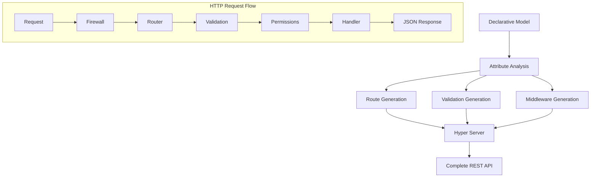
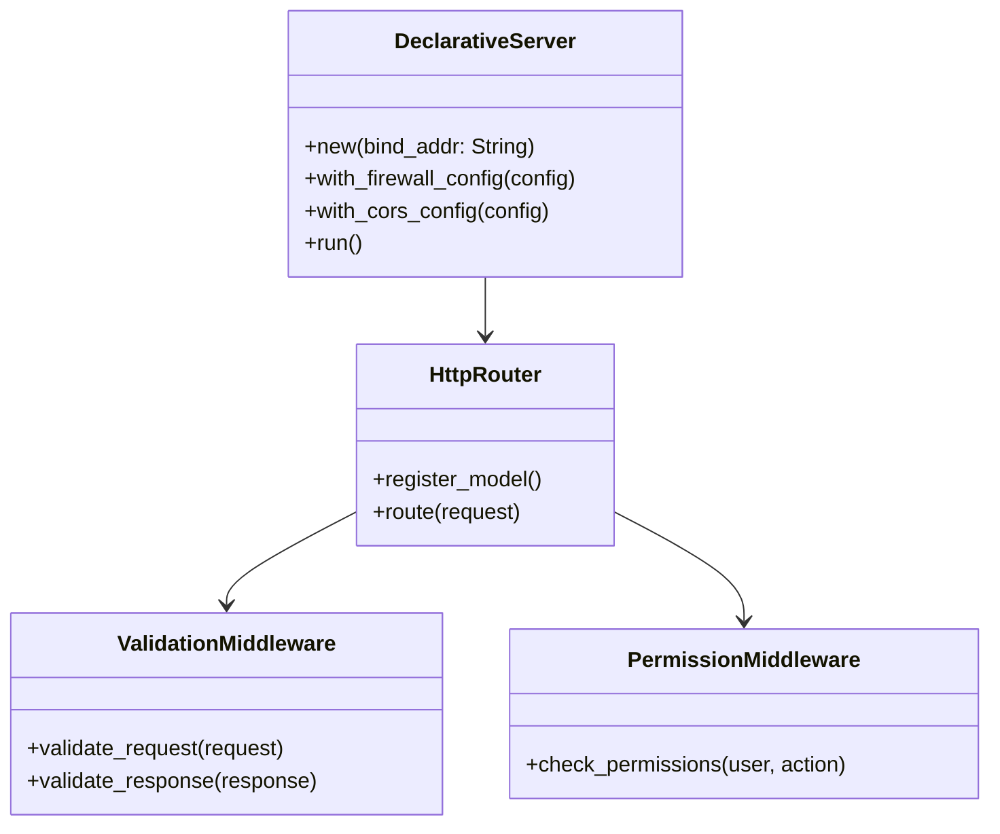
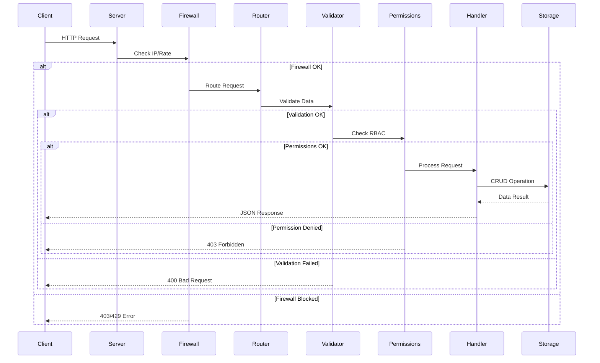

# HTTP Server Module

The Lithair HTTP server module provides a high-performance web server based on Hyper, with automatic REST API generation from declarative models.

## Overview

The Lithair HTTP server automatically transforms your declarative models into complete REST APIs, with built-in validation, authentication, and documentation.



## Main Features

### Automatic API Generation
- **Full CRUD**: Auto-generated GET, POST, PUT, DELETE
- **RESTful Routes**: `/api/users`, `/api/users/{id}`, etc.
- **Built-in Validation**: Data validation via attributes
- **JSON Serialization**: Automatic Serde

### Built-in Security
- **RBAC**: Role-based permissions
- **Firewall**: IP protection and rate limiting
- **CORS**: Full CORS support
- **Secure Headers**: Automatic security headers

### Monitoring
- **Metrics**: Built-in monitoring endpoints
- **Health checks**: `/health`, `/status`, `/metrics`
- **Logging**: Structured logs with tracing

## Architecture

### Main Components



### Technology Stack
- **Hyper**: High-performance async HTTP server
- **Tokio**: Async runtime
- **Serde**: JSON serialization/deserialization
- **Tower**: Middleware and services
- **OpenTelemetry**: Observability

## Configuration

### Basic Server

```rust
use lithair_core::http::declarative_server::DeclarativeServer;

#[tokio::main]
async fn main() -> Result<(), Box<dyn std::error::Error>> {
    let server = DeclarativeServer::new("127.0.0.1:8080").await?;
    server.run().await?;
    Ok(())
}
```

### Advanced Configuration

```rust
use lithair_core::http::{DeclarativeServer, FirewallConfig, CorsConfig};

let firewall_config = FirewallConfig {
    enabled: true,
    allowed_ips: vec!["127.0.0.1".to_string()],
    global_qps_limit: Some(1000),
    per_ip_qps_limit: Some(100),
    ..Default::default()
};

let cors_config = CorsConfig {
    allow_origins: vec!["http://localhost:3000".to_string()],
    allow_methods: vec!["GET", "POST", "PUT", "DELETE"],
    allow_headers: vec!["Content-Type", "Authorization"],
    ..Default::default()
};

let server = DeclarativeServer::new("127.0.0.1:8080")
    .await?
    .with_firewall_config(firewall_config)
    .with_cors_config(cors_config);

server.run().await?;
```

## Models and Routes

### Model Example

```rust
#[derive(DeclarativeModel)]
pub struct Product {
    #[db(primary_key, indexed)]
    #[http(expose)]
    #[permission(read = "Public")]
    pub id: Uuid,

    #[http(expose, validate = "non_empty")]
    #[permission(read = "Public", write = "ProductManager")]
    pub name: String,

    #[http(expose, validate = "min_value(0.01)")]
    #[lifecycle(audited)]
    #[permission(read = "Public", write = "ProductManager")]
    pub price: f64,

    #[db(indexed)]
    #[http(expose, validate = "min_value(0)")]
    #[permission(read = "StockManager", write = "StockManager")]
    pub stock: i32,
}
```

### Auto-Generated Routes

```
GET    /api/products          # List all products
GET    /api/products/{id}     # Get a product
POST   /api/products          # Create a new product
PUT    /api/products/{id}     # Update a product
DELETE /api/products/{id}     # Delete a product

GET    /health               # Health check
GET    /metrics             # Prometheus metrics
GET    /status              # Server status
```

## Request Lifecycle



## Performance

### Benchmarks

| Metric | Value | Context |
|--------|-------|---------|
| **Throughput** | 15,000 req/s | Without firewall, simple GET |
| **Latency P50** | 0.8ms | CRUD requests |
| **Latency P99** | 2.5ms | Complex requests |
| **Memory** | 25MB | Server at rest |
| **Startup** | 150ms | Startup time |

### Optimizations

```rust
// High-performance configuration
let server = DeclarativeServer::new("0.0.0.0:8080")
    .with_worker_threads(num_cpus::get())
    .with_connection_pool_size(1000)
    .with_request_timeout(Duration::from_secs(30))
    .with_keep_alive_timeout(Duration::from_secs(90));
```

## Monitoring and Observability

### Prometheus Metrics

```
# HTTP Requests
http_requests_total{method="GET", status="200"} 1500
http_request_duration_seconds{method="POST", quantile="0.95"} 0.002

# Server Performance
http_connections_active 45
http_request_size_bytes{quantile="0.5"} 1024
http_response_size_bytes{quantile="0.95"} 2048

# Firewall
firewall_requests_blocked_total{reason="ip_denied"} 12
firewall_rate_limited_total{type="global"} 3
```

### Health Check

```bash
curl http://localhost:8080/health
```

```json
{
    "status": "healthy",
    "timestamp": "2024-09-13T10:30:00Z",
    "uptime_seconds": 3600,
    "connections_active": 45,
    "requests_per_second": 125.5,
    "memory_usage_mb": 28.2,
    "storage_status": "connected",
    "consensus_status": "leader"
}
```

## Testing and Development

### Unit Tests

```rust
#[tokio::test]
async fn test_product_crud() {
    let server = test_server().await;

    // Test POST
    let product = json!({
        "name": "Test Product",
        "price": 19.99,
        "stock": 100
    });

    let response = server
        .post("/api/products")
        .json(&product)
        .send()
        .await?;

    assert_eq!(response.status(), 201);

    // Test GET
    let id = response.json::<Product>().await?.id;
    let response = server
        .get(&format!("/api/products/{}", id))
        .send()
        .await?;

    assert_eq!(response.status(), 200);
}
```

### Integration Tests

```bash
# Start test server
cargo run --bin test_server &

# Integration tests
cargo test --test http_integration

# Load tests
wrk -t12 -c400 -d30s http://127.0.0.1:8080/api/products
```

## Integrations

### With React Frontend

```typescript
// Auto-generated TypeScript types (roadmap)
interface Product {
    id: string;
    name: string;
    price: number;
    stock: number;
}

const api = {
    products: {
        list: () => fetch('/api/products'),
        get: (id: string) => fetch(`/api/products/${id}`),
        create: (product: Omit<Product, 'id'>) =>
            fetch('/api/products', {
                method: 'POST',
                headers: {'Content-Type': 'application/json'},
                body: JSON.stringify(product)
            }),
        // ...
    }
};
```

### With OpenAPI/Swagger

```rust
// Auto-generated API documentation (roadmap)
#[derive(DeclarativeModel)]
#[openapi(
    title = "Products API",
    version = "1.0.0",
    description = "Product management API"
)]
pub struct Product {
    /// Unique product ID
    #[openapi(example = "123e4567-e89b-12d3-a456-426614174000")]
    pub id: Uuid,

    /// Product name
    #[openapi(example = "iPhone 15 Pro")]
    #[http(validate = "min_length(3)")]
    pub name: String,
}
```

## Roadmap

### v1.1
- WebSocket support
- Auto-generated GraphQL
- Streaming responses
- File upload support

### v1.2
- TypeScript auto-generation
- OpenAPI/Swagger docs
- API versioning
- Built-in HTTP cache

---

**Note:** The Lithair HTTP server is designed to be zero-configuration while remaining highly configurable for advanced use cases.
