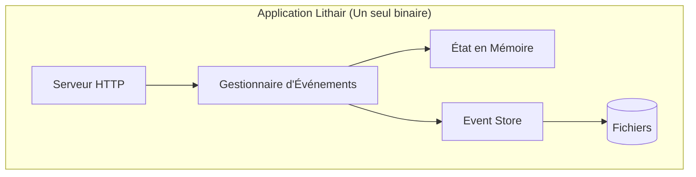
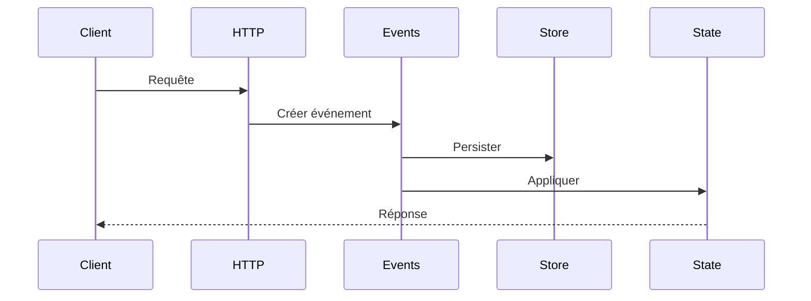

# Lithair Documentation Guide

Created by Yoan Roblet with AI assistance.

## 📚 Complete Documentation Available

Complete documentation with Mermaid diagrams has been created to clarify the
Lithair architecture. Here are the current anchor documents:

### 🎯 Main Documents Created

1. **[overview.md](../architecture/overview.md)** - Complete system overview
2. **[distributed-consensus.md](../modules/consensus/distributed-consensus.md)**
   - OpenRaft distributed consensus integration
3. **[benchmark-optimization.md](benchmark-optimization.md)** - Performance
   optimization guide
4. **[iot-architecture.md](../architecture/iot-architecture.md)** -
   High-throughput IoT ingestion architecture

### 📖 Existing Documentation

The existing documentation in `docs/` already covers these aspects well:

- **[README.md](../architecture/README.md)** - Architecture générale du
  framework
- **[event-chain.md](../features/persistence/event-chain.md)** - Event
  sourcing et chaîne d'événements
- **[performance.md](../guides/performance.md)** - Benchmarks et métriques de
  performance
- **[overview.md](../examples/overview.md)** - Guide des exemples disponibles
- **[api-reference.md](api-reference.md)** - Référence API complète

## 🔍 Quick Navigation by Topic

### Architecture and Concepts

- [overview.md](../architecture/overview.md) - Overview with diagrams
- [distributed-consensus.md](../modules/consensus/distributed-consensus.md) -
  Multi-node consensus with OpenRaft
- [system-design.md](../architecture/system-design.md) - Detailed architecture
- [event-chain.md](../features/persistence/event-chain.md) - Event sourcing and
  persistence

### Performance and Optimizations

- [benchmark-optimization.md](benchmark-optimization.md) - Optimization guide
- [performance.md](../guides/performance.md) - Detailed benchmarks
- [memory-architecture.md](../architecture/memory-architecture.md) - Memory
  management

### Examples and Use Cases

- [iot-architecture.md](../architecture/iot-architecture.md) - IoT
  architecture
- [overview.md](../examples/overview.md) - Examples guide
- [ecommerce-tutorial.md](../guides/ecommerce-tutorial.md) - E-commerce
  tutorial

### Development

- [developer-guide.md](../guides/developer-guide.md) - Developer guide
- [api-reference.md](api-reference.md) - API reference
- [getting-started.md](../guides/getting-started.md) - Quick start

## 🎨 New Mermaid Diagrams

### 1. Global Architecture

```mermaid
graph TB
    subgraph "Application Lithair (Un seul binaire)"
        HTTP[Serveur HTTP] --> EVENTS[Gestionnaire d'Événements]
        EVENTS --> STATE[État en Mémoire]
        EVENTS --> STORE[Event Store]
        STORE --> FILES[(Fichiers)]
    end
```

### 2. Event Flow

```mermaid
sequenceDiagram
    Client->>HTTP: Requête
    HTTP->>Events: Créer événement
    Events->>Store: Persister
    Events->>State: Appliquer
    State-->>Client: Réponse
```

### 3. Performance Benchmark

```mermaid
xychart-beta
    title "Performance Improvement"
    x-axis [Avant, Après]
    y-axis "Events/sec" 0 --> 2500
    bar [500, 2000]
```

## 🚀 Key Documented Points

### Core Architecture Themes

- **Single binary** - Integrated runtime and application surface
- **Direct memory access** - avoids a separate query layer for in-memory
  workloads
- **Native event sourcing** - Complete audit trail
- **Automatic deduplication** - Built-in idempotence support
- **Distributed consensus** - OpenRaft multi-node clusters
- **Embedded HTTP stack** - Fewer layers to operate in the default setup

### Validated Optimizations

- **Disabled logging** - 4x performance improvement
- **Optimized snapshots** - Reduced disk I/O
- **Adaptive timeout** - Intelligent waiting
- **Binary persistence** - High-performance option

### Massive IoT Injection

- **High-throughput ingestion** - workload-specific throughput depending on
  hardware and configuration
- **Adaptive mode** - Automatic load management
- **Real-time monitoring** - Complete metrics
- **Integrity controls** - Automatic validation and consistency checks

## 📋 Documentation Checklist

- ✅ System overview with diagrams
- ✅ Detailed event sourcing architecture
- ✅ Distributed consensus with OpenRaft
- ✅ Embedded HTTP stack documentation
- ✅ Performance optimization guide
- ✅ Massive IoT injection architecture
- ✅ Data flows with sequences
- ✅ Metrics and benchmarks
- ✅ Production configuration
- ✅ Validation scripts
- ✅ Recommended monitoring
- ✅ Future evolutions

## 🎯 Next Steps

The documentation is now more complete and easier to navigate. To go further:

1. **Practical testing** - Use the guides to reproduce results
2. **Customization** - Adapt configurations to your needs
3. **Monitoring** - Implement recommended metrics
4. **Optimizations** - Apply documented techniques

All Mermaid diagrams are integrated and display correctly in GitHub/GitLab,
providing a clearer visual understanding of the Lithair system.
