# Lithair Documentation Guide

*Created by Yoan Roblet - Disruptive database architecture with AI assistance*

## 📚 Complete Documentation Available

Complete documentation with Mermaid diagrams has been created to clarify the Lithair architecture. Here are the new documents:

### 🎯 Main Documents Created

1. **[SYSTEM_OVERVIEW.md](SYSTEM_OVERVIEW.md)** - Complete system overview
2. **[DISTRIBUTED_CONSENSUS.md](DISTRIBUTED_CONSENSUS.md)** - **NEW** - OpenRaft distributed consensus integration
3. **[BENCHMARK_OPTIMIZATION_GUIDE.md](BENCHMARK_OPTIMIZATION_GUIDE.md)** - Performance optimization guide
4. **[IOT_INJECTION_ARCHITECTURE.md](IOT_INJECTION_ARCHITECTURE.md)** - Massive IoT injection architecture

### 📖 Existing Documentation

The existing documentation in `docs/` already covers these aspects well:

- **[architecture.md](architecture.md)** - Architecture générale du framework
- **[event-sourcing.md](event-sourcing.md)** - Event sourcing avec compaction intelligente
- **[performance.md](performance.md)** - Benchmarks et métriques de performance
- **[EXAMPLES.md](EXAMPLES.md)** - Guide des exemples disponibles
- **[API_REFERENCE.md](API_REFERENCE.md)** - Référence API complète

## 🔍 Quick Navigation by Topic

### Architecture and Concepts
- [SYSTEM_OVERVIEW.md](SYSTEM_OVERVIEW.md) - **NEW** - Overview with diagrams
- [DISTRIBUTED_CONSENSUS.md](DISTRIBUTED_CONSENSUS.md) - **NEW** - Multi-node consensus with OpenRaft
- [architecture.md](architecture.md) - Detailed architecture
- [event-sourcing.md](event-sourcing.md) - Event sourcing and persistence

### Performance and Optimizations
- [BENCHMARK_OPTIMIZATION_GUIDE.md](BENCHMARK_OPTIMIZATION_GUIDE.md) - **NEW** - Optimization guide
- [performance.md](performance.md) - Detailed benchmarks
- [MEMORY_ARCHITECTURE.md](MEMORY_ARCHITECTURE.md) - Memory management

### Examples and Use Cases
- [IOT_INJECTION_ARCHITECTURE.md](IOT_INJECTION_ARCHITECTURE.md) - **NEW** - IoT architecture
- [EXAMPLES.md](EXAMPLES.md) - Examples guide
- [ecommerce-tutorial.md](ecommerce-tutorial.md) - E-commerce tutorial

### Development
- [DEVELOPER_GUIDE.md](DEVELOPER_GUIDE.md) - Developer guide
- [API_REFERENCE.md](API_REFERENCE.md) - API reference
- [GETTING_STARTED.md](GETTING_STARTED.md) - Quick start

## 🎨 New Mermaid Diagrams

### 1. Global Architecture

```mermaid
graph TB
    subgraph "Application Lithair (Un seul binaire)"
        HTTP[Serveur HTTP] --> EVENTS[Gestionnaire d'Événements]
        EVENTS --> STATE[État en Mémoire]
        EVENTS --> STORE[Event Store]
        STORE --> FILES[(Fichiers)]
    end
```


### 2. Event Flow

```mermaid
sequenceDiagram
    Client->>HTTP: Requête
    HTTP->>Events: Créer événement
    Events->>Store: Persister
    Events->>State: Appliquer
    State-->>Client: Réponse
```


### 3. Performance Benchmark
```mermaid
xychart-beta
    title "Performance Improvement"
    x-axis [Avant, Après]
    y-axis "Events/sec" 0 --> 2500
    bar [500, 2000]
```

## 🚀 Key Documented Points

### Disruptive Architecture
- **Single binary** - Embedded database
- **Direct memory access** - 1,000,000x faster
- **Native event sourcing** - Complete audit trail
- **Automatic deduplication** - Guaranteed idempotence
- **Distributed consensus** - OpenRaft multi-node clusters
- **Zero-dependency HTTP** - Pure std::net networking

### Validated Optimizations
- **Disabled logging** - 4x performance improvement
- **Optimized snapshots** - Reduced disk I/O
- **Adaptive timeout** - Intelligent waiting
- **Binary persistence** - High-performance option

### Massive IoT Injection
- **80,000+ points/sec** - Production-validated throughput
- **Adaptive mode** - Automatic load management
- **Real-time monitoring** - Complete metrics
- **Guaranteed integrity** - Automatic validation

## 📋 Documentation Checklist

- ✅ System overview with diagrams
- ✅ Detailed event sourcing architecture
- ✅ Distributed consensus with OpenRaft
- ✅ Zero-dependency HTTP stack documentation
- ✅ Performance optimization guide
- ✅ Massive IoT injection architecture
- ✅ Data flows with sequences
- ✅ Metrics and benchmarks
- ✅ Production configuration
- ✅ Validation scripts
- ✅ Recommended monitoring
- ✅ Future evolutions

## 🎯 Next Steps

The documentation is now complete and clear. To go further:

1. **Practical testing** - Use the guides to reproduce results
2. **Customization** - Adapt configurations to your needs
3. **Monitoring** - Implement recommended metrics
4. **Optimizations** - Apply documented techniques

All Mermaid diagrams are integrated and display correctly in GitHub/GitLab for optimal visual understanding of the Lithair system.
